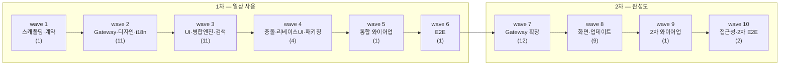

# tickets — 작업 단위 SSOT

Undine 구현을 **53개 티켓 / 10개 wave** 로 분해한 결과다.
**착수 전 자기 티켓의 소유 패키지를 확인한다** — 같은 wave 의 다른 티켓과 파일이 겹치면
머지 충돌이 난다 (`.agent/docs/conventions.md` Rule 3).

> 아래 표는 **각 티켓 md 의 헤더 줄에서 생성**한다. 헤더를 고치면 이 표를 다시 만들어야 하며,
> 둘이 어긋나면 티켓 헤더가 정본이다.

## 범위 구분

| 범위 | wave | 티켓 | 내용 |
|---|---|---|---|
| **1차 — 일상 사용** | 1~6 | 29건 | 저장소·그래프·diff·스테이징·브랜치·원격·병합·충돌·리베이스·검색 |
| **2차 — 완성도** | 2, 7~10 | 25건 | cherry-pick·blame·reflog·patch·submodule·LFS·worktree·bisect·서명·undo·설정 화면·드래그&드롭·탭·접근성·자동 업데이트 |

**1차만 끝나도 매일 쓸 수 있다.** 2차는 "GitKraken 과 비슷해지는" 구간이며,
필요 없다고 판단되는 티켓은 지워도 1차 결과물이 깨지지 않도록 의존을 설계했다.

> **여전히 재현하지 않는 것**: GitHub/GitLab PR·이슈 연동, 이슈 트래커 연동, GitKraken Workspaces,
> Cloud Patches, Focus View, Insights 등 **클라우드 서비스 영역**. 앱을 따라 만든다고 생기지 않으며
> 개인 도구에는 대부분 불필요하다.

## 티켓 목록 — 1차

| ID | 제목 | 사이즈 | wave | 의존 | 소유 패키지 |
|---|---|---|---|---|---|
| [UND-01](UND-01-scaffolding-contracts.md) | 프로젝트 스캐폴딩 · 공통 계약 정의 | L | 1 | — | 루트 Gradle 설정 · `app/build.gradle.kts` · `app/src/main/kotlin/dev/undine/domain/` 전체 계약 · 최소 `app/src/main/kotlin/dev/undine/presentation/App.kt` |
| [UND-02](UND-02-repository-open-status.md) | 저장소 열기 · 워킹트리 상태 조회 | M | 2 | UND-01 | `infrastructure/git/repository/` |
| [UND-03](UND-03-commit-history.md) | 커밋 이력 조회 (페이징) | M | 2 | UND-01 | `infrastructure/git/history/` |
| [UND-04](UND-04-graph-lane-layout.md) | 커밋 그래프 레인 배치 알고리즘 | M | 2 | UND-01 | `domain/graph/` |
| [UND-05](UND-05-diff-computation.md) | Diff 계산 (파일 · hunk · word-level) | M | 2 | UND-01 | `infrastructure/git/diff/` |
| [UND-06](UND-06-staging-commit.md) | 스테이징 · 커밋 | M | 2 | UND-01 | `infrastructure/git/staging/` |
| [UND-07](UND-07-ref-management.md) | 브랜치 · 태그 관리 | M | 2 | UND-01 | `infrastructure/git/ref/` |
| [UND-08](UND-08-remote-sync-auth.md) | 원격 동기화 (clone/fetch/pull/push) · 인증 | L | 2 | UND-01 | `infrastructure/git/remote/` |
| [UND-09](UND-09-stash-reset-revert.md) | Stash · Reset · Revert | M | 2 | UND-01 | `infrastructure/git/worktreeops/` |
| [UND-10](UND-10-design-system.md) | 디자인 시스템 · 테마 | M | 2 | UND-01 | `presentation/design/` |
| [UND-11](UND-11-app-settings-persistence.md) | 앱 설정 · 최근 저장소 영속화 | S | 2 | UND-01 | `infrastructure/settings/` |
| [UND-12](UND-12-app-shell-layout.md) | 앱 셸 3분할 레이아웃 | M | 3 | UND-10 | `presentation/shell/` |
| [UND-13](UND-13-sidebar-ref-tree.md) | 사이드바 레퍼런스 트리 | M | 3 | UND-07 · UND-09 · UND-10 | `presentation/sidebar/` |
| [UND-14](UND-14-commit-graph-view.md) | 커밋 그래프 뷰 렌더링 | L | 3 | UND-03 · UND-04 · UND-10 | `presentation/graph/` |
| [UND-15](UND-15-commit-detail-panel.md) | 커밋 상세 패널 | M | 3 | UND-03 · UND-05 · UND-10 | `presentation/commitdetail/` |
| [UND-16](UND-16-diff-viewer.md) | Diff 뷰어 | L | 3 | UND-05 · UND-10 | `presentation/diff/` |
| [UND-17](UND-17-staging-commit-panel.md) | 스테이징 · 커밋 작성 패널 | M | 4 | UND-06 · UND-10 · UND-53 | `presentation/staging/` |
| [UND-18](UND-18-toolbar-remote-progress.md) | 툴바 · 원격 작업 진행 표시 | M | 3 | UND-08 · UND-10 | `presentation/toolbar/` |
| [UND-19](UND-19-repo-open-clone-screen.md) | 저장소 열기 · 클론 화면 | M | 3 | UND-02 · UND-08 · UND-10 · UND-11 | `presentation/welcome/` |
| [UND-20](UND-20-commit-search-filter.md) | 커밋 검색 · 필터 | M | 3 | UND-03 · UND-10 | `presentation/search/` |
| [UND-21](UND-21-merge-rebase-execution.md) | 병합 · 리베이스 실행 | L | 3 | UND-07 | `domain/merge/` · `application/merge/` · `infrastructure/git/merge/` |
| [UND-22](UND-22-command-palette-shortcuts.md) | 커맨드 팔레트 · 단축키 | M | 3 | UND-10 | `presentation/palette/` |
| [UND-23](UND-23-conflict-resolution-editor.md) | 충돌 해결 에디터 UI | L | 4 | UND-16 · UND-21 | `presentation/conflict/` |
| [UND-24](UND-24-interactive-rebase-ui.md) | 대화형 리베이스 UI | L | 4 | UND-10 · UND-21 | `presentation/rebase/` |
| [UND-25](UND-25-packaging-distribution.md) | 패키징 · 배포 | M | 4 | UND-01 | `build.gradle.kts` · `packaging/` |
| [UND-26](UND-26-app-wiring-di.md) | 앱 통합 와이어업 · DI | M | 5 | UND-12 · UND-13 · UND-14 · UND-15 · UND-16 · UND-17 · UND-18 · UND-19 · UND-20 · UND-21 · UND-22 · UND-23 · UND-24 | `presentation/App.kt` · `di/` |
| [UND-27](UND-27-e2e-scenario-tests.md) | E2E 시나리오 테스트 | M | 6 | UND-26 | `app/src/test/kotlin/.../scenario/` |
| [UND-49](UND-49-i18n-string-resources.md) | i18n 문자열 리소스 기반 | M | 2 | UND-01 | `presentation/i18n/` |
| [UND-53](UND-53-amend-preflight-contract.md) | amend 사전 확인 계약 · 실행 가드 | M | 3 | UND-06 | `domain/`(StagingGateway·CommitResult·amend 예외) · `infrastructure/git/staging/` · `application/staging/` |

## 티켓 목록 — 2차

| ID | 제목 | 사이즈 | wave | 의존 | 소유 패키지 |
|---|---|---|---|---|---|
| [UND-28](UND-28-cherry-pick.md) | Cherry-pick 실행 | M | 7 | UND-21 | `domain/cherrypick/` · `application/cherrypick/` · `infrastructure/git/cherrypick/` |
| [UND-29](UND-29-blame-file-history.md) | Blame · 파일 이력 조회 | M | 7 | UND-01 · UND-05 | `domain/blame/` · `infrastructure/git/blame/` |
| [UND-30](UND-30-reflog-recovery.md) | Reflog 조회 · 복구 | M | 7 | UND-01 | `domain/reflog/` · `infrastructure/git/reflog/` |
| [UND-31](UND-31-patch-create-apply.md) | Patch 생성 · 적용 | M | 7 | UND-05 | `domain/patch/` · `infrastructure/git/patch/` |
| [UND-32](UND-32-submodule-management.md) | Submodule 관리 | M | 7 | UND-02 | `domain/submodule/` · `infrastructure/git/submodule/` |
| [UND-33](UND-33-git-lfs.md) | Git LFS 연동 | M | 7 | UND-08 | `domain/lfs/` · `infrastructure/git/lfs/` |
| [UND-34](UND-34-worktree-management.md) | Worktree 관리 | M | 7 | UND-02 | `domain/worktree/` · `infrastructure/git/worktree/` |
| [UND-35](UND-35-bisect-session.md) | Bisect 세션 | M | 7 | UND-03 | `domain/bisect/` · `application/bisect/` · `infrastructure/git/bisect/` |
| [UND-36](UND-36-commit-signing.md) | 커밋 서명 (GPG / SSH) | M | 7 | UND-06 | `domain/signing/` · `infrastructure/git/signing/` |
| [UND-37](UND-37-git-identity-profiles.md) | Git identity 프로필 | S | 7 | UND-06 · UND-11 | `domain/identity/` · `application/identity/` · `infrastructure/identity/` |
| [UND-38](UND-38-operation-history-undo.md) | 실행 이력 · Undo 스택 | L | 7 | UND-09 · UND-21 | `domain/undo/` · `application/undo/` |
| [UND-39](UND-39-external-diff-merge-tool.md) | 외부 diff/merge 도구 연동 | S | 7 | UND-05 · UND-11 | `domain/externaltool/` · `infrastructure/externaltool/` |
| [UND-40](UND-40-preferences-screen.md) | 설정 화면 | M | 8 | UND-10 · UND-11 · UND-22 · UND-37 · UND-39 | `presentation/preferences/` |
| [UND-41](UND-41-blame-history-view.md) | Blame 뷰 · 파일 이력 화면 | M | 8 | UND-10 · UND-29 | `presentation/blame/` |
| [UND-42](UND-42-graph-drag-drop.md) | 그래프 드래그&드롭 조작 | L | 8 | UND-14 · UND-21 · UND-28 · UND-38 | `presentation/graph/` (dnd 확장) |
| [UND-43](UND-43-undo-history-panel.md) | Undo 버튼 · 실행 이력 패널 | M | 8 | UND-10 · UND-38 | `presentation/undo/` |
| [UND-44](UND-44-multi-repo-tabs.md) | 다중 저장소 탭 | L | 8 | UND-02 · UND-12 | `presentation/tabs/` · `presentation/shell/` · `application/session/` · `infrastructure/git/repository/` (다중 세션 확장) |
| [UND-45](UND-45-submodule-worktree-panel.md) | Submodule · Worktree 패널 | M | 8 | UND-10 · UND-32 · UND-34 | `presentation/submodule/` |
| [UND-46](UND-46-reflog-bisect-screen.md) | Reflog · Bisect 화면 | M | 8 | UND-10 · UND-30 · UND-35 | `presentation/recovery/` |
| [UND-47](UND-47-patch-screen.md) | Patch 화면 | M | 8 | UND-10 · UND-31 | `presentation/patch/` |
| [UND-48](UND-48-auto-update.md) | 자동 업데이트 | M | 8 | UND-25 | `domain/update/` · `application/update/` · `infrastructure/update/` · `build.gradle.kts` |
| [UND-50](UND-50-accessibility-audit.md) | 접근성 감사 · 보강 | M | 10 | UND-40 · UND-41 · UND-42 · UND-43 · UND-44 · UND-45 · UND-46 · UND-47 · UND-51 | `presentation/**` (감사 결과 보강) |
| [UND-51](UND-51-wiring-phase2.md) | 2차 통합 와이어업 | M | 9 | UND-22 · UND-26 · UND-38 · UND-40 · UND-41 · UND-42 · UND-43 · UND-44 · UND-45 · UND-46 · UND-47 · UND-48 | `presentation/App.kt` · `di/` · `presentation/palette/` (등록) |
| [UND-52](UND-52-e2e-scenario-phase2.md) | 2차 E2E 시나리오 테스트 | M | 10 | UND-51 | `app/src/test/kotlin/.../scenario2/` |
| [UND-54](UND-54-merge-start-state-guard.md) | merge/rebase 시작 경로 상태 가드 완결 | S | 4 | UND-21 | `infrastructure/git/merge/` (가드 추가) |
| [UND-56](UND-56-gitkraken-visual-tuning.md) | GitKraken 계열 시각 튜닝 · 렌더 확인 수단 | S | 5 | UND-26 · UND-10 | `presentation/design/` · `presentation/graph/`(그리기) · `presentation/shell/`(분할선) |
| [UND-57](UND-57-list-remotes-contract.md) | 원격 목록 계약 · 툴바 활성화 | S | 5 | UND-18 · UND-26 | `domain/RemoteGateway.kt` · `infrastructure/git/remote/` · `di/` |

> **UND-49(i18n)만 wave 2 에 있다.** 2차 범위에서 추가됐지만, 나중에 넣으면 이미 작성된 전 화면의
> 문자열을 추출해야 해 거대한 retrofit 티켓이 된다. 구현 착수 전인 지금 선행 티켓으로 옮겨
> **모든 UI 티켓이 처음부터 문자열 리소스를 쓰게** 했다.

사이즈 기준: S ≈ 200줄 · M ≈ 400줄 · L ≈ 800줄 (구현 코드 기준, 테스트 제외).

## 티켓 목록 — 하네스 (앱 wave DAG 밖)

앱 구현이 아니라 `.agent/` 하네스를 대상으로 하는 티켓이다. 앱 티켓과 의존이 없어 **위상정렬·파일
교집합 표에 넣지 않는다** — 언제든 단독으로 착수할 수 있고, 앱 wave 를 막지도 앱 wave 에 막히지도 않는다.

| ID | 제목 | 사이즈 | 의존 | 소유 |
|---|---|---|---|---|
| [UND-55](UND-55-orchestration-routing-table.md) | 오케스트레이션 실행 구성 라우팅 테이블 | S | — | `.agent/orchestration/profiles.toml`(신규) · `runner/run-graph.py` · `workflows/*.toml` |

## 공통 규약 (전 티켓 적용)

각 티켓 md 에 반복해 적지 않고 여기에 한 번만 둔다.

1. **UI 티켓은 문자열을 하드코딩하지 않는다** — UND-49 의 문자열 리소스를 통해서만 표시 문자열을 쓴다.
2. **UI 티켓은 색을 하드코딩하지 않는다** — UND-10 의 디자인 토큰을 통해서만 색을 쓴다.
3. **모든 변경 연산은 UND-38 Undo 스택에 기록한다** — 되돌릴 수 없는 연산은 사유와 함께 기록한다.
4. **주요 동작에는 키보드 경로가 있어야 한다** — 드래그·마우스 전용 동작을 만들지 않는다 (UND-50 이 감사).
5. **JGit `AutoCloseable` 은 `use {}` 로만 연다** — [`jgit-usage`](../.agent/rules/jgit-usage.md).
6. **자기 domain 패키지를 새로 여는 티켓은 자기 Gateway interface 를 그 패키지에 정의한다** —
   그래야 그 티켓만으로 레이어가 닫힌다 (UND-01 이 닫는 것은 wave 2 가 구현할 계약뿐이다).

> 공통 규약이 커버하는 참조는 **의존으로 선언하지 않는다** (예: 규약 3 에 따른 UND-38 참조).
> 의존 선언은 **그 티켓의 산출물이 없으면 착수할 수 없을 때만** 한다.

## 의존 DAG (wave 수준)



티켓 단위 의존은 위 목록 표의 "의존" 열이 정본이다 — 다이어그램 노드는 15개 이하로 유지한다.

## 위상정렬 시뮬레이션 (강제 게이트)

| wave | 티켓 | 너비 |
|---|---|---|
| 1 | UND-01 | 1 |
| 2 | UND-02, UND-03, UND-04, UND-05, UND-06, UND-07, UND-08, UND-09, UND-10, UND-11, UND-49 | 11 |
| 3 | UND-12, UND-13, UND-14, UND-15, UND-16, UND-18, UND-19, UND-20, UND-21, UND-22, UND-53 | 11 |
| 4 | UND-17, UND-23, UND-24, UND-25 | 4 |
| 5 | UND-26 | 1 |
| 6 | UND-27 | 1 |
| 7 | UND-28, UND-29, UND-30, UND-31, UND-32, UND-33, UND-34, UND-35, UND-36, UND-37, UND-38, UND-39 | 12 |
| 8 | UND-40, UND-41, UND-42, UND-43, UND-44, UND-45, UND-46, UND-47, UND-48 | 9 |
| 9 | UND-51 | 1 |
| 10 | UND-50, UND-52 | 2 |

- **너비 분포**: [1, 11, 11, 4, 1, 1, 12, 9, 1, 2]
- **평균 wave 너비**: 5.30
- **판정: 통과** — 모든 wave 너비가 1~2 인 직선형 DAG 가 아니다.
  wave 2·3·7·8 에서 각각 11·11·12·9 개가 동시에 열린다.

꼬리 wave 의 너비 1~2 는 **의도**다. 와이어업과 E2E 는 앞선 결과 전체를 전제로 하는
단일 책임이라 쪼개면 오히려 충돌을 만든다.

> **wave 7 의 실제 시작 시점**: wave 7 티켓의 진짜 의존은 대부분 wave 1~3 에 있어 **1차 완료 전에도
> 착수 가능**하다. 여기서 wave 7 로 둔 것은 "1차를 먼저 끝낸다" 는 일정상의 선택이지 기술적 제약이 아니다.

## 병목 분석

후행 의존이 3건 이상인 티켓 (분해 재검토 트리거):

| 티켓 | 후행 의존 수 | 제목 |
|---|---|---|
| UND-10 | 17 | 디자인 시스템 · 테마 |
| UND-01 | 14 | 프로젝트 스캐폴딩 · 공통 계약 정의 |
| UND-21 | 6 | 병합 · 리베이스 실행 |
| UND-05 | 5 | Diff 계산 (파일 · hunk · word-level) |
| UND-02 | 4 | 저장소 열기 · 워킹트리 상태 조회 |
| UND-03 | 4 | 커밋 이력 조회 (페이징) |
| UND-11 | 4 | 앱 설정 · 최근 저장소 영속화 |
| UND-06 | 3 | 스테이징 · 커밋 |
| UND-08 | 3 | 원격 동기화 (clone/fetch/pull/push) · 인증 |
| UND-22 | 3 | 커맨드 팔레트 · 단축키 |
| UND-38 | 3 | 실행 이력 · Undo 스택 |

- **UND-01** 은 불가피한 병목이다. 빌드 골격 없이는 어떤 계약도 컴파일되지 않으므로
  빌드 설정과 도메인 계약은 **연관 병목**이며 한 티켓으로 묶었다.
- **UND-10**(디자인 시스템)·**UND-49**(i18n)는 UND-01 과 **독립적인** 병목이라 분리해 wave 2 를 넓혔다.
- **UND-26 / UND-51**(와이어업)은 후행이 아니라 **선행이 많다**. UI 티켓이 공통 파일(`App.kt`·DI 배선)을
  건드리지 않도록 미뤄 둔 통합 티켓이며, 각 단계 마지막에 단독 배치했다.

## 파일 교집합 검증 (Single Writer per File)

같은 wave 안의 소유 선언을 전수 대조한 결과 **교집합 0건**이다.

| wave | 소유 분포 |
|---|---|
| 1 | 1건 — 루트 빌드 · `domain/` 전체 계약 · 최소 `presentation/App.kt` |
| 2 | 11건 — `infrastructure/git/repository/` · `infrastructure/git/history/` · `domain/graph/` · `infrastructure/git/diff/` · `infrastructure/git/staging/` · `infrastructure/git/ref/` · `infrastructure/git/remote/` · `infr |
| 3 | 11건 — `presentation/shell/` · `presentation/sidebar/` · `presentation/graph/` · `presentation/commitdetail/` · `presentation/diff/` · `presentation/toolbar/` · `presentation/welcome/` · `presentation/search/` · `domain/merge/` · `application/merge/` · `infrastructure/git/merge/` · `presentation/palette/` · `domain/` · `infrastructure/git/staging/` · `application/staging/` |
| 4 | 4건 — `presentation/staging/` · `presentation/conflict/` · `presentation/rebase/` · `build.gradle.kts` · `packaging/` |
| 5 | 1건 — `presentation/App.kt` · `di/` |
| 6 | 1건 — `app/src/test/kotlin/.../scenario/` |
| 7 | 12건 — `domain/cherrypick/` · `application/cherrypick/` · `infrastructure/git/cherrypick/` · `domain/blame/` · `infrastructure/git/blame/` · `domain/reflog/` · `infrastructure/git/reflog/` · `domain/patch/` · `infrast |
| 8 | 9건 — `presentation/preferences/` · `presentation/blame/` · `presentation/graph/` (dnd 확장) · `presentation/undo/` · `presentation/tabs/` · `presentation/shell/` · `application/session/` · `infrastructure/git/reposito |
| 9 | 1건 — `presentation/App.kt` · `di/` · `presentation/palette/` (등록) |
| 10 | 2건 — `presentation/**` (감사 결과 보강) · `app/src/test/kotlin/.../scenario2/` |

교차 wave 재수정 파일 — 전부 **서로 다른 wave** 라 동시 수정이 없다:

| 파일 | 최초 | 재수정 |
|---|---|---|
| `build.gradle.kts` | UND-01 (w1) | UND-25 (w4) · UND-48 (w8) |
| `presentation/App.kt` | UND-01 최소 형태 (w1) | UND-26 최종 형태 (w5) · UND-51 (w9) |
| `di/` | UND-26 (w5) | UND-51 (w9) |
| `presentation/shell/` | UND-12 (w3) | UND-44 (w8) |
| `presentation/graph/` | UND-14 (w3) | UND-42 (w8) |
| `presentation/palette/` | UND-22 (w3) | UND-51 등록 (w9) |
| `presentation/**` 컴포넌트 | 각 UI 티켓 (w3·w8) | UND-50 감사 보강 (w10) |
| `infrastructure` Repository 홀더 | UND-02 (w2) | UND-44 다중 세션 확장 (w8) |

## 티켓 md 규약

**AC(인수 조건)와 생성/수정 파일 목록은 넣지 않는다** — 파일 목록의 기준은 코드베이스다.

```markdown
# [UND-NN] 제목
> wave · 사이즈 · 의존 · 소유 패키지

## 작업 내용 (설계 의도)
**롤백**: (파괴적 변경·상태 전이·외부 연동이 있을 때 1줄)
## 다이어그램 (처리 흐름 sequenceDiagram + 클래스 의존 flowchart LR)
## 테스트 케이스   ← 해피·실패·엣지 최소 3개
```

## 작업 흐름

```
/custom-develop-orchestrator UND-NN   # 스펙 → 승인 게이트 → 구현 → 5축 검증
/custom-affected-test-runner          # 변경 범위 테스트 실행
/custom-self-code-review              # push 전 5축 자가 점검
/custom-pr-create                     # Draft PR
```

브랜치는 `feat/UND-NN-<slug>`, 커밋 접두사는 `[UND-NN]` 이다.

## 리뷰 이력

| 일자 | 방법 | 결과 |
|---|---|---|
| 2026-08-19 | `/custom-orchestrate ticket-review` 1차 | REQUEST_CHANGES — p1 12 · p2 15 → 전건 반영 |
| 2026-08-19 | `/custom-orchestrate ticket-review` 2차 (수정본) | REQUEST_CHANGES — p1 3 · p2 6 → 전건 반영 |
