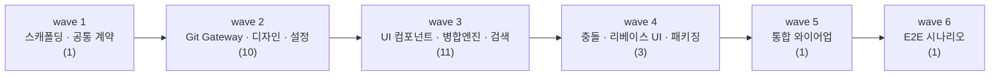

# tickets — 작업 단위 SSOT

Undine 구현을 27개 티켓으로 분해한 결과다. **착수 전 자기 티켓의 소유 패키지를 확인한다** —
같은 wave 의 다른 티켓과 파일이 겹치면 머지 충돌이 난다 (`.agent/docs/conventions.md` Rule 3).

## 티켓 목록

| ID | 제목 | 사이즈 | wave | 의존 | 소유 패키지 |
|---|---|---|---|---|---|
| [UND-01](UND-01-scaffolding-contracts.md) | 프로젝트 스캐폴딩 · 공통 계약 정의 | L | 1 | — | 루트 빌드 · `domain/` 전체 계약 |
| [UND-02](UND-02-repository-open-status.md) | 저장소 열기 · 워킹트리 상태 조회 | M | 2 | UND-01 | `infrastructure/git/repository/` |
| [UND-03](UND-03-commit-history.md) | 커밋 이력 조회 (페이징) | M | 2 | UND-01 | `infrastructure/git/history/` |
| [UND-04](UND-04-graph-lane-layout.md) | 커밋 그래프 레인 배치 알고리즘 | M | 2 | UND-01 | `domain/graph/` |
| [UND-05](UND-05-diff-computation.md) | Diff 계산 (파일 · hunk · word-level) | M | 2 | UND-01 | `infrastructure/git/diff/` |
| [UND-06](UND-06-staging-commit.md) | 스테이징 · 커밋 | M | 2 | UND-01 | `infrastructure/git/staging/` |
| [UND-07](UND-07-ref-management.md) | 브랜치 · 태그 관리 | M | 2 | UND-01 | `infrastructure/git/ref/` |
| [UND-08](UND-08-remote-sync-auth.md) | 원격 동기화 (clone/fetch/pull/push) · 인증 | L | 2 | UND-01 | `infrastructure/git/remote/` |
| [UND-09](UND-09-stash-reset-revert.md) | Stash · Reset · Revert | M | 2 | UND-01 | `infrastructure/git/worktreeops/` |
| [UND-10](UND-10-design-system.md) | 디자인 시스템 · 테마 | M | 2 | UND-01 | `presentation/design/` |
| [UND-11](UND-11-app-settings-persistence.md) | 앱 설정 · 최근 저장소 영속화 | S | 2 | UND-01 | `infrastructure/settings/` |
| [UND-12](UND-12-app-shell-layout.md) | 앱 셸 3분할 레이아웃 | M | 3 | UND-10 | `presentation/shell/` |
| [UND-13](UND-13-sidebar-ref-tree.md) | 사이드바 레퍼런스 트리 | M | 3 | UND-07 · UND-09 · UND-10 | `presentation/sidebar/` |
| [UND-14](UND-14-commit-graph-view.md) | 커밋 그래프 뷰 렌더링 | L | 3 | UND-03 · UND-04 · UND-10 | `presentation/graph/` |
| [UND-15](UND-15-commit-detail-panel.md) | 커밋 상세 패널 | M | 3 | UND-03 · UND-05 · UND-10 | `presentation/commitdetail/` |
| [UND-16](UND-16-diff-viewer.md) | Diff 뷰어 | L | 3 | UND-05 · UND-10 | `presentation/diff/` |
| [UND-17](UND-17-staging-commit-panel.md) | 스테이징 · 커밋 작성 패널 | M | 3 | UND-06 · UND-10 | `presentation/staging/` |
| [UND-18](UND-18-toolbar-remote-progress.md) | 툴바 · 원격 작업 진행 표시 | M | 3 | UND-08 · UND-10 | `presentation/toolbar/` |
| [UND-19](UND-19-repo-open-clone-screen.md) | 저장소 열기 · 클론 화면 | M | 3 | UND-02 · UND-08 · UND-10 · UND-11 | `presentation/welcome/` |
| [UND-20](UND-20-commit-search-filter.md) | 커밋 검색 · 필터 | M | 3 | UND-03 · UND-10 | `presentation/search/` |
| [UND-21](UND-21-merge-rebase-execution.md) | 병합 · 리베이스 실행 | L | 3 | UND-07 | `domain/merge/` · `application/merge/` |
| [UND-22](UND-22-command-palette-shortcuts.md) | 커맨드 팔레트 · 단축키 | M | 3 | UND-10 | `presentation/palette/` |
| [UND-23](UND-23-conflict-resolution-editor.md) | 충돌 해결 에디터 UI | L | 4 | UND-16 · UND-21 | `presentation/conflict/` |
| [UND-24](UND-24-interactive-rebase-ui.md) | 대화형 리베이스 UI | L | 4 | UND-10 · UND-21 | `presentation/rebase/` |
| [UND-25](UND-25-packaging-distribution.md) | 패키징 · 배포 | M | 4 | UND-01 | `build.gradle.kts` · `packaging/` |
| [UND-26](UND-26-app-wiring-di.md) | 앱 통합 와이어업 · DI | M | 5 | UND-12 · UND-13 · UND-14 · UND-15 · UND-16 · UND-17 · UND-18 · UND-19 · UND-20 · UND-21 · UND-22 · UND-23 · UND-24 | `presentation/App.kt` · `di/` |
| [UND-27](UND-27-e2e-scenario-tests.md) | E2E 시나리오 테스트 | M | 6 | UND-26 | `app/src/test/kotlin/.../scenario/` |

사이즈 기준: S ≈ 200줄 · M ≈ 400줄 · L ≈ 800줄 (구현 코드 기준, 테스트 제외).

## 의존 DAG (wave 수준)



티켓 단위 의존은 위 목록 표의 "의존" 열이 정본이다 (노드 27개는 한 다이어그램에 담지 않는다 — 다이어그램 노드는 15개 이하로 유지한다).

## 위상정렬 시뮬레이션 (강제 게이트)

| wave | 티켓 | 너비 |
|---|---|---|
| 1 | UND-01 | 1 |
| 2 | UND-02, UND-03, UND-04, UND-05, UND-06, UND-07, UND-08, UND-09, UND-10, UND-11 | 10 |
| 3 | UND-12, UND-13, UND-14, UND-15, UND-16, UND-17, UND-18, UND-19, UND-20, UND-21, UND-22 | 11 |
| 4 | UND-23, UND-24, UND-25 | 3 |
| 5 | UND-26 | 1 |
| 6 | UND-27 | 1 |

- **너비 분포**: [1, 10, 11, 3, 1, 1]
- **평균 wave 너비**: 4.50
- **판정: 통과** — 모든 wave 너비가 1~2 인 직선형 DAG 가 아니다. wave 2·3 에서 각각 10·11 개가
  동시에 열리므로 병렬 이득이 실재한다.

꼬리 wave 5·6 의 너비가 1인 것은 **의도**다. 와이어업과 E2E 는 앞선 결과 전체를 전제로 하는
단일 책임이라 쪼개면 오히려 충돌을 만든다.

## 병목 분석

후행 의존이 3건 이상인 티켓 (분해 재검토 트리거):

| 티켓 | 후행 의존 수 | 제목 |
|---|---|---|
| UND-01 | 11 | 프로젝트 스캐폴딩 · 공통 계약 정의 |
| UND-10 | 11 | 디자인 시스템 · 테마 |
| UND-03 | 3 | 커밋 이력 조회 (페이징) |
| UND-21 | 3 | 병합 · 리베이스 실행 |

- **UND-01** 은 불가피한 병목이다. 빌드 골격 없이는 어떤 계약도 컴파일되지 않으므로
  빌드 설정과 도메인 계약은 **연관 병목**이며 한 티켓으로 묶었다. 쪼개면 wave 1→2 가 1→1 직렬 사슬이 된다.
- **UND-10**(디자인 시스템)은 UND-01 과 **독립적인** 병목이라 분리해 wave 2 를 넓혔다.
  다른 wave 2 티켓과 파일이 겹치지 않는다.
- **UND-26**(통합 와이어업)은 후행이 아니라 **선행이 13개**다. wave 3~4 의 UI 티켓이 공통 파일
  (`App.kt`·DI 배선)을 건드리지 않도록 미뤄 둔 통합 티켓이며, 마지막 wave 에 단독 배치했다.

## 파일 교집합 검증 (Single Writer per File)

| wave | 검증 |
|---|---|
| 1 | 티켓 1개 — 교집합 없음 |
| 2 | UND-02·03·05·06·07·08·09 는 각각 `infrastructure/git/<하위>` 신규 패키지, UND-04 는 `domain/graph`, UND-10 은 `presentation/design`, UND-11 은 `infrastructure/settings`. **교집합 ∅** |
| 3 | UND-12~20·22 는 각각 `presentation/<하위>` 신규 패키지, UND-21 은 `domain/merge`+`application/merge`. **교집합 ∅** |
| 4 | UND-23 `presentation/conflict` · UND-24 `presentation/rebase` · UND-25 빌드 스크립트. **교집합 ∅** |
| 5 | 티켓 1개 (`App.kt`·`di/`) — 공통 파일 수정을 여기로 모았다 |
| 6 | 티켓 1개 (테스트 신규 패키지) |

`build.gradle.kts` 는 UND-01 이 만들고 **UND-25 만 다시 수정**한다 (서로 다른 wave).
`App.kt` 는 UND-01 이 최소 형태로 만들고 **UND-26 만 다시 수정**한다.

## 티켓 md 규약

각 티켓은 다음 구조를 따른다. **AC(인수 조건)와 생성/수정 파일 목록은 넣지 않는다** —
파일 목록의 기준은 코드베이스다.

```markdown
# [UND-NN] 제목
> wave · 사이즈 · 의존 · 소유 패키지

## 작업 내용 (설계 의도)
## 다이어그램 (처리 흐름 sequenceDiagram + 클래스 의존 flowchart LR)
## 테스트 케이스   ← 해피·실패·엣지 최소 3개
```

파괴적 변경·상태 전이가 있는 티켓은 **롤백 방법을 1줄 명시**한다.

## 작업 흐름

```
/custom-develop-orchestrator UND-NN   # 스펙 → 승인 게이트 → 구현 → 5축 검증
/custom-affected-test-runner          # 변경 범위 테스트 실행
/custom-self-code-review              # push 전 5축 자가 점검
/custom-pr-create                     # Draft PR
```

브랜치는 `feat/UND-NN-<slug>`, 커밋 접두사는 `[UND-NN]` 이다.
