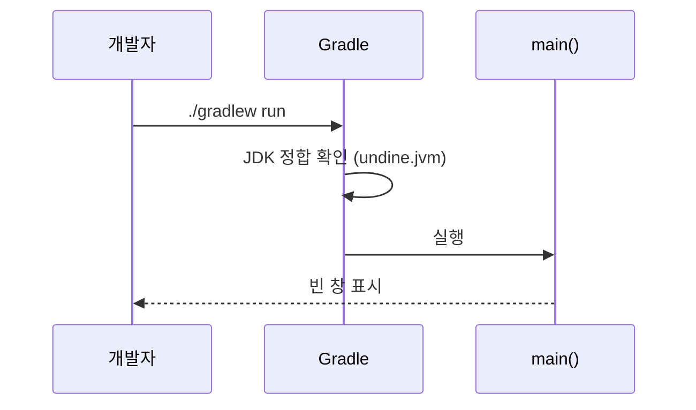
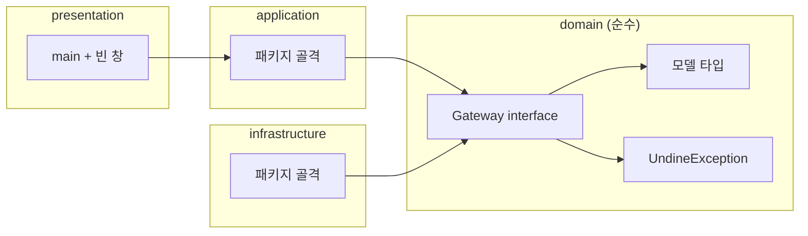

# [UND-01] 프로젝트 스캐폴딩 · 공통 계약 정의

> wave 1 · 사이즈 L · 의존 없음 (선행 wave) · 소유 루트 Gradle 설정 · `app/build.gradle.kts` · `app/src/main/kotlin/dev/undine/domain/` 전체 계약 · 최소 `app/src/main/kotlin/dev/undine/presentation/App.kt`

## 작업 내용 (설계 의도)
후행 티켓 **전부**가 import 하는 공통 산출물을 한 티켓에 모은다. 빌드 골격 없이는 어떤 계약도
컴파일되지 않으므로 둘은 **분리할 수 없는 연관 병목**이다 — 쪼개면 선행 wave 가 1→1 직렬 사슬이 된다.

세 가지를 확립한다.

1. **빌드 골격** — 루트 프로젝트 + `:app` 애플리케이션 모듈. 루트는 `settings.gradle.kts`·`gradle.properties`·
   버전 카탈로그·플러그인 선언만 갖고, Compose Desktop 설정과 진입점(`dev.undine.presentation.AppKt`)은
   `app/build.gradle.kts` 에 둔다. 라이브러리 버전은 전부 `gradle/libs.versions.toml` 카탈로그에 핀하고,
   JDK 는 `gradle.properties` 의 `undine.jvm` 을 SSOT 로 둔다 (훅 가드가 이 값을 읽는다).
2. **레이어 패키지 골격** — `domain` / `application` / `infrastructure` / `presentation`.
   `domain` 은 프레임워크(JGit·Compose·코루틴)를 자유롭게 쓸 수 있다 — 다만 **다른 레이어는 import 하지 않는다.**
3. **도메인 모델 + Gateway interface 전체** — 후행 티켓이 구현만 채울 수 있도록 **계약 표면을 미리 닫는다**.
   JGit 타입(`RevCommit`·`ObjectId`)을 도메인에서 직접 써도 된다 — 래핑 의무는 없다.

정의할 계약:

| 종류 | 타입 |
|---|---|
| 식별자·값 | `CommitId`, `RefName`, `RepositoryPath` |
| 모델 | `Commit`, `Branch`, `Tag`, `RemoteRef`, `FileChange`, `DiffHunk`, `StashEntry` |
| 상태 | `WorkingTreeStatus`, `RepositoryState`(정상/빈저장소/병합중/리베이스중/detached) |
| Gateway | `RepositoryGateway`, `HistoryGateway`, `DiffGateway`, `StagingGateway`, `RefGateway`, `RemoteGateway`, `WorktreeOpsGateway` |
| 반환 타입 | `OpenedRepository` · `DiffResult` · `CommitResult` · `DeleteBranchResult` · `PushResult` · `RevertResult` · `ResetMode` · `Progress` |
| 설정 | `SettingsGateway` · `Settings(recentRepositories, theme, window)` · `ThemeMode` · `WindowBounds(width, height, maximized)` |
| 예외 | `UndineException` sealed 계층 (인증 실패·충돌·상태 위반·더티 워킹트리) |

여기서 닫는 것은 **wave 2 가 구현할 계약**이다. 자기 domain 패키지를 새로 여는 후행 티켓
(UND-21 `domain/merge`, UND-28 `domain/cherrypick`, UND-35 `domain/bisect`, UND-37 `domain/identity`)은
**자기 Gateway interface 를 자기 패키지에 정의**한다 — 그래야 그 티켓만으로 레이어가 닫힌다.

마지막으로 **빈 창 하나가 뜨는 최소 `main`** 을 둔다 — 후행 UI 티켓이 붙일 자리이자, 패키징 티켓이
포장할 대상이다. `presentation/App.kt` 의 **최종 형태는 UND-26 이 소유**한다.

## 다이어그램

### 처리 흐름

### 클래스 의존

## 테스트 케이스

- `./gradlew build` 가 성공하고 detekt 위반 0건이다
- `domain` 패키지의 어떤 파일도 `application`·`infrastructure`·`presentation` 을 import 하지 않는다 (import 스캔 테스트)
- `gradle.properties` 의 `undine.jvm` 과 다른 JDK 로 실행하면 훅이 빌드를 차단한다
- `CommitId` 는 40자 hex 가 아닌 문자열로 생성하면 예외를 던진다
- `RepositoryState` 는 정의된 상태 외 값으로 생성할 수 없다 (sealed/enum 폐쇄성)
