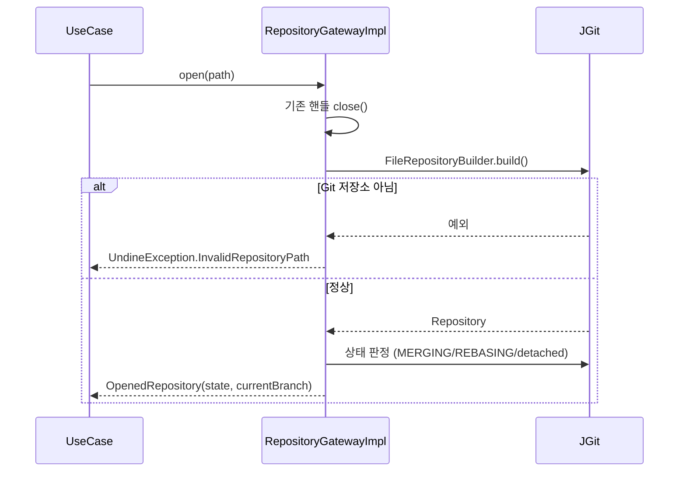
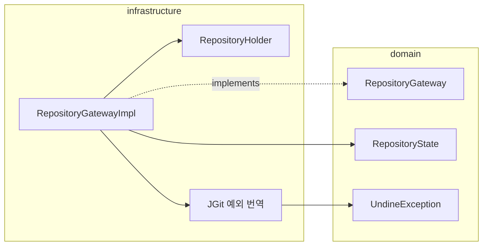

# [UND-02] 저장소 열기 · 워킹트리 상태 조회

> wave 2 · 사이즈 M · 의존 UND-01 · 소유 `infrastructure/git/repository/`

## 작업 내용 (설계 의도)
`RepositoryGateway` 를 JGit 으로 구현한다. 앱이 저장소를 **여는 유일한 경로**이자, 이후 모든 Gateway 가
공유할 `Repository` 인스턴스의 소유자다.

두 가지가 설계의 핵심이다.

1. **저장소 핸들은 세션당 하나만 연다.** 조회할 때마다 새로 열면 JGit 객체 캐시가 매번 무효화돼
   대형 저장소의 이력 로딩이 눈에 띄게 느려진다. 저장소를 **전환할 때만** 이전 것을 닫고 새로 연다.
   홀더는 처음부터 **세션 키로 조회하는 형태**로 둔다 — 단일 세션만 쓰더라도 그렇게 해야
   다중 저장소 탭(UND-44)이 이 계약을 깨지 않고 확장할 수 있다.
2. **워킹트리 상태 조회는 파일 수에 비례해 느려진다.** 상태를 화면이 필요할 때마다 통째로 다시 계산하지 않고,
   변경 파일 목록 단위로 반환해 호출부가 부분 갱신할 수 있게 한다.

열기 실패는 원인을 구분해 도메인 예외로 번역한다 — 경로 없음 / Git 저장소 아님 / 권한 없음은
사용자가 취할 행동이 각각 다르다. 베어 저장소는 워킹트리가 없으므로 열기 단계에서 거부한다.

`RepositoryState` 판정(정상·병합중·리베이스중·detached HEAD)도 여기서 담당한다 — 후행 티켓이
"지금 무엇을 할 수 있는가" 를 이 값으로 판단한다.

## 다이어그램

### 처리 흐름

### 클래스 의존

## 테스트 케이스

- 정상 저장소 경로를 열면 `OpenedRepository(state = NORMAL, currentBranch)` 를 반환한다
- Git 저장소가 아닌 디렉토리를 열면 `UndineException.InvalidRepositoryPath` 를 던진다
- 존재하지 않는 경로를 열면 경로 없음 예외를 던지며, 권한 없음과 구분된다
- 커밋이 0건인 빈 저장소를 열어도 예외 없이 열리고 HEAD 없음 상태를 보고한다
- detached HEAD 상태의 저장소는 `RepositoryState.DETACHED` 로 판정되고 `currentBranch` 가 null 이다
- 베어 저장소는 열기 단계에서 거부된다
- 저장소를 전환하면 이전 `Repository` 핸들이 닫힌다 (파일 핸들 누수 없음)
