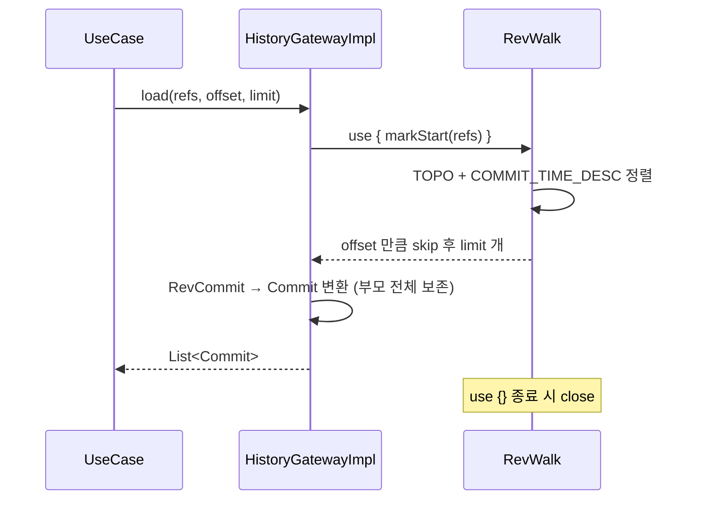
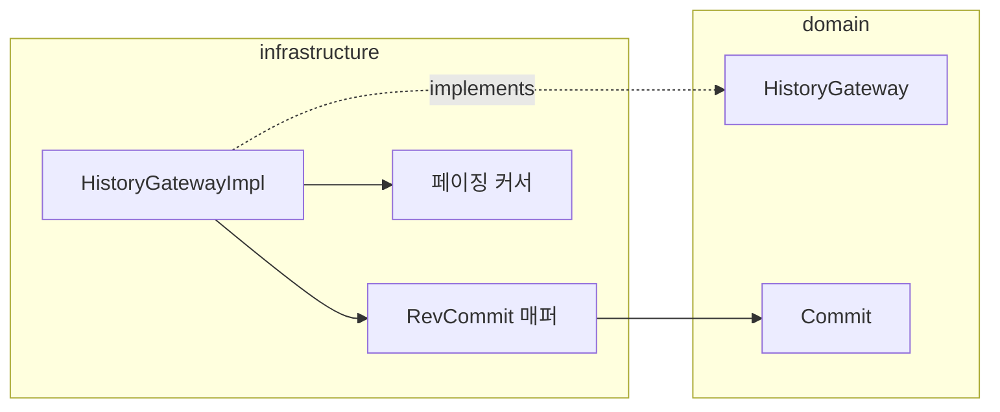

# [UND-03] 커밋 이력 조회 (페이징)

> wave 2 · 사이즈 M · 의존 UND-01 · 소유 `infrastructure/git/history/`

## 작업 내용 (설계 의도)
`HistoryGateway` 를 구현한다. 수만 커밋 저장소에서도 화면이 즉시 뜨는 것이 목표다.

**반환 목록의 전량 적재를 금지한다.** `RevWalk` 결과를 통째로 도메인 `Commit` 리스트에 담으면
대형 저장소에서 힙이 터진다. `(offset, limit)` 페이징으로 필요한 만큼만 `Commit` 으로 변환하고,
`RevWalk` 는 조회 단위로 열고 닫는다 — 재사용하면 순회 상태가 남아 두 번째 조회가 조용히
틀린 결과를 낸다.

커밋 정렬은 **위상 정렬 + 시각 역순**을 쓴다. 시각만으로 정렬하면 시스템 시계가 어긋난 커밋이 섞여
부모가 자식보다 위에 오는 그래프가 나온다.

**두 요구는 JGit 에서 완전히 양립하지 않는다.** JGit 의 위상 정렬 제너레이터(`TopoSortGenerator`)는
정렬 특성상 도달 가능한 `RevCommit` 을 내부 큐에 모은 뒤에야 첫 결과를 내보낸다. **정확성을 우선해
위상 정렬을 유지**하고, 적재 금지는 **도메인 `Commit` 목록에 한정**한다 (결정문 C5). 페이지당 비용이
저장소 크기에 비례하므로, 화면이 느려지면 커밋 그래프 캐시를 별도 티켓으로 다룬다.

병합 커밋은 부모가 둘 이상이다. 부모 ID 목록을 그대로 보존해야 UND-04 가 레인을 이을 수 있다 —
첫 번째 부모만 남기는 단순화를 하지 않는다.

브랜치 여러 개를 동시에 보려면 시작점이 여럿이므로, 시작 ref 목록을 인자로 받는다.

## 다이어그램

### 처리 흐름

### 클래스 의존

## 테스트 케이스

- 커밋 100건 저장소에서 `limit=20` 으로 조회하면 정확히 20건을 최신순으로 반환한다
- `offset` 을 이동시키며 전부 조회하면 중복·누락 없이 전체 커밋이 나온다
- 병합 커밋의 부모 ID 가 2개 모두 보존된다
- 커밋이 0건인 빈 저장소는 빈 리스트를 반환하고 예외를 던지지 않는다
- 커밋 1건짜리 저장소에서 부모 목록이 빈 리스트로 반환된다
- 시각이 부모보다 앞선 커밋이 있어도 부모가 자식보다 뒤에 정렬된다 (위상 정렬 우선)
- 조회 종료 후 `RevWalk` 가 닫혀 파일 핸들이 남지 않는다
