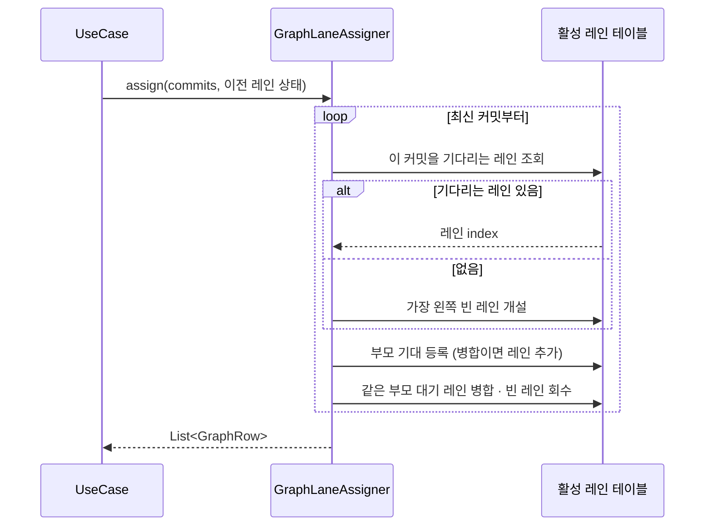
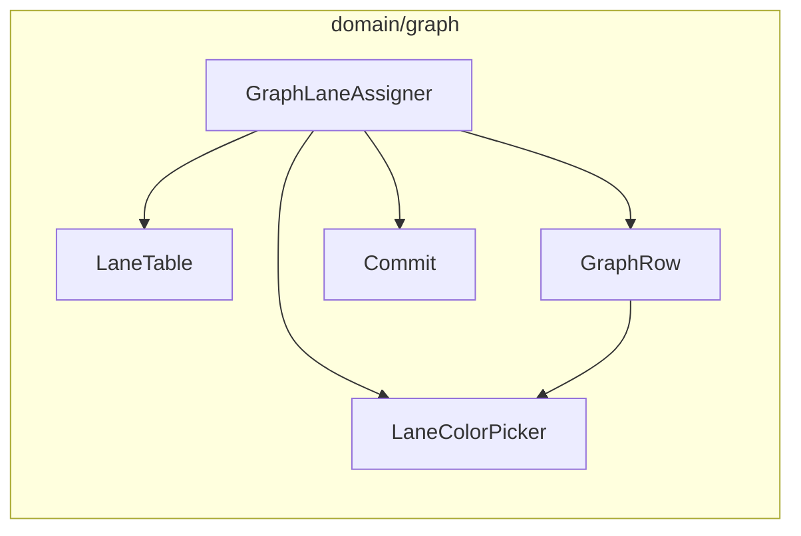

# [UND-04] 커밋 그래프 레인 배치 알고리즘

> wave 2 · 사이즈 M · 의존 UND-01 · 소유 `domain/graph/`

## 작업 내용 (설계 의도)
커밋 목록을 받아 **각 커밋이 몇 번 레인에 놓이고 어떤 선이 이어지는지**를 계산한다.
GitKraken 류 클라이언트의 핵심 차별점이자, 이 프로젝트에서 가장 알고리즘다운 부분이다.

**입력은 데이터, 출력도 데이터**다. 프레임워크를 써도 되지만 **저장소를 열지 않고 단위 테스트할 수 있어야**
한다 — 레인 배치는 이 프로젝트에서 가장 알고리즘다운 부분이라 빠른 결정적 테스트가 가치의 대부분이다.
입력은 `List<Commit>`(부모 ID 포함),
출력은 `List<GraphRow>`(레인 인덱스 + 통과선 + 색 인덱스). 저장소 없이 단위 테스트할 수 있어야 하고,
실제로 그렇게 테스트한다.

배치 규칙:

1. 커밋을 최신부터 훑으며 **활성 레인 테이블**을 유지한다. 각 레인은 "다음에 이 커밋을 기다린다" 는
   기대 커밋 ID 를 하나 갖는다.
2. 현재 커밋을 기다리던 레인이 있으면 그 레인에 놓는다. 없으면 **가장 왼쪽 빈 레인**을 새로 연다
   (브랜치 시작점).
3. 부모가 1개면 그 레인이 부모를 계속 기다린다. **부모가 2개 이상이면**(병합) 첫 부모는 현재 레인이,
   나머지는 새 레인이 기다린다 — 이게 병합선이다.
4. 여러 레인이 같은 부모를 기다리게 되면 **왼쪽 레인으로 합치고** 오른쪽 레인을 닫는다 (브랜치 합류).
5. 레인이 닫히면 이후 커밋이 그 자리를 재사용한다 — 재사용하지 않으면 오래된 저장소에서 레인이 수백 개로 늘어난다.

색은 레인 인덱스가 아니라 **레인이 열릴 때 배정한 색 슬롯**을 따른다. 인덱스를 그대로 쓰면 레인 재사용
시 색이 튄다.

페이징 경계에서 배치가 끊기지 않도록, 이전 페이지의 활성 레인 테이블을 이어받는 진입점을 둔다.

## 다이어그램

### 처리 흐름

### 클래스 의존

## 테스트 케이스

- 선형 이력(부모 1개씩)은 모든 커밋이 레인 0 에 배치된다
- 브랜치가 갈라지면 새 커밋이 레인 1 에 배치되고 통과선이 유지된다
- 병합 커밋은 두 부모 레인을 잇는 병합선을 만든다
- 닫힌 레인의 인덱스는 이후 커밋이 재사용한다 (레인 수가 무한히 늘지 않는다)
- 커밋 0건 입력은 빈 결과를 반환한다
- 부모가 3개인 옥토퍼스 병합도 레인이 끊기지 않는다
- 레인이 재사용돼도 색 슬롯이 이전 레인과 겹치지 않는다
- 페이지 경계에서 이전 레인 상태를 이어받으면 통과선이 끊기지 않는다
