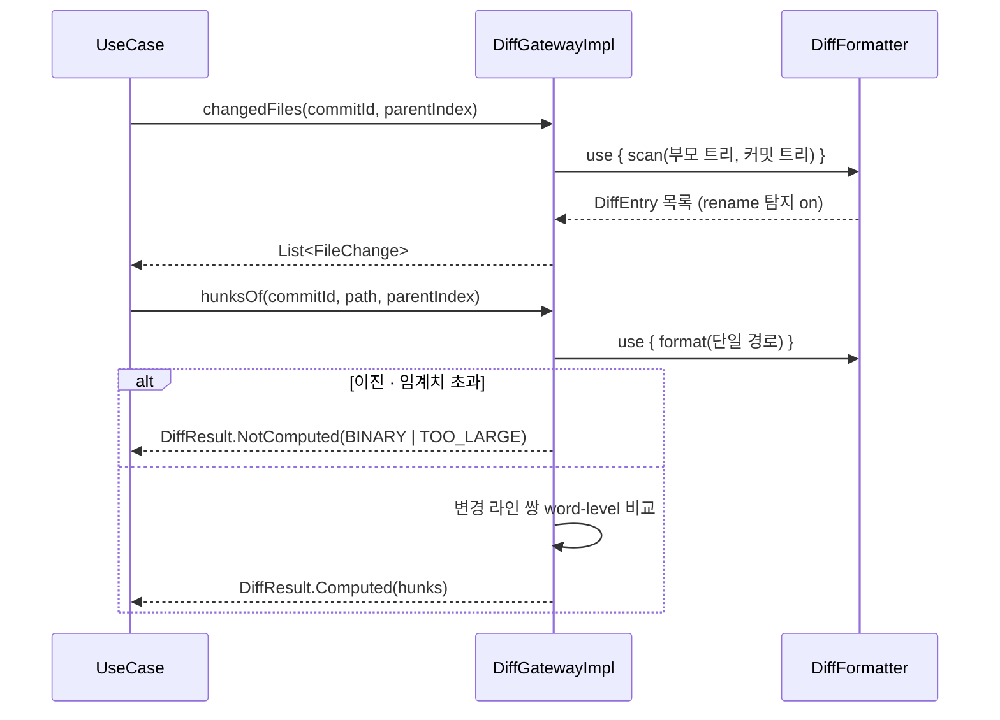
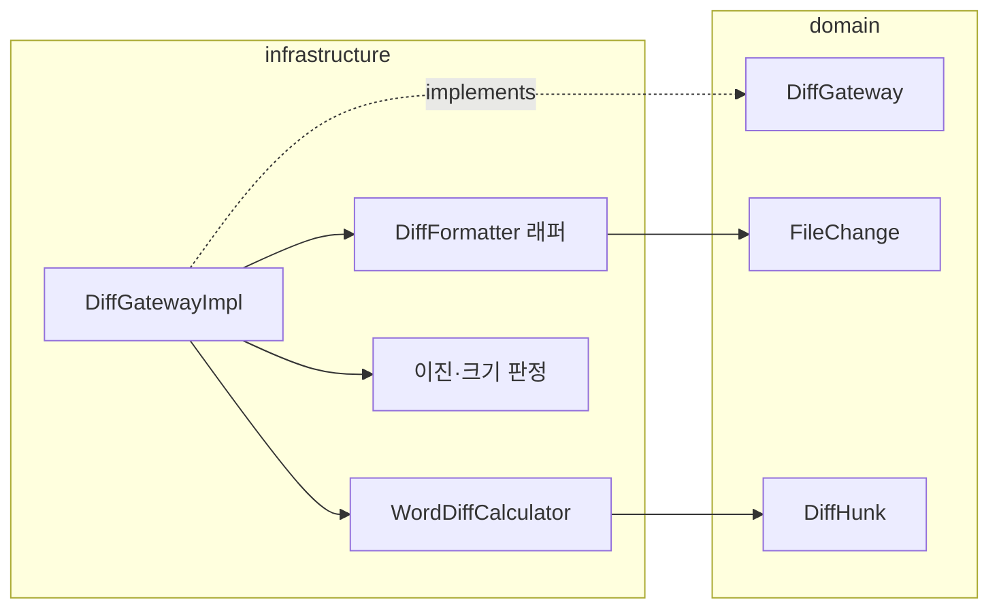

# [UND-05] Diff 계산 (파일 · hunk · word-level)

> wave 2 · 사이즈 M · 의존 UND-01 · 소유 `infrastructure/git/diff/`

## 작업 내용 (설계 의도)
`DiffGateway` 를 구현한다. 세 가지 축의 diff 를 같은 계약으로 제공한다 —
`changedFiles(commitId, parentIndex)`(커밋↔지정 부모) · `changedFilesUnstaged()`(워킹트리↔인덱스) ·
`changedFilesStaged()`(인덱스↔HEAD). `parentIndex` 는 병합 커밋에서 비교 부모를 고르는 인자다.

**지연 계산이 원칙이다.** 커밋 목록을 그릴 때 전체 diff 를 미리 만들면 대형 저장소에서 즉시 멈춘다.
파일 목록(경로 + 변경 종류 + 증감 라인 수)과 **개별 파일의 hunk 내용**을 분리해서,
사용자가 파일을 고른 순간에만 hunk 를 계산한다.

word-level diff 는 라인 diff 위에서 계산한다 — 변경된 라인 쌍에 대해서만 토큰 단위로 비교해
UI 가 강조 구간을 받을 수 있게 한다. 라인 전체를 다시 비교하지 않는다.

이진 파일과 대용량 파일은 **내용을 읽지 않는다.** 이진 판정 결과만 돌려주고 UI 가 "이진 파일" 로
표시하게 한다. 임계치를 넘는 텍스트 파일도 hunk 생성을 생략하고 그 사실을 명시한다 —
조용히 빈 diff 를 반환하면 "변경 없음" 으로 오해된다.

이름 변경 탐지를 켜서 rename 을 삭제+추가 두 건으로 보고하지 않는다.

## 다이어그램

### 처리 흐름

### 클래스 의존

## 테스트 케이스

- 한 줄 수정한 커밋의 변경 파일 목록에 해당 파일이 1건 나온다
- hunk 내용은 파일을 지정해 요청했을 때만 계산된다 (목록 조회 시 미계산)
- 파일 이름만 바뀐 변경이 rename 1건으로 보고된다 (삭제+추가 2건이 아니다)
- 이진 파일은 `DiffResult.NotComputed(BINARY)` 로 반환된다
- 임계치를 넘는 대용량 텍스트 파일은 `DiffResult.NotComputed(TOO_LARGE)` 로 반환된다
- 최초 커밋(부모 없음)의 diff 는 전체 추가로 계산된다
- word-level 결과가 변경된 라인 쌍에만 존재하고 동일 라인에는 없다
- `DiffFormatter` 가 조회 후 닫힌다
