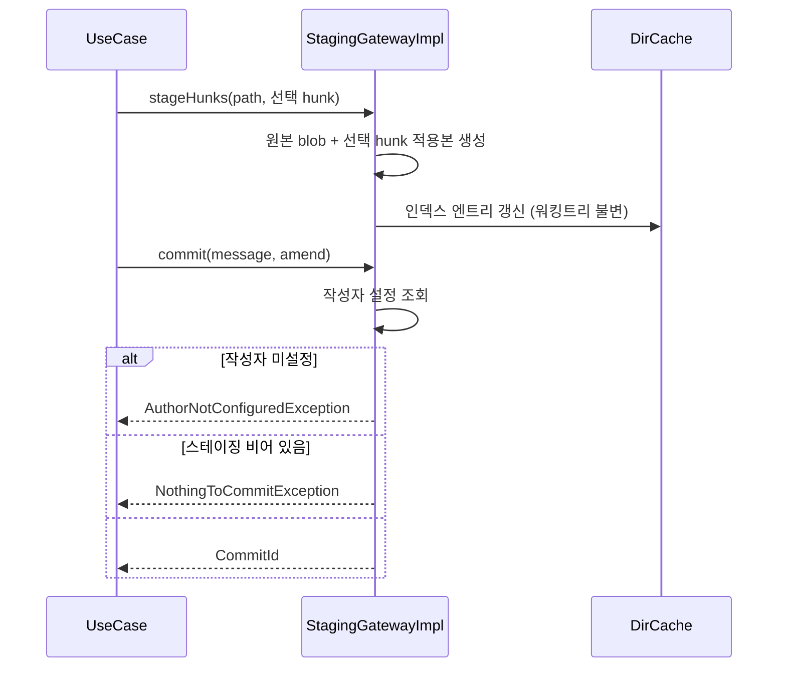
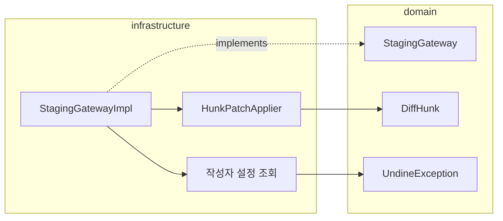

# [UND-06] 스테이징 · 커밋

> wave 2 · 사이즈 M · 의존 UND-01 · 소유 `infrastructure/git/staging/`

## 작업 내용 (설계 의도)
`StagingGateway` 를 구현한다. 파일 단위 stage/unstage, **hunk 단위 부분 stage**, 그리고 커밋 생성이다.

hunk 단위 스테이징이 이 티켓의 난이도 대부분을 차지한다. JGit 의 `AddCommand` 는 파일 단위라
부분 적용을 지원하지 않으므로, **선택한 hunk 만 적용한 blob 을 만들어 인덱스에 직접 기록**한다.
워킹트리 파일은 건드리지 않는다 — 사용자가 편집 중인 내용을 앱이 덮어쓰면 안 된다.

커밋 생성 시 작성자 정보는 저장소·전역 Git 설정에서 읽는다. **앱이 임의로 채우지 않는다** —
설정이 없으면 커밋을 만들지 않고 사용자에게 설정을 요구한다. 잘못된 작성자로 쌓인 커밋은
되돌리는 비용이 크다.

amend 는 별도 경로로 둔다. 이미 push 된 커밋을 amend 하면 이력이 갈라지므로,
Gateway 는 amend **실행 전에** 대상과 원격 존재 여부를 조회해 UI 가 확인을 받을 수 있게 한다.
사전 확인 계약과 실행 직전 재검사는 [UND-53](UND-53-amend-preflight-contract.md) 이 소유한다 —
원격 존재 여부는 커밋 결과가 아니라 amend preflight 결과로 돌아온다.

빈 커밋과 빈 메시지는 거부한다.

**롤백**: 커밋은 직전 커밋으로 soft reset 해 되돌리고 스테이징 이동은 반대 동작으로 복구한다 — amend 는 UND-53 이 남기는 백업 ref 가 복구 지점이다.

## 다이어그램

### 처리 흐름

### 클래스 의존

## 테스트 케이스

- 파일을 stage 하면 staged 목록에 나타나고 unstaged 목록에서 사라진다
- 변경을 stage 한 뒤 커밋하면 새 CommitId 가 반환되고 이력에 반영된다
- hunk 1개만 stage 하면 인덱스에는 반영되고 **워킹트리 파일은 변경되지 않는다**
- 작성자 설정이 없으면 커밋하지 않고 `UndineException.AuthorNotConfigured` 를 던진다
- 스테이징이 비어 있으면 커밋을 거부한다
- 빈 메시지로 커밋하면 거부된다
- amend 대상 커밋이 원격에 존재하면 그 사실이 preflight 결과에 포함된다 (UND-53)
- 삭제된 파일을 stage 하면 인덱스에서도 삭제로 기록된다
- unstage 후 다시 stage 해도 결과가 동일하다 (멱등)
