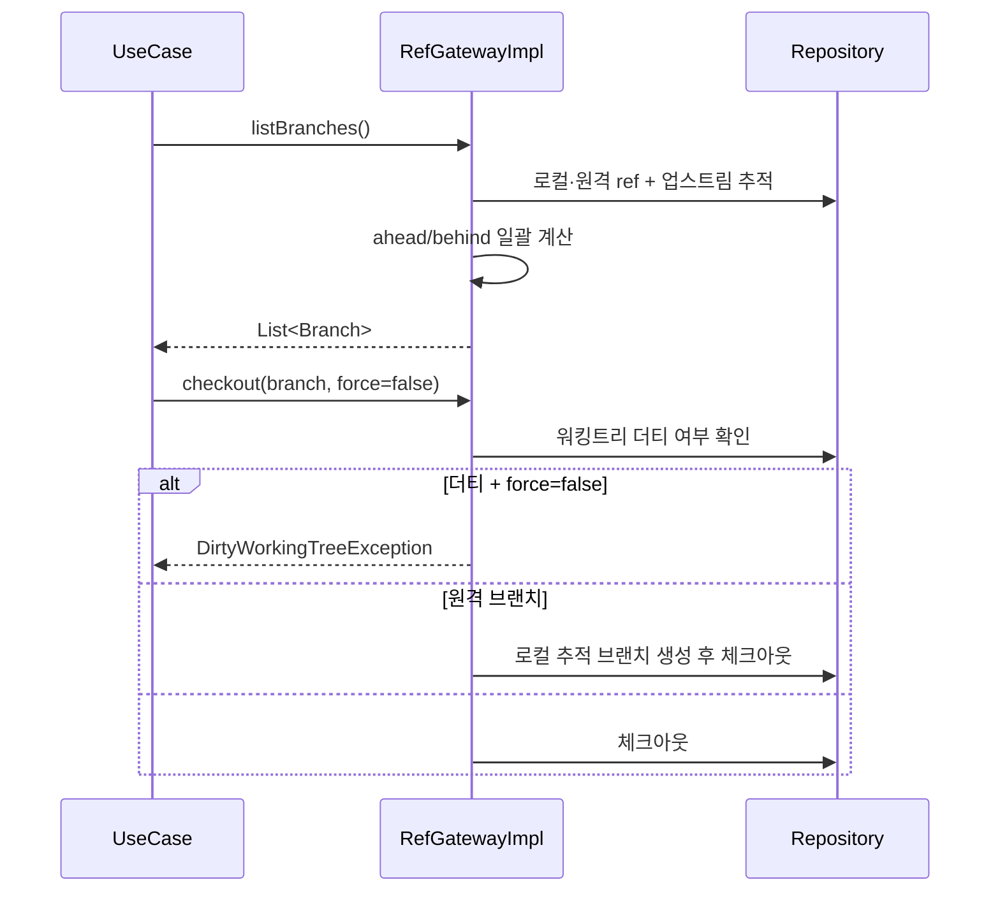
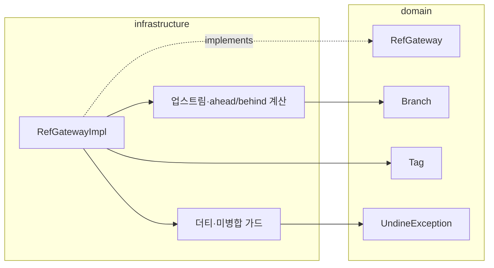

# [UND-07] 브랜치 · 태그 관리

> wave 2 · 사이즈 M · 의존 UND-01 · 소유 `infrastructure/git/ref/`

## 작업 내용 (설계 의도)
`RefGateway` 를 구현한다. 로컬/원격 브랜치와 태그의 목록 조회, 생성, 이름 변경, 삭제, 체크아웃이다.

**체크아웃은 데이터 유실 위험이 있는 유일한 조회성 동작**이다. 워킹트리가 더티한 상태에서
강제 체크아웃하면 사용자의 편집이 사라진다. Gateway 는 기본적으로 **더티 상태면 거부**하고,
강제 여부를 명시적 인자로만 받는다 — 기본값을 강제로 두지 않는다.

브랜치 삭제도 마찬가지다. 병합되지 않은 브랜치를 지우면 커밋이 도달 불가가 된다.
기본은 거부하고, 미병합 여부를 결과에 담아 UI 가 경고 후 재시도하게 한다.

목록 조회는 각 브랜치의 **업스트림 추적 정보와 ahead/behind 개수**를 함께 반환한다 —
사이드바가 "2↑ 1↓" 를 그리려면 이 값이 필요하고, 브랜치마다 따로 계산하면 느리므로 한 번에 모은다.

원격 브랜치는 체크아웃 시 로컬 추적 브랜치를 만들어야 한다 — 원격 ref 를 직접 체크아웃하면
detached HEAD 가 되어 사용자가 커밋을 잃기 쉽다.

**롤백**: 브랜치·태그 생성은 삭제로 되돌리고, 체크아웃은 이전 ref 로 재체크아웃한다.

## 다이어그램

### 처리 흐름

### 클래스 의존

## 테스트 케이스

- 로컬·원격 브랜치 목록이 업스트림 추적 정보와 함께 반환된다
- 업스트림보다 2 커밋 앞선 브랜치의 ahead 가 2, behind 가 0 으로 계산된다
- 워킹트리가 더티하면 체크아웃이 `DirtyWorkingTreeException` 으로 거부된다
- `force=true` 를 명시하면 더티 상태에서도 체크아웃된다
- 원격 브랜치를 체크아웃하면 로컬 추적 브랜치가 생성되고 detached HEAD 가 되지 않는다
- 미병합 브랜치 삭제는 기본 거부되고 미병합 사실이 결과에 담긴다
- 이미 존재하는 이름으로 브랜치를 만들면 거부된다
- 현재 체크아웃된 브랜치는 삭제할 수 없다
- 커밋이 0건인 저장소에서 브랜치 목록은 빈 리스트를 반환한다
