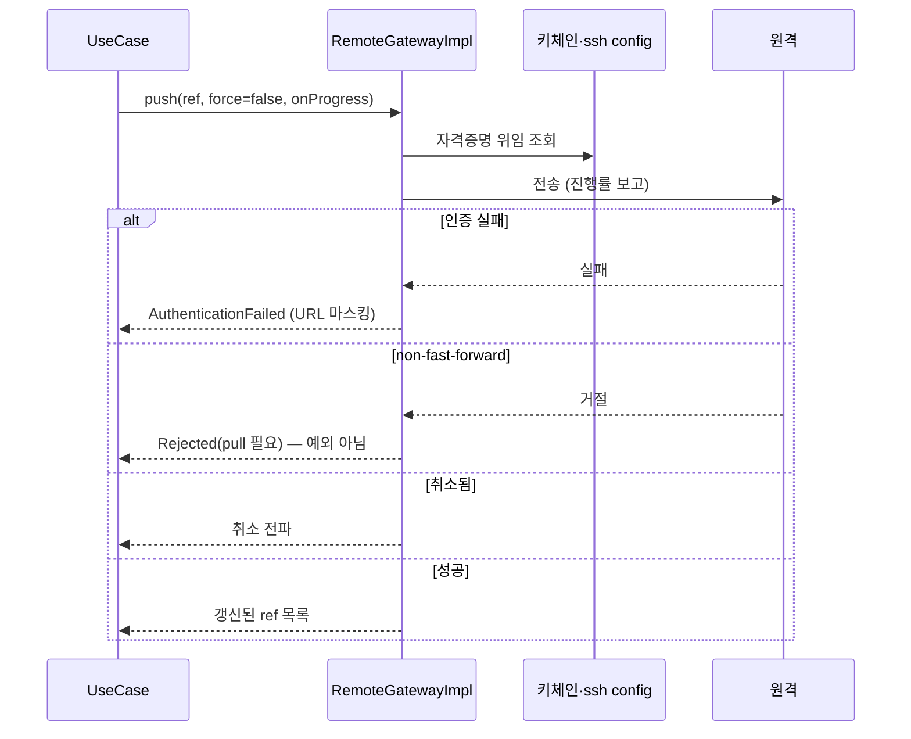
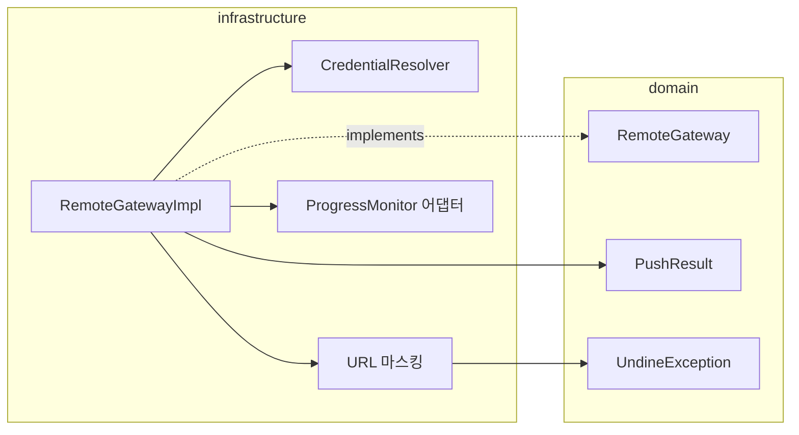

# [UND-08] 원격 동기화 (clone/fetch/pull/push) · 인증

> wave 2 · 사이즈 L · 의존 UND-01 · 소유 `infrastructure/git/remote/`

## 작업 내용 (설계 의도)
`RemoteGateway` 를 구현한다. clone·fetch·pull·push 와 **자격증명 취급**이 범위다.
이 티켓은 앱에서 가장 민감한 코드를 담는다.

자격증명 원칙은 [`credential-handling`](../.agent/rules/credential-handling.md) 이 정본이다. 요지는 셋이다.

1. **앱이 자격증명을 저장하지 않는다.** OS 키체인과 기존 `~/.ssh/config`·credential helper 에 위임한다.
   사용자가 이미 구성한 인증 경로를 앱이 우회하거나 덮어쓰지 않는다.

   **해소 경로**: JGit transport 의 자격증명 제공자 인터페이스를 구현하되, 그 구현은 값을 스스로 갖지 않고
   (a) HTTPS 는 **git credential helper 프로세스**에, (b) SSH 는 **`~/.ssh/config` 와 ssh-agent** 에 위임한다.
   앱에는 비밀번호 입력란이 없으므로 **helper·agent 가 없으면 인증을 완성할 수 없다** — 이 경우
   "자격증명 제공자를 찾을 수 없음" 으로 **안전하게 실패**하고 설정 방법을 안내한다. 조용히 익명 접근으로
   떨어지지 않는다.

   > 구체 API 이름은 스펙 단계(`develop-1-spec` 의 evidence 노드)에서 실제 JGit 버전으로 확인해 고정한다 —
   > 여기서 단정하지 않는다.
2. **예외 메시지를 그대로 올리지 않는다.** JGit 의 `TransportException` 메시지에는 원격 URL 이 들어가고
   거기에 토큰이 포함될 수 있다. 도메인 예외로 감싸면서 자격증명 구간을 마스킹한다.
3. **호스트 키 검증을 끄지 않는다.** 편의를 위한 `StrictHostKeyChecking` 무력화는 하지 않는다.

네트워크 작업은 전부 **취소 가능**해야 한다. 대형 저장소 clone 은 수 분이 걸리고, 사용자가 취소하면
즉시 멈춰야 한다. 진행률 콜백을 계약에 포함해 UI 가 상태를 그릴 수 있게 한다.

push 는 되돌릴 수 없다. force push 는 별도 인자로만 받고 기본값을 켜지 않는다. non-fast-forward
거절은 실패가 아니라 **정상적인 결과**이므로 예외가 아니라 결과 타입으로 구분해 반환한다 —
UI 가 "pull 후 재시도" 를 안내할 수 있어야 한다.

**롤백**: push 는 되돌릴 수 없다 — force push 는 사용자 확인을 거치고, 실패 시 로컬 ref 는 변경하지 않는다.

## 다이어그램

### 처리 흐름

### 클래스 의존

## 테스트 케이스

- 로컬 파일 경로를 원격으로 등록해 clone 하면 커밋 이력이 그대로 복제된다
- fetch 후 원격 추적 ref 가 갱신되고 로컬 브랜치는 변경되지 않는다
- non-fast-forward push 는 예외가 아니라 `Rejected` 결과로 반환된다
- 인증 실패 예외 메시지에 토큰·자격증명 문자열이 포함되지 않는다 (마스킹 검증)
- 진행 중 코루틴을 취소하면 전송이 중단되고 `CancellationException` 이 전파된다
- force push 는 명시적 인자 없이는 수행되지 않는다
- 진행률 콜백이 0 에서 시작해 단조 증가한다
- 원격이 없는 저장소에서 fetch 하면 원격 미설정 예외를 던진다
- credential helper 도 ssh-agent 도 없는 환경에서는 "자격증명 제공자 없음" 으로 실패하고 익명 접근으로 떨어지지 않는다
