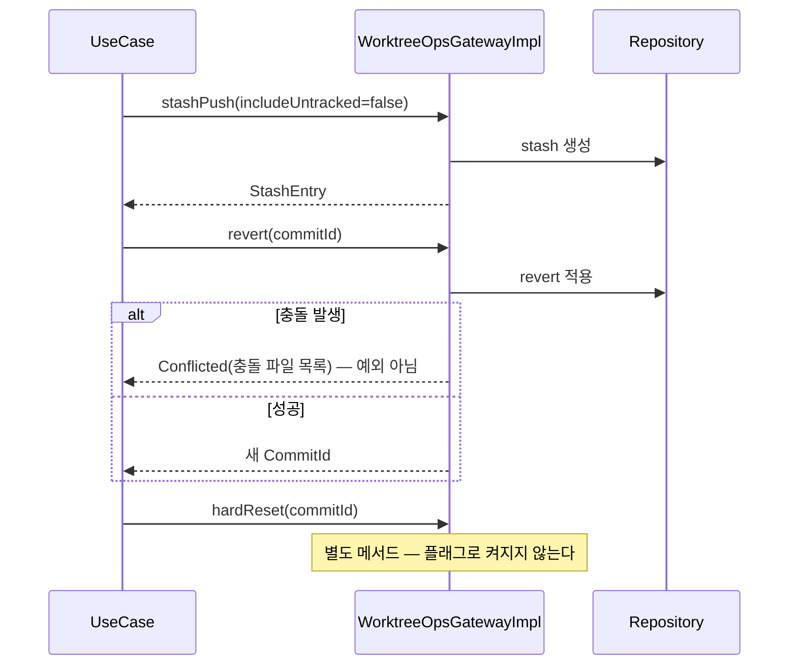
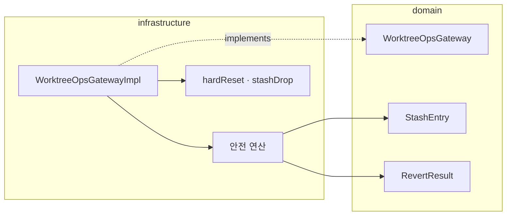

# [UND-09] Stash · Reset · Revert

> wave 2 · 사이즈 M · 의존 UND-01 · 소유 `infrastructure/git/worktreeops/`

## 작업 내용 (설계 의도)
`WorktreeOpsGateway` 를 구현한다. 워킹트리 상태를 바꾸는 **위험한 연산들**을 한곳에 모은다.

세 연산의 위험도가 다르므로 계약에서 구분한다.

| 연산 | 되돌리기 | 계약 설계 |
|---|---|---|
| stash push/pop/apply | 가능 (stash 보존) | 기본 허용 |
| revert | 가능 (새 커밋 추가) | 기본 허용 |
| reset --soft/--mixed | 가능 (워킹트리 보존) | 기본 허용 |
| **reset --hard** | **불가 (편집 유실)** | 별도 메서드 + 명시 인자 |
| **stash drop/clear** | **불가** | 별도 메서드 + 명시 인자 |

되돌릴 수 없는 두 연산은 **같은 메서드의 boolean 플래그로 만들지 않는다.** 플래그는 실수로 켜지지만
메서드 이름은 실수로 호출되지 않는다 — `hardReset()` 은 호출부에서 의도가 읽힌다.

stash 는 추적되지 않는 파일을 기본으로 포함하지 않는다. 포함 여부를 인자로 받되, 포함하면
`clean` 과 같은 효과가 나므로 그 사실을 결과에 명시한다.

revert 는 충돌할 수 있다. 충돌은 실패가 아니라 **정상적인 결과**이므로 결과 타입으로 반환하고,
저장소가 revert 진행 중 상태로 남았음을 알린다 (UND-23 충돌 에디터가 이어받는다).

**롤백**: reset --hard·stash drop 은 되돌릴 수 없다 — 실행 전 확인 절차를 UI 가 강제하고, Gateway 는 기본값을 안전한 쪽에 둔다.

## 다이어그램

### 처리 흐름

### 클래스 의존

## 테스트 케이스

- stash push 후 워킹트리가 깨끗해지고 pop 하면 변경이 복원된다
- 추적되지 않는 파일은 기본 stash 에 포함되지 않는다
- `includeUntracked=true` 로 stash 하면 추적되지 않는 파일도 포함되고 그 사실이 결과에 담긴다
- revert 충돌은 예외가 아니라 `Conflicted` 결과와 충돌 파일 목록으로 반환된다
- revert 충돌 후 저장소 상태가 revert 진행 중으로 보고된다
- `reset --soft` 후 워킹트리와 인덱스 내용이 보존된다
- `hardReset` 은 별도 메서드로만 호출 가능하다 (플래그 인자 부재 검증)
- stash 가 0건일 때 pop 하면 stash 없음 예외를 던진다
