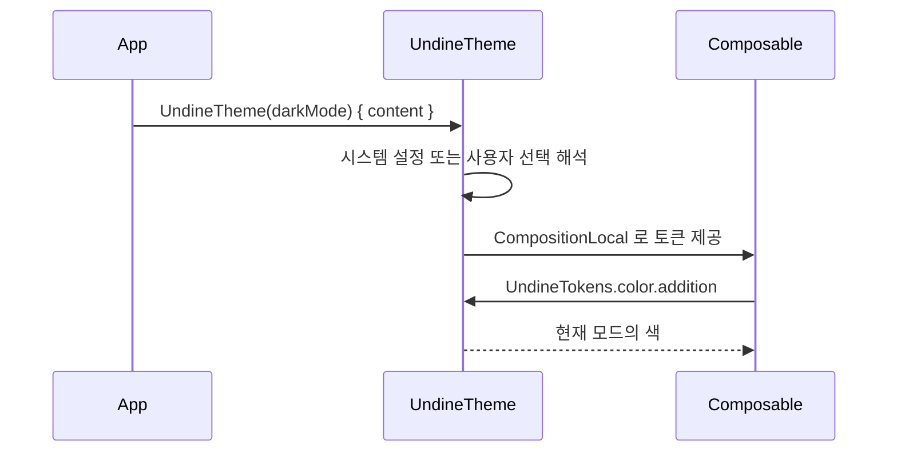
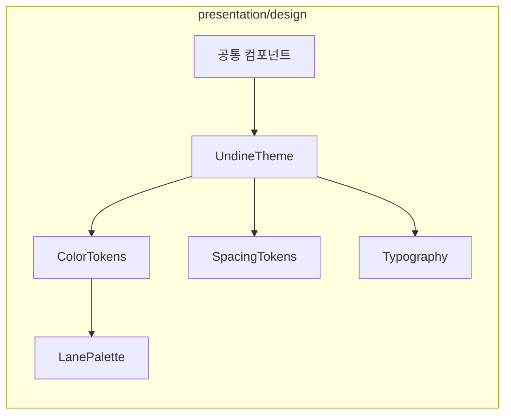

# [UND-10] 디자인 시스템 · 테마

> wave 2 · 사이즈 M · 의존 UND-01 · 소유 `presentation/design/`

## 작업 내용 (설계 의도)
모든 UI 티켓(UND-12~24)이 참조하는 **시각 계약**을 확립한다. 독립 병목이므로 다른 wave 2 티켓과
파일이 겹치지 않고 같은 wave 에서 병렬로 만들 수 있다.

토큰으로 정의하는 것:

| 축 | 내용 |
|---|---|
| 색 | 배경·표면·경계·전경 3단계·강조·상태색(추가/삭제/충돌/경고) |
| 그래프 레인 색 | 8~12색 팔레트 — 인접 레인이 구분되고 라이트/다크 양쪽에서 대비가 유지될 것 |
| 간격 | 4px 배수 스케일 |
| 타이포 | UI 서체 + **고정폭 서체**(diff·해시 전용) |
| 모양 | 모서리 반경, 경계 두께 |

**Composable 에 색을 하드코딩하지 않는다.** 라이트/다크 전환이 한 곳에서 끝나야 하고,
그러려면 토큰을 통해서만 색을 참조해야 한다. 이 규칙은 [`compose-ui`](../.agent/rules/compose-ui.md) 규칙 5 이며
리뷰에서 강제된다.

diff 색은 **색만으로 구분하지 않는다.** 추가/삭제는 배경색과 함께 `+`/`−` 기호를 쓴다 —
색각 이상 사용자에게 색상 대비만으로는 정보가 전달되지 않는다.

공통 컴포넌트도 여기서 만든다: 아이콘 버튼, 툴바 버튼, 리스트 행, 빈 상태 표시, 진행 표시, 토스트.

## 다이어그램

### 처리 흐름

### 클래스 의존

## 테스트 케이스

- 라이트/다크 모드 전환 시 모든 토큰이 대응 값으로 바뀐다
- 그래프 레인 팔레트의 인접 색이 라이트·다크 양쪽에서 최소 대비 기준을 만족한다
- diff 추가/삭제 표시가 색 외에 기호로도 구분된다
- 공통 컴포넌트가 토큰 외의 색 리터럴을 사용하지 않는다 (소스 스캔 테스트)
- 고정폭 서체가 diff·해시 컴포넌트에 적용된다
- 시스템 테마 설정이 없을 때 기본값으로 안전하게 렌더링된다
