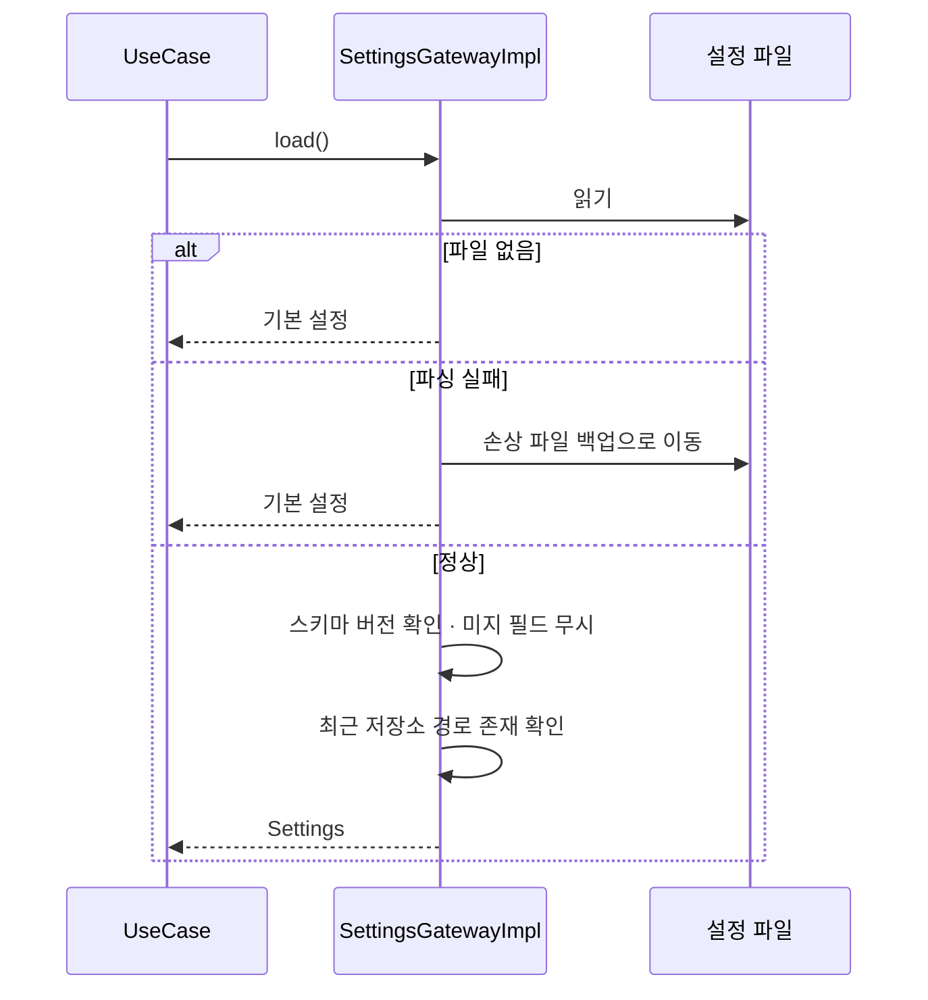
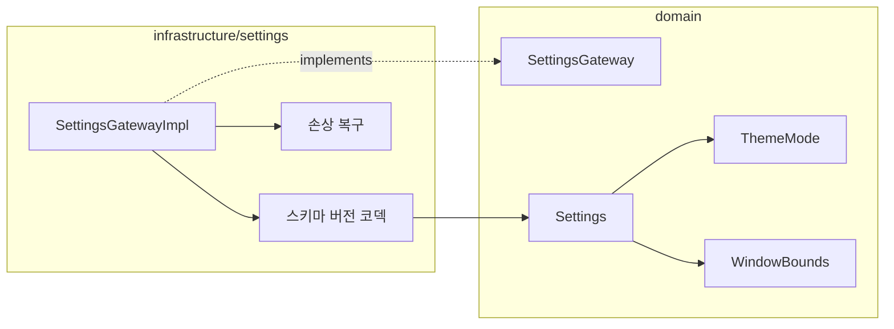

# [UND-11] 앱 설정 · 최근 저장소 영속화

> wave 2 · 사이즈 S · 의존 UND-01 · 소유 `infrastructure/settings/`

## 작업 내용 (설계 의도)
`SettingsGateway` 를 구현한다. UND-01 이 확정한 1차 계약은 다음과 같다.

```
Settings(recentRepositories: List<RepositoryPath>, theme: ThemeMode, window: WindowBounds)
ThemeMode   = LIGHT · DARK · SYSTEM
WindowBounds(width: Int, height: Int, maximized: Boolean)
```

**이 스키마의 확장은 이 티켓이 소유한다.** 최근 저장소의 마지막 접근 시각, 창 위치(x·y),
분할 비율(UND-12) 같은 필드가 필요하면 여기서 `Settings` 를 넓힌다 — UND-01 은 wave 1 이라
교차 wave 재수정으로 충돌하지 않는다.

**설정 파일은 앱과 함께 진화한다.** 새 버전이 필드를 추가했을 때 구버전이 그 파일을 읽어도
크래시하지 않아야 하고, 그 반대도 마찬가지다. 그래서 세 가지를 지킨다.

1. **스키마 버전 필드를 처음부터 넣는다.** 나중에 추가하면 이미 배포된 파일에는 없다.
2. **모르는 필드는 무시하고 읽는다.** 엄격 파싱은 하위 호환을 깨뜨린다.
3. **파싱 실패는 크래시가 아니라 기본값 복구다.** 손상된 설정 파일 때문에 앱이 열리지 않으면
   사용자는 복구 수단이 없다. 손상 파일은 백업으로 옮기고 기본값으로 시작한다.

**자격증명은 여기에 저장하지 않는다.** 토큰·패스프레이즈는 OS 키체인 소관이며 이 파일에는 어떤
비밀도 기록하지 않는다 ([`credential-handling`](../.agent/rules/credential-handling.md) 규칙 1).

최근 저장소는 경로만 저장하되, **읽을 때 존재 여부를 확인**한다 — 지워진 디렉토리가 목록에 남아
클릭하면 오류가 나는 것보다, 목록에서 회색 처리하거나 정리하는 편이 낫다.

**롤백**: 설정 파일 스키마 변경 시 구버전 필드를 읽는 fallback 을 유지하고, 파싱 실패는 기본값으로 복구한다.

## 다이어그램

### 처리 흐름



### 클래스 의존



## 테스트 케이스

- 설정을 저장한 뒤 다시 읽으면 동일한 값이 복원된다
- 설정 파일이 없으면 기본값으로 시작하고 예외를 던지지 않는다
- 손상된 설정 파일은 백업으로 옮겨지고 기본값으로 복구된다
- 알 수 없는 필드가 포함된 설정 파일도 오류 없이 읽힌다 (상위 호환)
- 최근 저장소 목록에서 존재하지 않는 경로가 사용 불가로 표시된다
- 최근 저장소는 최대 개수를 넘으면 오래된 항목부터 제거된다
- 같은 경로를 다시 열면 목록에 중복되지 않고 최상단으로 이동한다
- 설정 파일에 어떤 자격증명 문자열도 기록되지 않는다
