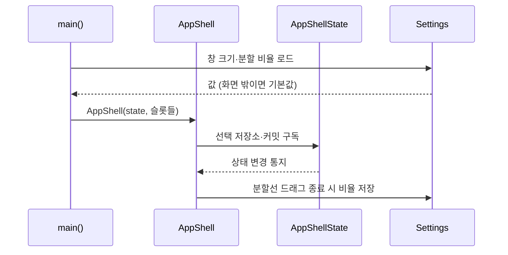
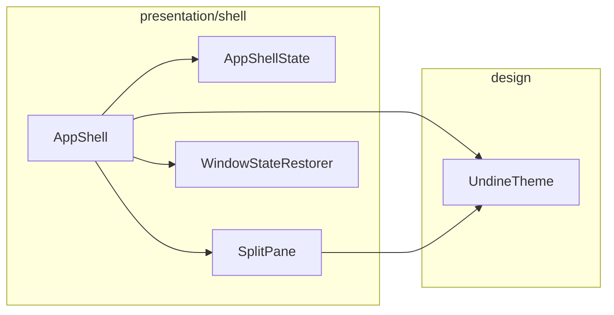

# [UND-12] 앱 셸 3분할 레이아웃

> wave 3 · 사이즈 M · 의존 UND-10 · 소유 `presentation/shell/`

## 작업 내용 (설계 의도)
창 골격과 3분할 레이아웃을 만든다. **각 영역은 슬롯(Composable 파라미터)으로 비워 둔다** —
실제 컴포넌트는 UND-13~20 이 각자 만들고, 연결은 통합 티켓 UND-26 이 한다.
이렇게 나눠야 wave 3 의 UI 티켓 9개가 같은 파일을 건드리지 않고 병렬로 진행된다.

레이아웃 구조:

```
┌──────────────────────────────────────────┐
│ 툴바 (slot)                              │
├──────────┬───────────────────────────────┤
│ 사이드바 │ 중앙 (그래프 slot)            │
│ (slot)   ├───────────────────────────────┤
│          │ 하단 (상세/diff slot)         │
└──────────┴───────────────────────────────┘
```

분할선은 **드래그로 크기 조절**되고 그 비율이 설정에 저장된다. 최소 폭을 두어 영역이 0 으로
찌그러지지 않게 한다.

창 크기·위치도 복원한다. 다만 **저장된 위치가 현재 모니터 구성에서 화면 밖이면 기본 위치로 되돌린다** —
외장 모니터를 뺀 뒤 앱이 보이지 않는 창으로 뜨는 흔한 사고를 막는다.

전역 상태 홀더(`AppShellState`)가 현재 선택된 저장소·커밋·파일을 보유한다. 하위 컴포넌트는
이 상태를 인자로 받고 직접 수정하지 않는다 — 상태 끌어올리기([`compose-ui`](../.agent/rules/compose-ui.md) 규칙 1).

## 다이어그램

### 처리 흐름



### 클래스 의존



## 테스트 케이스

- 3개 슬롯이 각각 지정한 위치에 렌더링된다
- 분할선을 드래그하면 영역 비율이 바뀌고 종료 시 설정에 저장된다
- 영역을 최소 폭 미만으로 드래그해도 최소 폭이 유지된다
- 저장된 창 위치가 현재 화면 밖이면 기본 위치로 복원된다
- 슬롯에 아무것도 넣지 않아도 레이아웃이 예외 없이 렌더링된다
- 테마를 전환하면 셸 배경과 분할선 색이 함께 바뀐다
