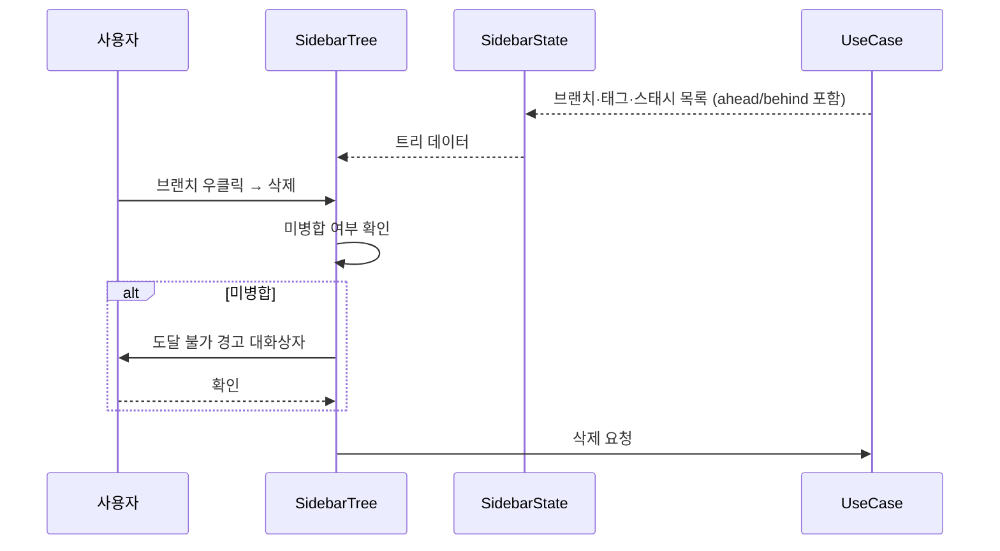
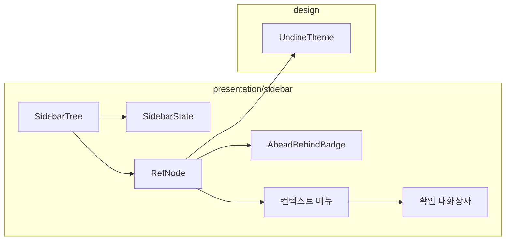

# [UND-13] 사이드바 레퍼런스 트리

> wave 3 · 사이즈 M · 의존 UND-07, UND-09, UND-10 · 소유 `presentation/sidebar/`

## 작업 내용 (설계 의도)
로컬 브랜치·원격 브랜치·태그·스태시를 접을 수 있는 트리로 보여준다. 저장소 탐색의 주 진입점이다.

각 브랜치 행에는 **ahead/behind 배지**(`2↑ 1↓`)를 표시한다. 값은 UND-07 이 목록 조회 시 한 번에
계산해 오므로 행마다 따로 조회하지 않는다.

현재 체크아웃된 브랜치는 시각적으로 구분한다. detached HEAD 상태면 그 사실을 트리 상단에 명시한다 —
사용자가 모른 채 커밋하면 나중에 찾기 어려운 커밋이 된다.

컨텍스트 메뉴로 체크아웃·이름 변경·삭제·병합 대상 선택을 제공한다. **파괴적 항목은 확인 대화상자를 거친다.**
특히 미병합 브랜치 삭제는 "커밋이 도달 불가가 된다" 는 사실을 문장으로 알린다 —
"정말 삭제하시겠습니까" 만으로는 결과가 전달되지 않는다.

브랜치가 수백 개인 저장소를 위해 필터 입력을 둔다. 트리 노드는 `LazyColumn` + 안정적 `key`(ref 이름)로
그린다 — key 가 없으면 필터 입력마다 전체가 재구성된다.

## 다이어그램

### 처리 흐름

### 클래스 의존

## 테스트 케이스

- 로컬·원격 브랜치, 태그, 스태시가 각 그룹으로 묶여 표시된다
- 현재 체크아웃된 브랜치가 시각적으로 구분된다
- ahead/behind 값이 배지로 표시되고 0 이면 배지가 숨겨진다
- detached HEAD 상태가 트리 상단에 명시된다
- 미병합 브랜치 삭제 시 도달 불가 경고가 포함된 확인 대화상자가 뜬다
- 필터 입력으로 브랜치 목록이 좁혀진다
- 브랜치가 0건이면 빈 상태 안내가 표시된다
- `LazyColumn` 항목에 ref 이름 key 가 지정된다 (필터 시 전체 재구성 없음)
