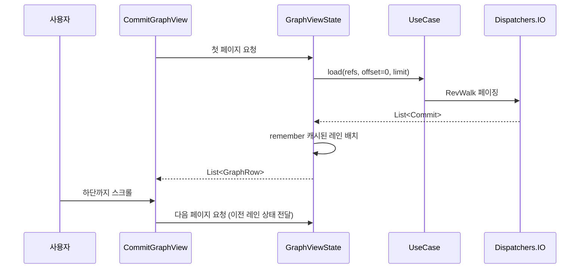
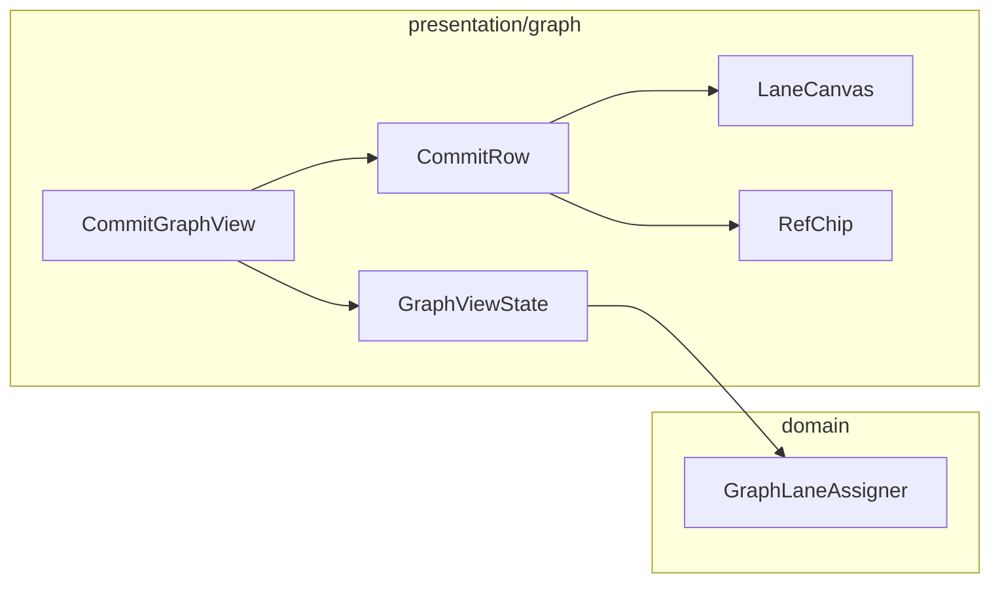

# [UND-14] 커밋 그래프 뷰 렌더링

> wave 3 · 사이즈 L · 의존 UND-03, UND-04, UND-10 · 소유 `presentation/graph/`

## 작업 내용 (설계 의도)
UND-04 가 계산한 `GraphRow` 를 실제로 그린다. **이 앱의 얼굴**이자 성능이 가장 민감한 화면이다.

성능 설계가 이 티켓의 본체다.

1. **가상 스크롤.** `LazyColumn` 에 커밋 해시를 `key` 로 준다. key 가 없으면 스크롤할 때마다
   전체가 재구성돼 수천 커밋에서 프레임이 무너진다.
2. **레인 배치는 캐시한다.** `remember(commitsPage)` 로 감싸 매 프레임 다시 계산하지 않는다.
   [`compose-ui`](../.agent/rules/compose-ui.md) 규칙 4.
3. **무한 스크롤.** 하단에 도달하면 다음 페이지를 `Dispatchers.IO` 에서 불러온다. UI 스레드에서
   `RevWalk` 를 돌리면 스크롤이 통째로 멈춘다.
4. **그래프는 Canvas 로 한 번에 그린다.** 커밋마다 Composable 을 중첩하면 노드 수가 폭발한다.
   레인 선·노드는 행 단위 `Canvas` 에서 직접 그린다.

각 행은 그래프 열 + 커밋 요약 + 작성자 + 상대 시각 + 짧은 해시를 표시하고, HEAD·브랜치·태그 ref 는
칩으로 붙인다.

선택 상태는 상태 홀더가 갖고 셸을 통해 상세 패널로 전달한다 — 그래프 뷰가 상세 패널을 직접 알지 않는다.

## 다이어그램

### 처리 흐름

### 클래스 의존

## 테스트 케이스

- 커밋 1000건을 로드해도 초기 렌더가 지연 없이 완료된다
- `LazyColumn` 항목 key 가 커밋 해시로 지정된다
- 하단 스크롤 시 다음 페이지가 이어 로드되고 레인 통과선이 끊기지 않는다
- 페이지 로딩이 `Dispatchers.IO` 에서 수행된다 (UI 스레드 점유 없음)
- 병합 커밋 행에 두 부모를 잇는 병합선이 그려진다
- HEAD·브랜치·태그가 해당 커밋 행에 칩으로 표시된다
- 커밋이 0건이면 빈 상태 안내가 표시되고 그래프 영역이 비어도 크래시하지 않는다
- 행을 선택하면 선택 상태가 상태 홀더에 반영된다
- 스크롤 중 코루틴을 취소하면 진행 중 로딩이 중단된다
