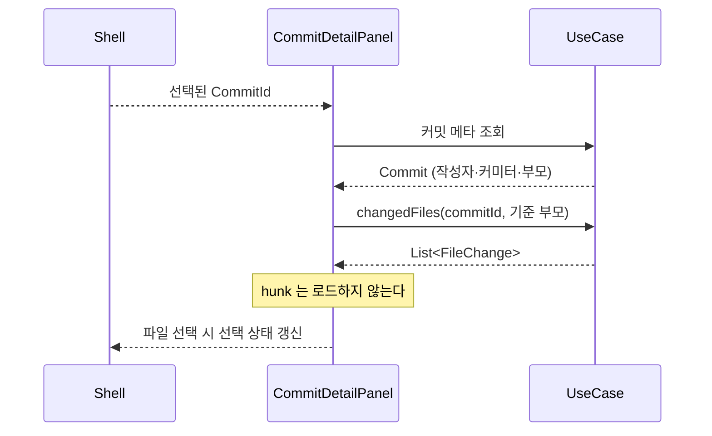
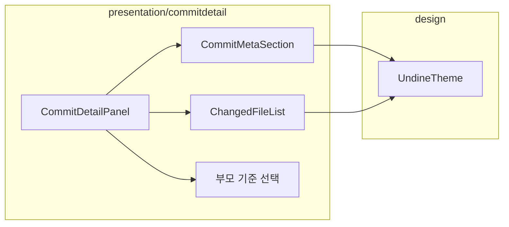

# [UND-15] 커밋 상세 패널

> wave 3 · 사이즈 M · 의존 UND-03, UND-05, UND-10 · 소유 `presentation/commitdetail/`

## 작업 내용 (설계 의도)
선택된 커밋의 메타데이터와 **변경 파일 목록**을 보여준다. 파일을 고르면 UND-16 diff 뷰어가 받을
선택 상태를 갱신한다.

표시 항목: 전체 해시(복사 가능), 작성자·커미터와 각각의 시각, 부모 커밋 링크, 전체 메시지,
변경 파일 목록(경로·변경 종류·증감 라인 수).

**파일 목록만 로드하고 hunk 는 로드하지 않는다.** UND-05 가 두 단계로 나눈 이유가 여기서 실현된다 —
커밋을 클릭할 때마다 전체 diff 를 계산하면 대형 커밋에서 화면이 멈춘다.

작성자와 커미터가 다르면(cherry-pick·rebase·amend 결과) 둘 다 표시한다. 하나만 보여주면
"내가 만들지 않은 커밋이 내 이름으로 보이는" 혼란이 생긴다.

부모가 둘 이상인 병합 커밋은 **어느 부모 기준의 diff 인지** 선택할 수 있어야 한다 —
기본은 첫 부모지만, 병합으로 들어온 변경을 보려면 두 번째 부모 기준이 필요하다.

커밋 메시지는 첫 줄(제목)과 본문을 구분해 렌더링하고, 긴 메시지는 접는다.

## 다이어그램

### 처리 흐름

### 클래스 의존

## 테스트 케이스

- 선택한 커밋의 전체 해시·작성자·커미터·메시지가 표시된다
- 변경 파일 목록이 표시되고 hunk 내용은 요청되지 않는다
- 작성자와 커미터가 다르면 둘 다 표시된다
- 병합 커밋은 기준 부모를 선택할 수 있고 선택에 따라 파일 목록이 바뀐다
- 최초 커밋(부모 없음)은 전체 파일이 추가로 표시된다
- 변경 파일이 0건인 빈 커밋도 안내와 함께 정상 표시된다
- 해시를 클릭하면 클립보드에 복사된다
- 파일을 선택하면 선택 상태가 갱신된다
