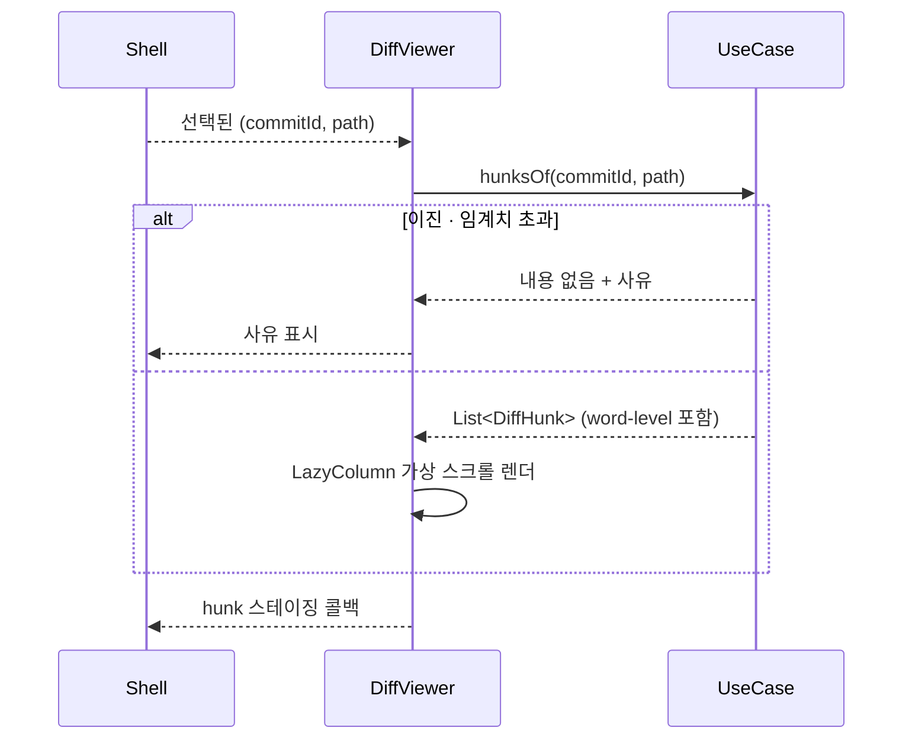
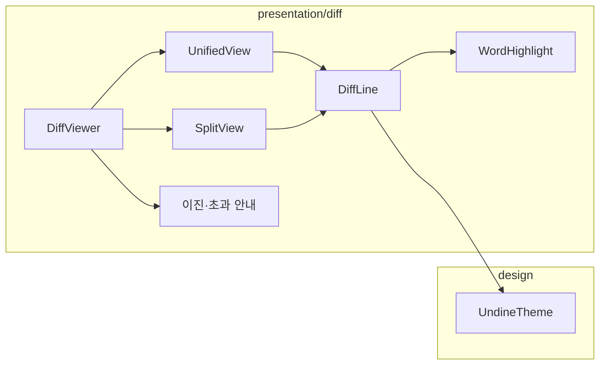

# [UND-16] Diff 뷰어

> wave 3 · 사이즈 L · 의존 UND-05, UND-10 · 소유 `presentation/diff/`

## 작업 내용 (설계 의도)
선택된 파일의 diff 를 그린다. 통합(unified)/분할(split) 두 모드를 지원하고,
**hunk·라인 단위 스테이징 조작**의 진입점이 된다.

렌더링 요건:

- 라인 번호는 원본/변경본 두 열로 표시한다.
- 추가/삭제는 배경색 + `+`/`−` 기호로 표시한다 (색만으로 구분하지 않는다 — UND-10 참조).
- 변경된 라인 쌍은 **word-level 강조**를 덧입혀 실제로 바뀐 토큰만 진하게 표시한다.
- 고정폭 서체를 쓰고 탭 폭을 설정으로 받는다.

성능:

- 파일 하나의 diff 도 수만 라인일 수 있으므로 `LazyColumn` + 라인 index key 로 가상 스크롤한다.
- 이진 파일·임계치 초과 파일은 UND-05 가 내용 없이 사유를 주므로 **그 사유를 그대로 표시**한다.
  빈 화면을 보여주면 "변경 없음" 으로 오해된다.

hunk 헤더에는 "이 hunk 스테이징" 액션을 둔다. 실제 적용은 UND-17 이 소유한 스테이징 상태를 거치므로,
여기서는 **콜백만 노출**하고 직접 Gateway 를 호출하지 않는다 — presentation 은 UseCase 만 호출한다는
레이어 규칙을 지키면서, 두 컴포넌트가 같은 상태를 두 벌로 갖지 않게 한다.

## 다이어그램

### 처리 흐름

### 클래스 의존

## 테스트 케이스

- 한 줄 수정이 추가 1줄·삭제 1줄로 표시되고 기호와 배경색이 함께 적용된다
- word-level 강조가 실제 변경 토큰에만 적용된다
- 통합/분할 모드 전환 시 같은 내용이 각 레이아웃으로 표시된다
- 이진 파일은 사유 안내가 표시되고 빈 화면이 되지 않는다
- 임계치 초과 파일도 사유가 표시된다
- 수만 라인 diff 에서 가상 스크롤이 동작하고 초기 렌더가 지연되지 않는다
- 변경이 없는 파일을 선택하면 변경 없음 안내가 표시된다
- hunk 스테이징 액션이 콜백으로만 노출되고 Gateway 를 직접 호출하지 않는다
