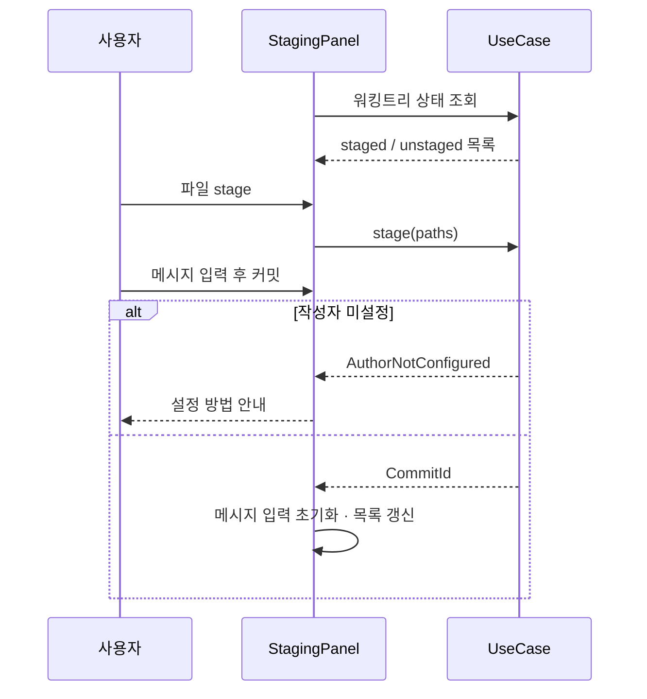
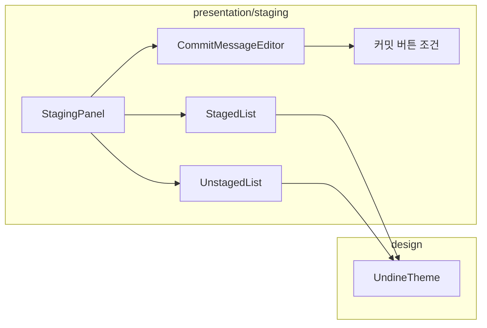

# [UND-17] 스테이징 · 커밋 작성 패널

> wave 4 · 사이즈 M · 의존 UND-06, UND-10, UND-53 · 소유 `presentation/staging/`

## 작업 내용 (설계 의도)
워킹트리 변경을 staged/unstaged 두 목록으로 보여주고, 커밋 메시지를 작성해 커밋한다.

두 목록 사이의 이동(stage/unstage)은 파일 단위와 **선택 다중 파일** 단위 모두 지원한다.
UND-16 이 올리는 hunk 스테이징 콜백도 여기서 받아 UseCase 로 넘긴다 —
스테이징 상태의 **단일 소유자**가 이 패널이다.

커밋 메시지 입력은 제목/본문을 시각적으로 구분한다. 제목 길이 가이드(50자)와 본문 줄바꿈 가이드(72자)를
**강제하지 않고 표시만** 한다 — 규칙을 어길 정당한 이유가 있는 커밋이 있다.

커밋 버튼은 다음 조건에서 비활성화하고 **이유를 문장으로 표시**한다:

| 조건 | 표시 |
|---|---|
| staged 가 비어 있음 | "스테이징된 변경이 없습니다" |
| 메시지가 비어 있음 | "커밋 메시지를 입력하세요" |
| 작성자 미설정 | "Git 작성자 정보를 설정하세요" + 설정 방법 |

비활성화 이유를 숨기면 사용자는 왜 눌리지 않는지 알 수 없다.

amend 체크박스는 **커밋을 실행하기 전에** `AmendCommitUseCase` 로 대상을 조회하고,
직전 커밋이 원격에 이미 있으면 대상 커밋을 보여 주는 **확인 절차를 거친 뒤에만** 실행한다
([UND-53](UND-53-amend-preflight-contract.md) 이 그 계약을 소유한다).
패널은 Gateway 를 직접 호출하지 않고 UseCase 에 사용자 의사(요청·확인)만 전달한다.

**롤백**: 커밋은 직전 상태로 soft reset 하고, staged↔unstaged 이동은 반대 동작으로 되돌린다.

## 다이어그램

### 처리 흐름

### 클래스 의존

## 테스트 케이스

- 파일을 stage 하면 staged 목록으로 이동하고 unstaged 에서 사라진다
- 여러 파일을 선택해 한 번에 stage 할 수 있다
- staged 가 비어 있으면 커밋 버튼이 비활성화되고 사유가 표시된다
- 메시지가 비어 있으면 커밋 버튼이 비활성화되고 사유가 표시된다
- 작성자 미설정 시 설정 방법이 함께 안내된다
- 커밋 성공 후 메시지 입력이 초기화되고 목록이 갱신된다
- amend 체크 시 직전 커밋이 원격에 있으면 실행하지 않고 대상 커밋 확인을 요구한다
- 사용자가 확인하면 같은 대상으로 amend 를 실행하고, 취소하면 저장소를 바꾸지 않는다
- 변경이 0건이면 빈 상태 안내가 표시된다
- hunk 스테이징 콜백을 받아 UseCase 로 위임한다
