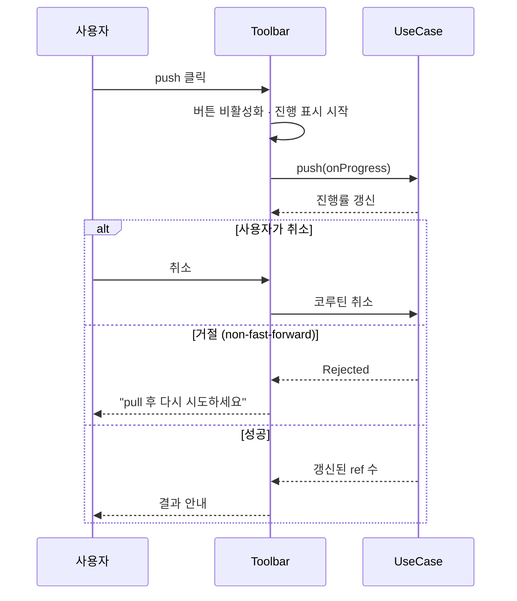
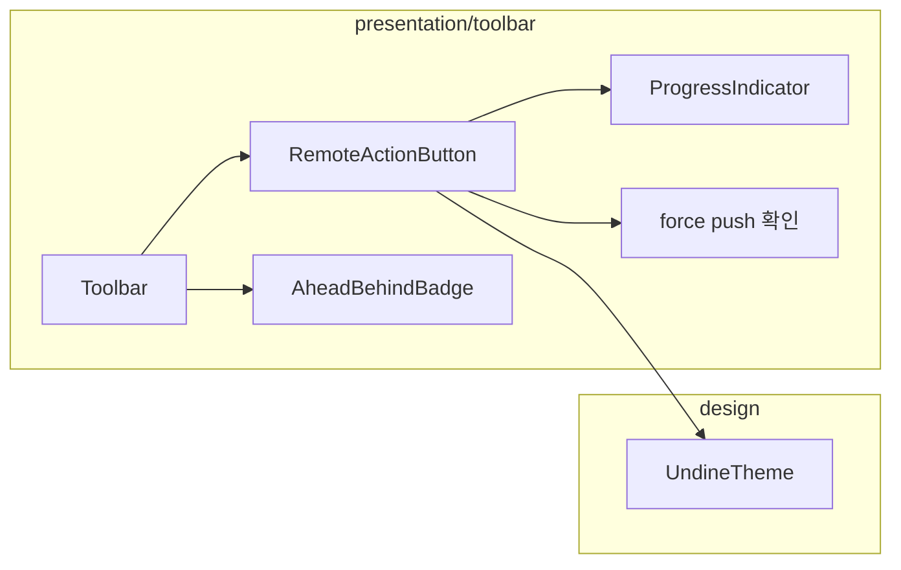

# [UND-18] 툴바 · 원격 작업 진행 표시

> wave 3 · 사이즈 M · 의존 UND-08, UND-10 · 소유 `presentation/toolbar/`

## 작업 내용 (설계 의도)
fetch·pull·push 버튼과 **진행 상태 표시**를 담당한다. 네트워크 작업은 초 단위로 걸리므로
무반응으로 보이면 사용자가 같은 버튼을 반복해서 누른다.

세 가지를 보장한다.

1. **진행 중 표시와 취소.** UND-08 의 진행률 콜백을 받아 진행 표시를 그리고, 취소 버튼으로
   코루틴을 취소한다. 취소는 즉시 반영돼야 한다.
2. **중복 실행 방지.** 진행 중인 원격 작업이 있으면 같은 작업 버튼을 비활성화한다.
3. **결과를 문장으로 알린다.** 성공은 무엇이 갱신됐는지(예: "3개 ref 갱신"), 실패는 무엇을 해야 하는지
   알린다. non-fast-forward 거절은 **실패가 아니라 안내**다 — "pull 후 다시 시도하세요" 로 표시한다.

push 는 되돌릴 수 없으므로 force push 는 툴바 기본 버튼에 두지 않는다. 별도 메뉴에 두고
**무엇이 덮어써지는지 문장으로 경고**한 뒤 확인을 받는다.

현재 브랜치의 ahead/behind 를 버튼 옆에 표시해 pull/push 필요 여부를 한눈에 보이게 한다.

**롤백**: fetch·pull 은 이전 ref 로 되돌린다 — push 는 되돌릴 수 없으므로 force push 는 별도 메뉴에서 확인 절차를 거친다.

## 다이어그램

### 처리 흐름

### 클래스 의존

## 테스트 케이스

- push 진행 중 진행 표시가 나타나고 해당 버튼이 비활성화된다
- 취소를 누르면 진행 중 작업이 중단된다
- non-fast-forward 거절이 실패가 아니라 재시도 안내로 표시된다
- 인증 실패 메시지에 자격증명 문자열이 노출되지 않는다
- 성공 시 갱신된 ref 수가 결과로 표시된다
- force push 는 기본 버튼이 아니라 별도 메뉴에 있고 확인 절차를 거친다
- 현재 브랜치의 ahead/behind 가 버튼 옆에 표시된다
- 원격이 없는 저장소에서는 원격 버튼이 비활성화되고 사유가 표시된다
