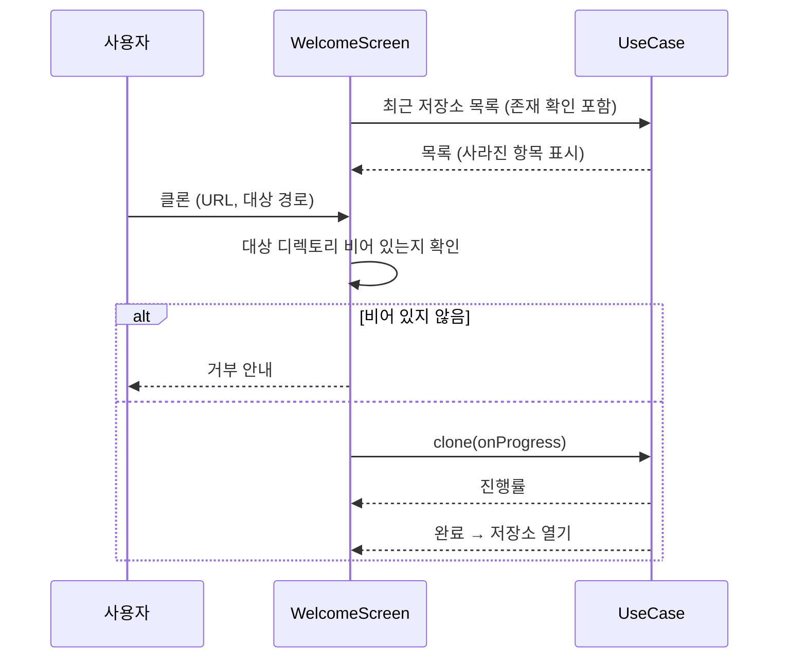
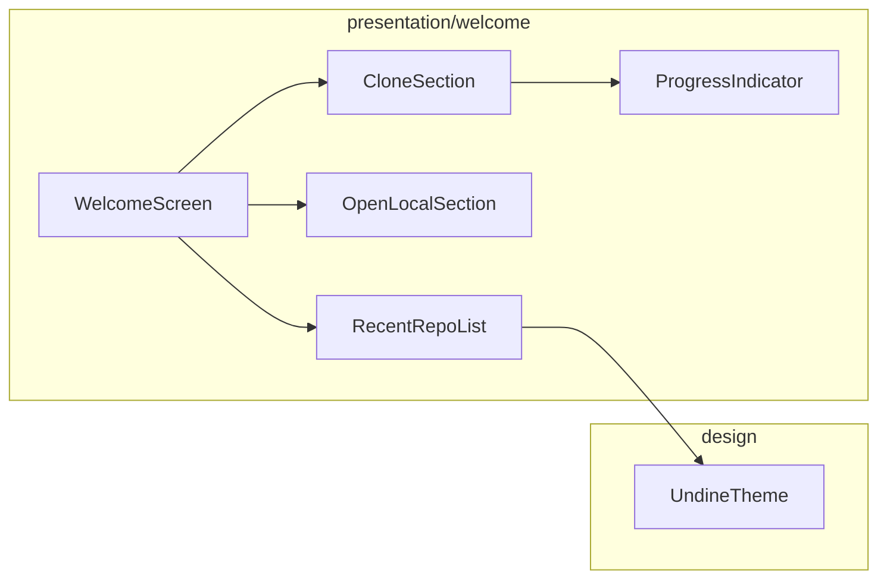

# [UND-19] 저장소 열기 · 클론 화면

> wave 3 · 사이즈 M · 의존 UND-02, UND-08, UND-10, UND-11 · 소유 `presentation/welcome/`

## 작업 내용 (설계 의도)
앱을 처음 켰을 때 보이는 화면이다. 최근 저장소 목록, 로컬 열기, 원격 클론 세 경로를 제공한다.

최근 저장소는 UND-11 이 존재 여부를 확인해 주므로, **사라진 경로는 회색으로 표시하고 목록에서
제거하는 액션을 제공**한다. 클릭했을 때 오류만 뜨고 끝나면 사용자는 목록을 정리할 방법이 없다.

로컬 열기는 디렉토리 선택 대화상자를 쓴다. Git 저장소가 아닌 디렉토리를 고르면 UND-02 가 구분해 주는
예외를 받아 **무엇이 문제인지** 표시한다 — 경로 없음·Git 저장소 아님·권한 없음은 사용자가 할 일이 다르다.

클론은 URL·대상 디렉토리·깊이(shallow) 옵션을 받는다. 진행률과 취소를 제공하고,
**대상 디렉토리가 비어 있지 않으면 미리 거부**한다 — 클론 도중 실패하면 반쯤 채워진 디렉토리가 남는다.

인증이 필요한 원격은 OS 키체인·ssh config 에 위임하므로 앱은 비밀번호 입력란을 두지 않는다.
인증 실패 시 "키체인/ssh 설정을 확인하세요" 로 안내한다.

**롤백**: clone 이 실패·취소되면 **앱이 만든 대상 디렉토리만** 정리한다 — 사용자가 미리 만들어 둔 디렉토리는 건드리지 않으며, 정리 실패 시 경로를 알려 수동 정리를 안내한다.

## 다이어그램

### 처리 흐름

### 클래스 의존

## 테스트 케이스

- 최근 저장소 목록이 최신순으로 표시된다
- 빈 대상 디렉토리에 로컬 원격을 clone 하면 진행률이 표시되고 완료 후 저장소가 열려 메인 화면으로 전환된다
- 사라진 경로가 회색으로 표시되고 목록에서 제거할 수 있다
- Git 저장소가 아닌 디렉토리를 열면 그 사유가 구체적으로 표시된다
- 권한 없는 경로는 저장소 아님과 다른 메시지로 표시된다
- 비어 있지 않은 대상 디렉토리로 클론하면 시작 전에 거부된다
- 클론 진행 중 취소하면 작업이 중단된다
- 인증 실패 시 키체인/ssh 설정 확인 안내가 표시되고 자격증명이 노출되지 않는다
- 최근 저장소가 0건이면 빈 상태 안내와 열기/클론 유도가 표시된다
