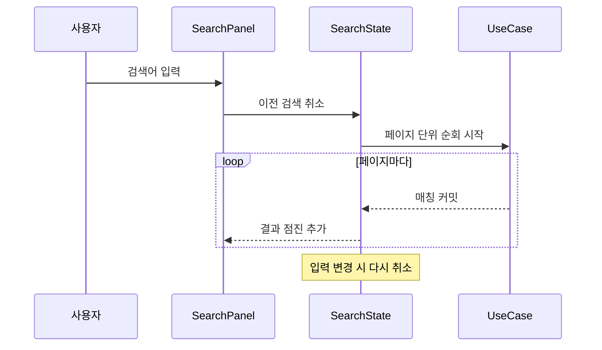
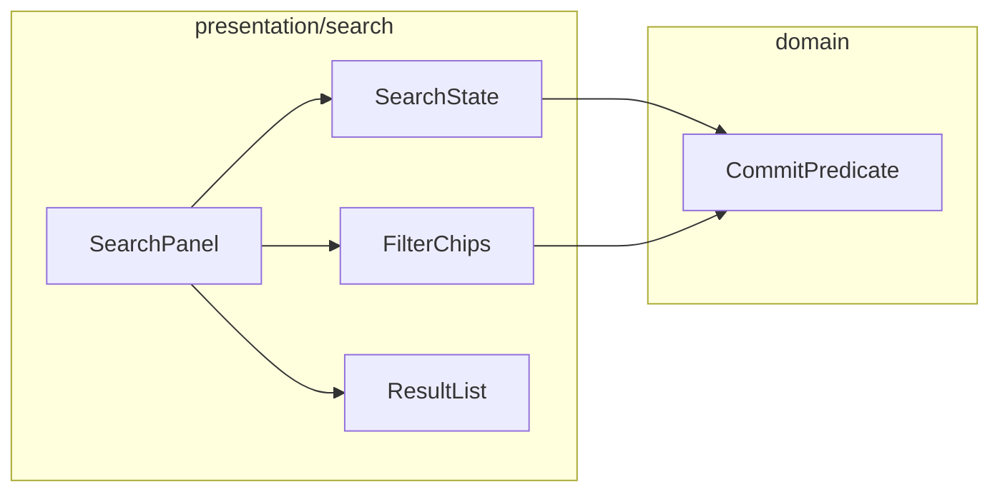

# [UND-20] 커밋 검색 · 필터

> wave 3 · 사이즈 M · 의존 UND-03, UND-10 · 소유 `presentation/search/`

## 작업 내용 (설계 의도)
커밋을 메시지·작성자·해시·파일 경로로 찾는다. 대형 저장소에서 원하는 커밋에 도달하는 주 수단이다.

검색은 **점진적**이어야 한다. 전체 이력을 다 훑은 뒤 결과를 주면 수만 커밋 저장소에서 응답이 없다.
페이지 단위로 훑으면서 찾는 대로 결과를 흘려보내고, 사용자가 원하는 것을 찾으면 중단한다.

입력이 바뀔 때마다 이전 검색을 **취소**한다. 취소하지 않으면 오래된 검색 결과가 나중에 도착해
새 결과를 덮어쓴다 — 흔한 경쟁 조건이다.

필터 축:

| 축 | 동작 |
|---|---|
| 메시지 | 부분 일치 (대소문자 무시) |
| 작성자 | 이름·이메일 부분 일치 |
| 해시 | 접두사 일치 (짧은 해시 지원) |
| 파일 경로 | 해당 경로를 건드린 커밋 |
| 기간 | 시작·종료일 |

파일 경로 필터는 커밋마다 diff 를 계산해야 하므로 가장 비싸다. 다른 필터로 후보를 먼저 좁힌 뒤
적용한다.

검색 중임을 표시하고, 결과 0건과 "아직 찾는 중" 을 구분해서 보여준다.

## 다이어그램

### 처리 흐름

### 클래스 의존

## 테스트 케이스

- 메시지 부분 일치로 커밋이 검색된다 (대소문자 무시)
- 짧은 해시 접두사로 커밋이 검색된다
- 작성자 이메일 일부로 커밋이 검색된다
- 검색어를 바꾸면 이전 검색이 취소되고 오래된 결과가 화면을 덮어쓰지 않는다
- 결과가 점진적으로 추가된다 (전체 순회 완료 전에 첫 결과 표시)
- 결과 0건과 검색 진행 중이 구분되어 표시된다
- 파일 경로 필터가 해당 경로를 건드린 커밋만 반환한다
- 기간 필터의 경계값(시작일·종료일 당일 커밋)이 포함된다
- 빈 저장소에서 검색해도 예외 없이 0건을 반환한다
