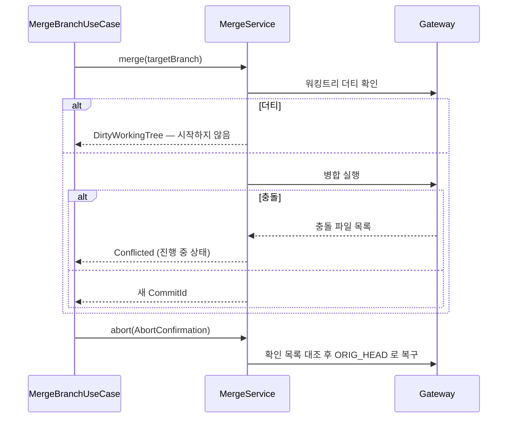
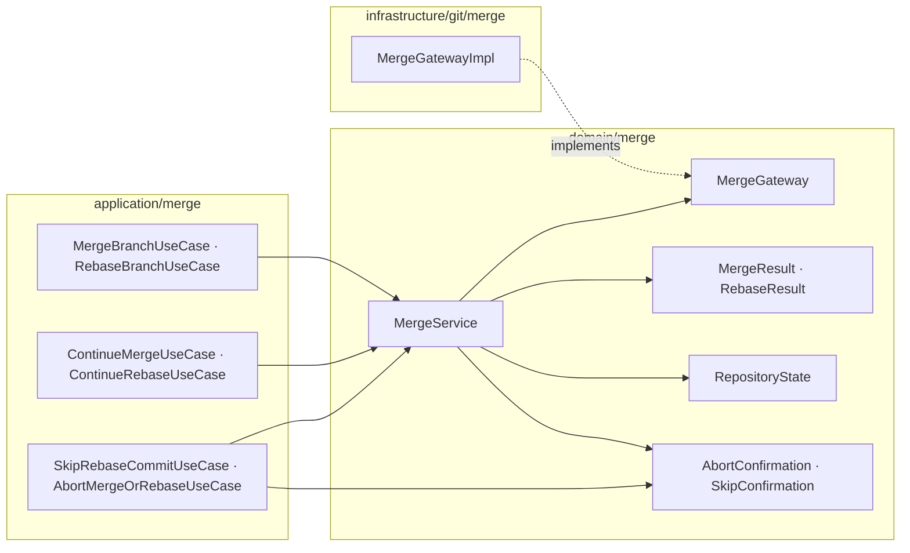

# [UND-21] 병합 · 리베이스 실행

> wave 3 · 사이즈 L · 의존 UND-07 · 소유 `domain/merge/` · `application/merge/` · `infrastructure/git/merge/`

## 작업 내용 (설계 의도)
병합과 리베이스의 **실행·중단·계속**을 담당한다. UI 는 UND-23·24 가 맡고, 여기서는 도메인과 응용 계층이다.

이 티켓의 핵심은 **중간 상태를 정확히 다루는 것**이다. 병합·리베이스는 충돌하면 저장소가
"진행 중" 상태로 남는다. 앱이 이 상태를 인식하지 못하면 사용자는 빠져나올 방법이 없다.

제공할 연산:

| 연산 | 설명 |
|---|---|
| merge | 대상 브랜치를 현재 브랜치로 병합 (fast-forward 여부 선택) |
| rebase | 현재 브랜치를 대상 위로 재배치 |
| continue | 충돌 해결 후 이어서 진행 |
| abort | 시작 전 상태로 되돌림 |
| skip | 현재 커밋 건너뜀 (리베이스 전용) |

**충돌은 실패가 아니다.** 예외가 아니라 `Conflicted(파일 목록)` 결과로 반환한다 —
예외로 던지면 호출부가 정상 흐름과 오류를 구분하지 못한다.

시작 전 **워킹트리가 더티하면 거부**한다. 더티 상태에서 리베이스를 시작하면 사용자의 편집과
리베이스 충돌이 뒤섞여 구분할 수 없다.

`abort` 는 항상 가능해야 한다. 저장소가 어떤 진행 중 상태에 있든 시작 전으로 돌아가는 경로를 보장한다.

**파괴적 연산은 확인 없이 실행되지 않는다.** `abort` 는 충돌 해결 중 쓴 워킹트리 편집을, `skip` 은
건너뛴 커밋의 변경을 되돌릴 수 없게 지운다. 둘 다 확인을 **타입으로** 받아 호출부가 절차를 건너뛰면
컴파일되지 않게 한다 — `AbortConfirmation`(사라질 경로 목록) · `SkipConfirmation`(사라질 커밋).
`MergeService` 는 확인이 지금 사라질 대상과 어긋나면(확인 뒤 편집이 늘었거나, 멈춘 커밋이 바뀌었거나,
대상을 읽을 수 없으면) Gateway 를 호출하지 않는다.

**확인 토큰은 Gateway 계약까지 내려간다.** 서비스 안에서만 검사하면 Gateway 를 직접 부르는 경로가
검사를 건너뛰고, 검사와 실행이 다른 임계구역이라 그 사이 상태가 바뀔 수 있다. `abortMerge`·`abortRebase`·
`skipRebaseCommit` 이 토큰을 인자로 받고, 구현이 **실행 직전 같은 임계구역에서** 다시 대조한다.

**롤백**: 병합·리베이스는 `ORIG_HEAD` 로 되돌릴 수 있다 — 중단(abort) 경로를 반드시 제공하고, 진행 중 상태를 저장소에서 읽어 복구한다.

## 다이어그램

### 처리 흐름

### 클래스 의존

## 테스트 케이스

- 충돌 없는 병합이 새 병합 커밋을 만든다
- fast-forward 가능한 병합에서 옵션에 따라 ff 또는 병합 커밋이 선택된다
- 충돌은 예외가 아니라 `Conflicted` 결과와 충돌 파일 목록으로 반환된다
- 워킹트리가 더티하면 병합·리베이스를 시작하지 않는다
- 충돌 후 `abort` 하면 시작 전 상태로 정확히 복구된다
- 확인한 뒤에 편집이 더 생기면 `abort` 하지 않는다 (낡은 확인)
- 충돌 해결 후 `continue` 하면 리베이스가 남은 커밋을 이어서 적용한다
- 리베이스 중 `skip` 하면 해당 커밋이 결과 이력에서 빠진다
- 확인한 커밋과 지금 멈춘 커밋이 다르면 `skip` 하지 않는다 (낡은 확인)
- 멈춘 커밋을 읽을 수 없으면 `skip` 하지 않는다 (대조 불가)
- 서비스를 거치지 않고 Gateway 를 직접 불러도 낡은 확인은 거부된다
- 확인과 실행 사이에 편집이 생기면 Gateway 가 중단하지 않는다
- 이미 병합된 브랜치를 다시 병합하면 변경 없음으로 보고된다
- 리베이스 진행 중 상태가 저장소에서 읽혀 복구된다 (앱 재시작 후에도)
