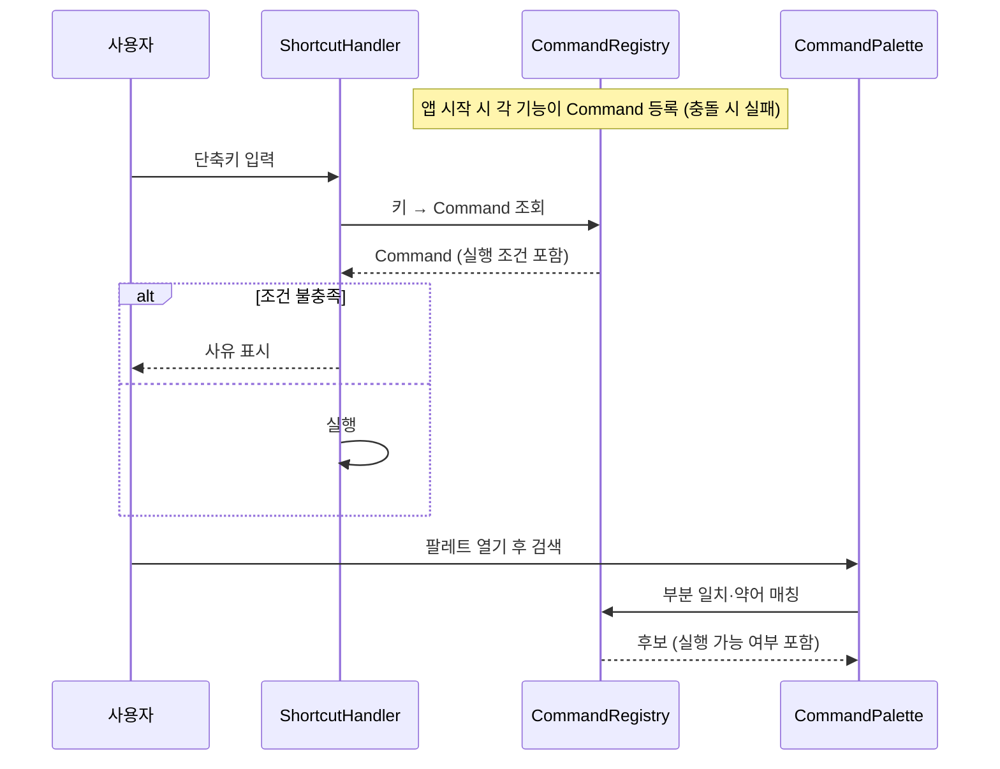
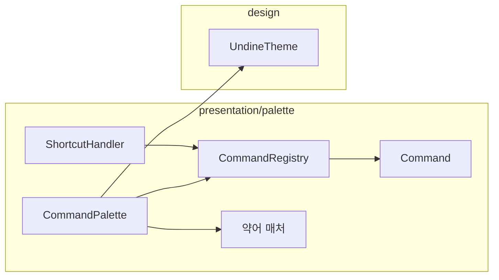

# [UND-22] 커맨드 팔레트 · 단축키

> wave 3 · 사이즈 M · 의존 UND-10 · 소유 `presentation/palette/`

## 작업 내용 (설계 의도)
키보드만으로 앱의 주요 동작에 도달하는 경로를 만든다. 마우스 전용 UI 는 숙련 사용자에게 병목이다.

**커맨드 레지스트리**를 둔다. 각 기능 티켓이 자신의 동작을 `Command`(id, 표시명, 기본 단축키, 실행 조건,
실행 람다)로 등록하고, 팔레트와 단축키 처리기는 이 레지스트리 하나만 본다.
레지스트리가 없으면 단축키 정의가 화면마다 흩어져 충돌을 발견할 수 없다.

- **단축키 매핑은 한 곳**에 정의한다 (`docs/ssot-map.md` 에 SSOT 로 등재).
- **충돌은 등록 시점에 감지**한다. 같은 키에 두 명령이 등록되면 개발 중에 실패시킨다 —
  런타임에 하나가 조용히 이기면 원인을 찾기 어렵다.
- **실행 조건**을 명령마다 둔다. 저장소가 열려 있지 않을 때 "커밋" 이 실행되면 안 된다.
  팔레트는 실행 불가 명령을 흐리게 표시하고 사유를 보여준다.

팔레트는 부분 일치 + 약어 매칭(예: `cb` → `Create Branch`)을 지원하고, 최근 실행 순으로 가중한다.

플랫폼별 수식키 차이(macOS `⌘` vs Windows/Linux `Ctrl`)를 레지스트리에서 흡수한다.

## 다이어그램

### 처리 흐름

### 클래스 의존

## 테스트 케이스

- 등록된 단축키를 누르면 해당 명령이 실행된다
- 같은 단축키에 두 명령을 등록하면 등록 시점에 실패한다
- 실행 조건을 만족하지 않는 명령은 실행되지 않고 사유가 표시된다
- 팔레트에서 부분 일치로 명령을 찾을 수 있다
- 약어 입력(`cb`)으로 `Create Branch` 가 매칭된다
- 최근 실행한 명령이 후보 상단에 온다
- 플랫폼별 수식키가 각 OS 표기로 표시된다
- 등록된 명령이 0건이면 팔레트가 빈 상태 안내를 표시한다
