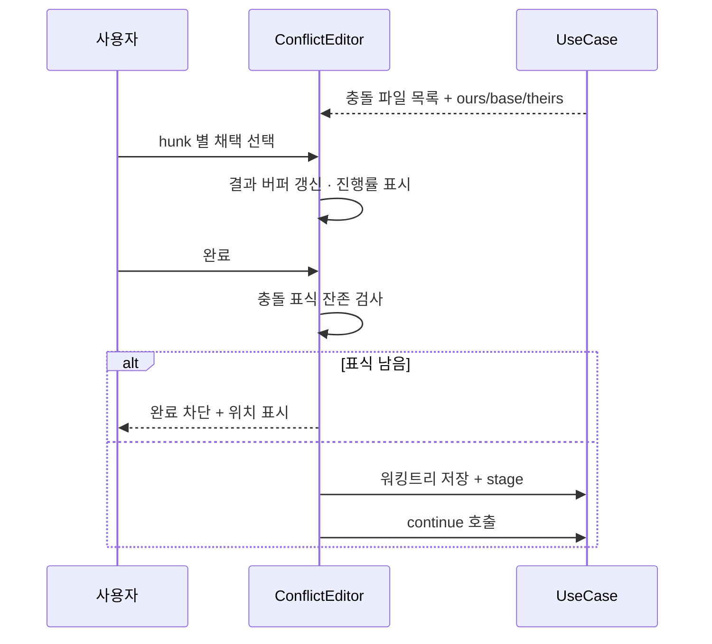
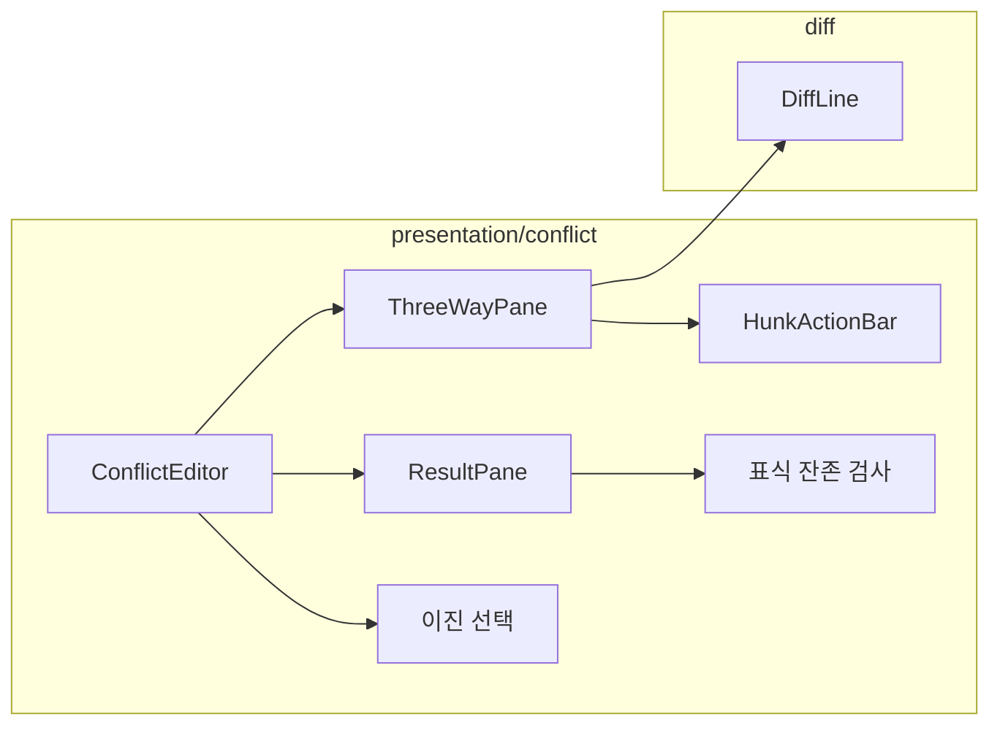

# [UND-23] 충돌 해결 에디터 UI

> wave 4 · 사이즈 L · 의존 UND-16, UND-21 · 소유 `presentation/conflict/`

## 작업 내용 (설계 의도)
병합·리베이스 충돌을 화면에서 해결한다. 3-way 비교(ours / base / theirs)와 결과 편집을 제공한다.

레이아웃은 4분할이다 — 세 원본을 위에, 결과를 아래에 둔다. 충돌 구간(hunk)마다
"ours 채택 / theirs 채택 / 둘 다 / 직접 편집" 액션을 제공한다.

**미해결 구간이 남아 있으면 완료를 막는다.** 충돌 표식(`<<<<<<<`)이 남은 채로 스테이징되면
그대로 커밋되어 소스에 표식이 박힌다. 저장 전에 표식 잔존을 검사한다.

해결 진행 상황을 표시한다 — "3개 중 1개 해결" 처럼 남은 양이 보여야 한다.
파일이 여러 개면 파일별 해결 여부도 함께 보여준다.

이진 파일 충돌은 병합할 수 없다. **ours/theirs 중 하나를 고르는 선택지만** 제공한다.

해결 결과는 워킹트리 파일에 쓰고 인덱스에 스테이징한다. 상위 병합/리베이스를 계속할지는
UND-21 의 `continue` 를 호출하며, 언제든 `abort` 로 전체를 되돌릴 수 있음을 화면에 명시한다.
`abort` 는 확인을 타입으로 요구한다 — 사라질 staged·unstaged·conflicted 경로와 복구 불가성을 보여 준 뒤
그 목록으로 만든 `AbortConfirmation` 을 넘긴다. 확인 뒤 편집이 더 생기면 UND-21 이 거부하므로,
갱신된 목록으로 다시 확인받는다.

**롤백**: 해결 결과는 **워킹트리와 인덱스를 함께** 갱신한다 — 상위 병합 작업의 abort(UND-21)는 두 위치를 모두 시작 전 상태로 복원한다.

## 다이어그램

### 처리 흐름

### 클래스 의존

## 테스트 케이스

- 충돌 파일의 ours/base/theirs 세 버전이 함께 표시된다
- hunk 단위로 ours 를 채택하면 결과 버퍼에 반영된다
- '둘 다' 를 선택하면 양쪽 내용이 순서대로 결과에 들어간다
- 충돌 표식이 남은 채로 완료하면 차단되고 남은 위치가 표시된다
- 해결 진행률이 남은 충돌 수와 함께 표시된다
- 이진 파일 충돌은 ours/theirs 선택만 제공된다
- 완료 시 결과가 워킹트리에 저장되고 인덱스에 스테이징된다
- 충돌 파일이 여러 개면 파일별 해결 여부가 표시된다
- abort 로 전체를 되돌릴 수 있음이 화면에 안내된다
- 사라질 경로 목록과 복구 불가성을 표시한 명시적 확인 뒤에만 abort 가 실행된다
- 확인 뒤 편집이 더 생기면 갱신된 목록으로 다시 확인받는다
- abort 하면 워킹트리와 인덱스가 **둘 다** 시작 전 상태로 복원된다 (인덱스만 되돌아가지 않는다)
