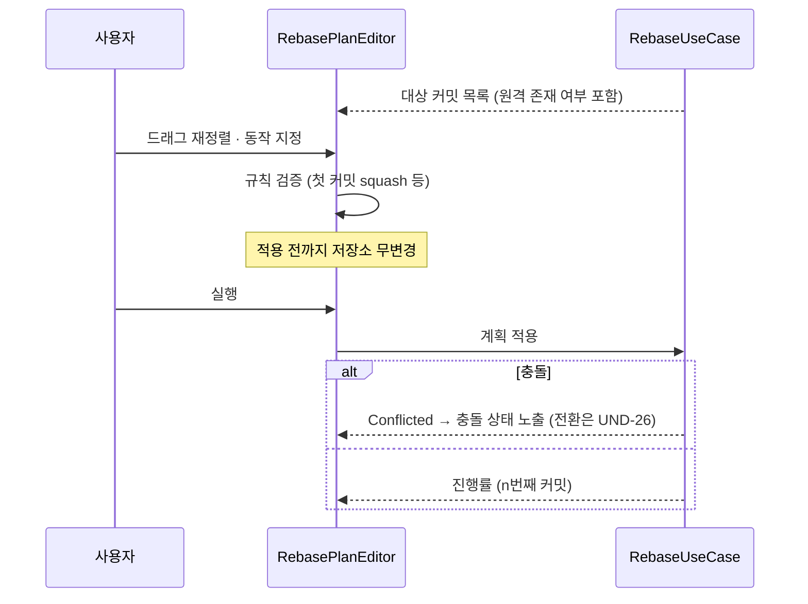
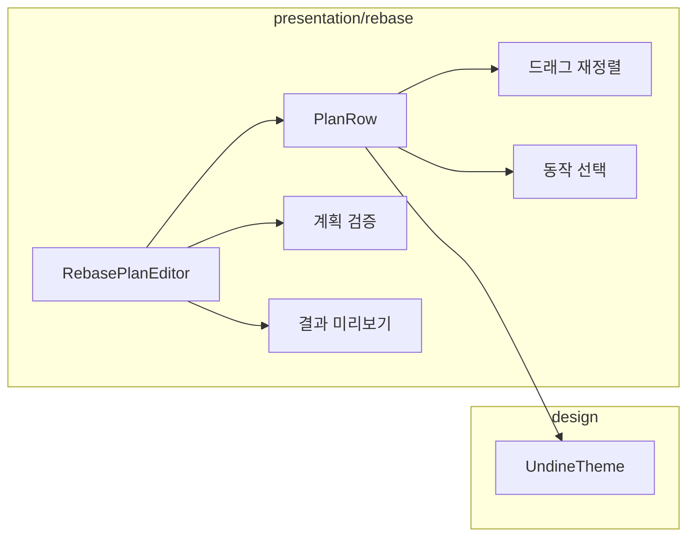

# [UND-24] 대화형 리베이스 UI

> wave 4 · 사이즈 L · 의존 UND-10, UND-21 · 소유 `presentation/rebase/`

## 작업 내용 (설계 의도)
리베이스 대상 커밋 목록을 **드래그로 재정렬**하고 각 커밋의 동작(pick/reword/edit/squash/fixup/drop)을
지정한다. 터미널 `git rebase -i` 의 에디터를 GUI 로 대체한다.

계획 편집은 **적용 전까지 저장소를 건드리지 않는다.** 사용자가 자유롭게 만지다가 취소할 수 있어야 한다.

편집 중 검증:

| 규칙 | 이유 |
|---|---|
| 첫 커밋은 squash/fixup 불가 | 합칠 대상이 없다 |
| 전부 drop 은 거부 | 결과가 빈 리베이스다 |
| reword/edit 은 실행 중 멈춤이 필요함을 표시 | 사용자가 예상하지 못하면 멈춘 화면을 오류로 오해한다 |

계획을 시각적으로 미리 보여준다 — squash 로 묶인 커밋들이 어떤 커밋 하나로 합쳐지는지,
drop 된 커밋이 무엇인지 목록에서 바로 읽혀야 한다.

실행은 UND-21 에 위임한다. 충돌이 나면 **충돌 발생 상태를 올리는 데서 멈춘다** —
충돌 에디터(UND-23)로의 화면 전환은 이 티켓이 직접 연결하지 않고 통합 티켓(UND-26)이 배선한다.
UND-23 과 같은 wave 라 산출물을 전제할 수 없기 때문이며, 이렇게 두면 두 티켓을 병렬로 진행할 수 있다.
진행 중에는 **몇 번째 커밋을 적용 중인지** 표시한다.

이미 push 된 커밋을 포함하면 이력이 갈라진다 — 계획 화면에서 그 사실을 경고한다.

**롤백**: 적용 전에는 계획만 편집하므로 되돌릴 것이 없고, 실행 후에는 UND-21 의 abort 로 시작 전 상태로 복구한다.

## 다이어그램

### 처리 흐름

### 클래스 의존

## 테스트 케이스

- 드래그로 커밋 순서를 바꾸면 계획에 반영된다
- 첫 커밋에 squash 를 지정하면 거부되고 사유가 표시된다
- 모든 커밋을 drop 하면 실행이 거부된다
- squash 로 묶인 커밋들이 미리보기에서 하나로 표시된다
- 계획을 편집하는 동안 저장소가 변경되지 않는다
- 이미 push 된 커밋이 포함되면 이력 분기 경고가 표시된다
- 실행 중 몇 번째 커밋을 적용 중인지 표시된다
- 충돌이 발생하면 충돌 상태가 노출되고 진행이 멈춘다 (화면 전환은 UND-26 소관)
- 취소하면 계획이 폐기되고 저장소는 그대로다
