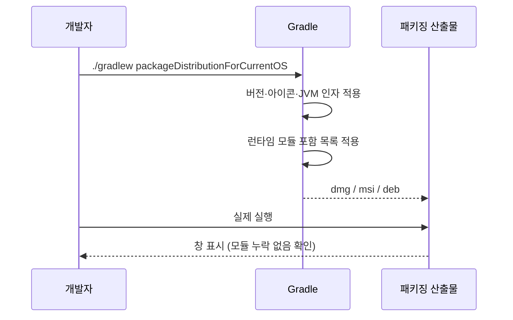
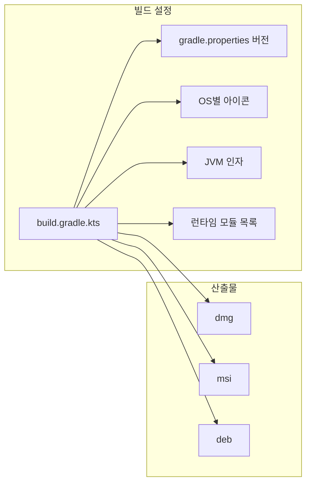

# [UND-25] 패키징 · 배포

> wave 4 · 사이즈 M · 의존 UND-01 · 소유 `build.gradle.kts` · `packaging/`

## 작업 내용 (설계 의도)
실행 가능한 네이티브 배포본을 만든다. macOS `dmg`, Windows `msi`, Linux `deb` 다.

Compose Desktop 의 `packageDistributionForCurrentOS` 를 쓰되, 다음을 명시적으로 설정한다.

| 항목 | 이유 |
|---|---|
| 앱 아이콘 (OS별 포맷) | 기본 아이콘으로 배포하면 앱을 식별할 수 없다 |
| 앱 이름·벤더·버전 | 버전은 단일 지점에서 읽는다 (태그와 어긋나면 안 된다) |
| JVM 인자 (힙 상한) | 대형 저장소에서 기본 힙으로는 부족하다 |
| 모듈 포함 목록 | JGit 이 리플렉션으로 쓰는 모듈이 빠지면 **런타임에만** 실패한다 |

**빌드가 성공하는 것과 앱이 실행되는 것은 다르다.** 패키징 산출물을 실제로 실행해 창이 뜨는지
확인하는 것까지가 이 티켓의 범위다 — 모듈 누락은 빌드 시점에 드러나지 않는다.

서명·공증은 **범위 밖**이다. 개인 사용이 목적이므로 서명 없이 배포하고, macOS 에서 최초 실행 시
Gatekeeper 를 통과시키는 방법을 README 에 적는다.

버전은 `gradle.properties` 한 곳에서 읽고, `/custom-release-tagger` 가 만드는 태그와 같은 값을 쓴다.

**롤백**: 패키징 설정 변경은 이전 커밋으로 revert 하면 즉시 복구된다 — 산출물 자체는 재빌드로 재생성한다.

## 다이어그램

### 처리 흐름

### 클래스 의존

## 테스트 케이스

- `packageDistributionForCurrentOS` 가 성공하고 산출물이 생성된다
- 필수 런타임 모듈을 뺀 설정으로 패키징하면 실행 단계에서 실패가 드러난다 (빌드 성공만으로 통과시키지 않는다)
- 잘못된 아이콘 경로·버전 형식이면 패키징이 실패하고 원인이 출력에 표시된다
- 현재 OS 에 해당하는 산출물만 생성된다 (다른 OS 형식은 만들지 않는다)
- 생성된 산출물을 실행하면 창이 뜬다 (런타임 모듈 누락 없음)
- 앱 버전이 `gradle.properties` 값과 일치한다
- OS 기본 아이콘이 아닌 지정 아이콘이 적용된다
- JVM 힙 상한 인자가 실행 프로세스에 반영된다
- 버전을 바꿔 재빌드하면 산출물 메타데이터가 함께 바뀐다
