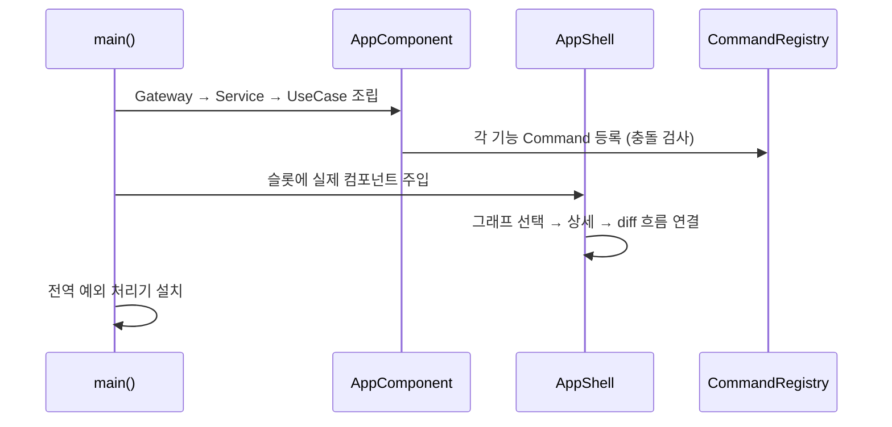
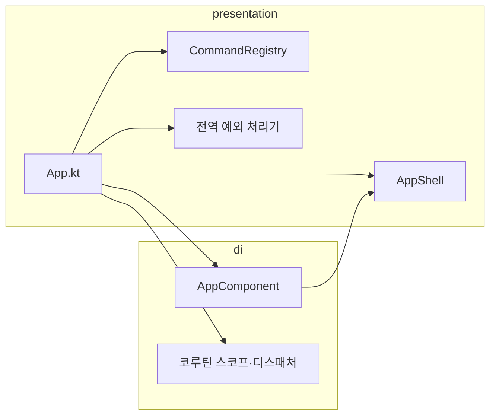

# [UND-26] 앱 통합 와이어업 · DI

> wave 5 · 사이즈 M · 의존 UND-12, UND-13, UND-14, UND-15, UND-16, UND-17, UND-18, UND-19, UND-20, UND-21, UND-22, UND-23, UND-24 · 소유 `presentation/App.kt` · `di/`

## 작업 내용 (설계 의도)
지금까지 각자 만들어진 컴포넌트를 **하나의 앱으로 연결**한다. wave 3~4 의 UI 티켓들이 같은 파일을
건드리지 않도록 미뤄 둔 공통 파일 수정을 여기서 단독으로 처리한다 (Single Writer per File).

하는 일:

1. **의존성 그래프 구성** — Gateway 구현체 → DomainService → UseCase → 상태 홀더 순으로 조립한다.
   프레임워크 DI 를 도입하지 않고 **명시적 생성자 조립**으로 시작한다. 규모가 작을 때 DI 컨테이너는
   추적을 어렵게 만들 뿐이다.
2. **셸 슬롯 연결** — UND-12 가 비워 둔 슬롯에 실제 컴포넌트를 넣는다.
3. **상태 흐름 연결** — 그래프에서 커밋 선택 → 상세 패널 → diff 뷰어로 이어지는 단방향 흐름을 잇는다.
4. **커맨드 등록** — 각 기능의 동작을 UND-22 레지스트리에 등록한다. 등록 시점 충돌 검사가 여기서 발동한다.
5. **코루틴 스코프·디스패처 배선** — Git I/O 는 `Dispatchers.IO`, `Repository` 접근은 직렬화 디스패처.
6. **저장소 열기 → 메인 화면 전환** 흐름 완성.

**전역 예외 처리기**를 여기 둔다. 어디서도 잡히지 않은 예외로 앱이 조용히 죽으면 사용자는 원인을 알 수 없다.
크래시 대신 오류 안내를 띄우고 로그 위치를 알린다.

**롤백**: 와이어업은 단일 커밋으로 유지해 `git revert` 로 통째로 되돌린다.

## 다이어그램

### 처리 흐름

### 클래스 의존

## 테스트 케이스

- 앱을 실행하면 환영 화면이 뜨고 저장소를 열면 메인 화면으로 전환된다
- 그래프에서 커밋을 선택하면 상세 패널이 갱신되고 파일 선택 시 diff 가 표시된다
- 커맨드 등록 시 단축키 충돌이 있으면 앱 시작이 실패한다
- Git I/O 가 `Dispatchers.IO` 에서 실행된다 (UI 스레드 점유 없음)
- `Repository` 동시 접근이 직렬화 디스패처로 직렬화된다
- 처리되지 않은 예외가 발생해도 앱이 죽지 않고 오류 안내가 표시된다
- 저장소를 전환하면 이전 저장소의 상태가 화면에 남지 않는다
- 창을 닫으면 열린 JGit 자원이 모두 닫힌다
