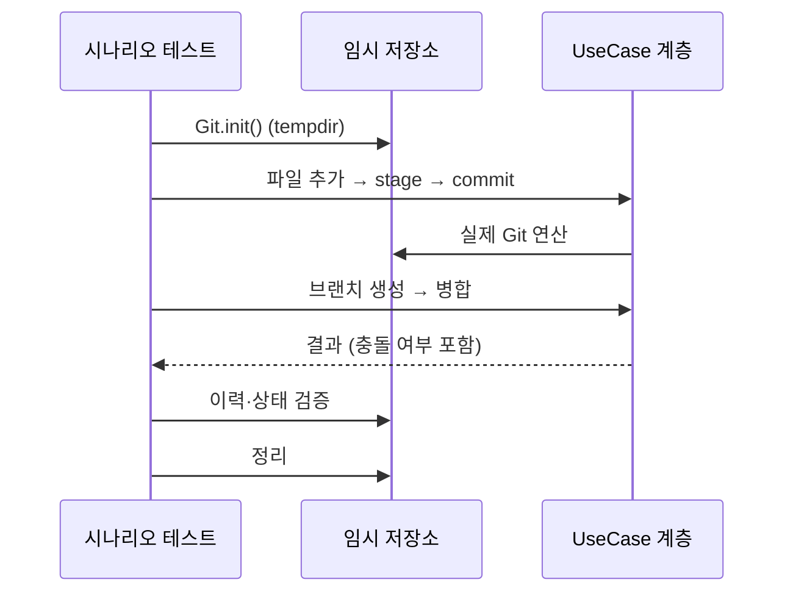
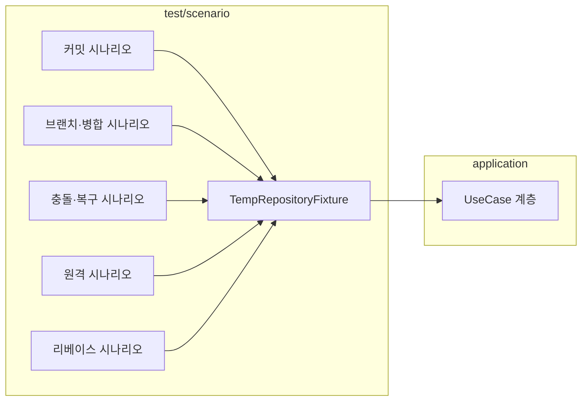

# [UND-27] E2E 시나리오 테스트

> wave 6 · 사이즈 M · 의존 UND-26 · 소유 `app/src/test/kotlin/.../scenario/`

## 작업 내용 (설계 의도)
개별 티켓의 단위·통합 테스트가 통과해도 **이어 붙였을 때 깨지는 것**이 있다. 실제 임시 저장소를 만들어
사용자 흐름을 처음부터 끝까지 돌린다.

**Mock 을 쓰지 않는다.** 시나리오 테스트에서 JGit 을 대체하면 검증하려던 것을 검증하지 못한다
([`testing`](../.agent/rules/testing.md) 규칙 1). 임시 디렉토리에 저장소를 만들고, 원격이 필요한 시나리오는
로컬 경로를 원격으로 등록해 네트워크 없이 검증한다.

시나리오:

| # | 흐름 |
|---|---|
| 1 | 저장소 생성 → 파일 추가 → stage → 커밋 → 이력에 반영 확인 |
| 2 | 브랜치 생성 → 체크아웃 → 커밋 → 원 브랜치로 복귀 → 병합 |
| 3 | 충돌 유발 병합 → 충돌 감지 → 해결 → continue → 병합 커밋 확인 |
| 4 | 충돌 유발 병합 → abort → 시작 전 상태 복구 확인 |
| 5 | 로컬 원격 등록 → push → 다른 클론에서 fetch → 이력 일치 확인 |
| 6 | 변경 → stash → 워킹트리 정리 확인 → pop → 복원 확인 |
| 7 | 커밋 여러 개 → 대화형 리베이스(재정렬 + squash) → 결과 이력 확인 |
| 8 | 저장소 열기 → 전환 → 이전 저장소 자원 해제 확인 |

각 시나리오는 **독립적**이다. 이전 시나리오가 남긴 상태에 의존하지 않고, 자기 임시 저장소를 만들고 정리한다.

시간·난수에 의존하지 않도록 커밋 타임스탬프는 고정값을 주입한다.

## 다이어그램

### 처리 흐름

### 클래스 의존

## 테스트 케이스

- 저장소 생성 → 커밋까지의 흐름이 이력에 정확히 반영된다
- 브랜치 분기 후 병합하면 병합 커밋의 부모가 2개다
- 충돌 병합을 해결하고 continue 하면 병합 커밋이 생성된다
- 충돌 병합을 abort 하면 시작 전 이력·워킹트리로 정확히 복구된다
- 로컬 원격으로 push 후 다른 클론에서 fetch 하면 이력이 일치한다
- stash push 후 워킹트리가 정리되고 pop 하면 변경이 복원된다
- 대화형 리베이스로 재정렬·squash 한 결과 이력이 계획과 일치한다
- 저장소를 전환하면 이전 저장소의 JGit 자원이 해제된다 (열린 핸들 0)
- 각 시나리오가 독립 임시 저장소를 쓰고 종료 시 정리된다
