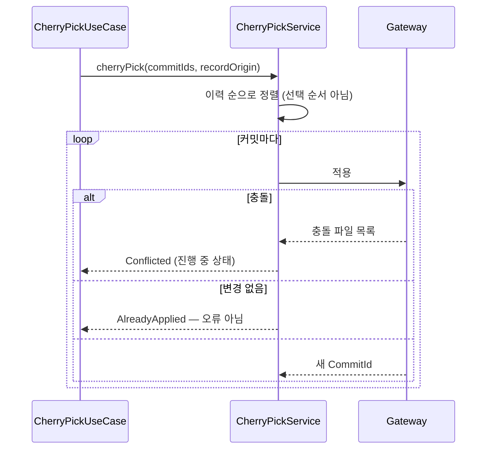
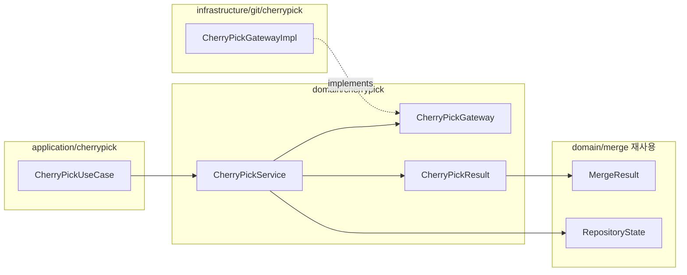

# [UND-28] Cherry-pick 실행

> wave 7 · 사이즈 M · 의존 UND-21 · 소유 `domain/cherrypick/` · `application/cherrypick/` · `infrastructure/git/cherrypick/`

## 작업 내용 (설계 의도)
특정 커밋의 변경만 현재 브랜치로 가져온다. 병합·리베이스와 **충돌 처리 구조를 공유**하므로
충돌 결과는 `CherryPickResult` 로 표현하고, 진행 중 상태는 UND-21 과 같은 공통 `RepositoryState` 로
읽는다 — 상태 타입을 두 벌로 만들지 않는다.

여러 커밋을 한 번에 cherry-pick 할 수 있어야 한다. 이때 **순서가 결과를 바꾼다** —
선택 순서가 아니라 **이력 순서(오래된 것부터)** 로 적용하고 그 사실을 결과에 명시한다.
클릭한 순서대로 적용하면 뒤 커밋이 앞 커밋을 전제로 할 때 불필요한 충돌이 난다.

원본 커밋 해시를 메시지에 기록하는 옵션(`-x` 상당)을 둔다. 나중에 "이 커밋이 어디서 왔는지" 를
추적하는 유일한 단서다.

이미 적용된 변경을 다시 cherry-pick 하면 **빈 커밋**이 된다. 오류가 아니라 정상 결과이므로
"이미 적용됨" 으로 구분해 반환한다 — 실패로 처리하면 사용자가 뭘 해야 할지 모른다.

계속·중단은 `CherryPickGateway`·`CherryPickService` 의 cherry-pick 전용 연산으로 둔다 — UND-21 의
`MergeService` continue·abort 는 병합·리베이스 상태 전용이다. 중단은 UND-21 과 같은 원칙으로
사라질 편집을 확인받은 뒤에만 실행한다.

**롤백**: 충돌 시 abort 로 시작 전 상태로 복구한다 — 적용 완료 후에는 revert 로 되돌린다.

## 다이어그램

### 처리 흐름

### 클래스 의존

## 테스트 케이스

- 단일 커밋 cherry-pick 이 현재 브랜치에 새 커밋을 만든다
- 여러 커밋을 선택하면 선택 순서가 아니라 이력 순서로 적용된다
- 충돌 시 `Conflicted` 결과와 충돌 파일 목록이 반환된다 (예외 아님)
- 이미 적용된 변경을 cherry-pick 하면 `AlreadyApplied` 로 구분 반환된다
- 원본 기록 옵션을 켜면 커밋 메시지에 원본 해시가 남는다
- 충돌 후 abort 하면 시작 전 상태로 복구된다
- 사라질 편집을 확인받지 않으면 abort 하지 않는다
- 워킹트리가 더티하면 시작하지 않는다
