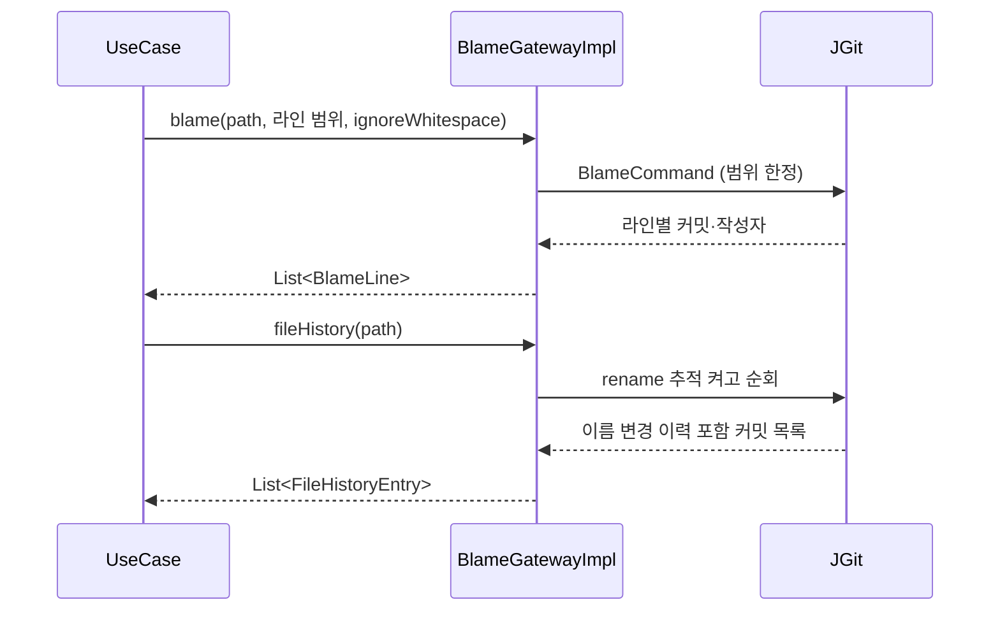
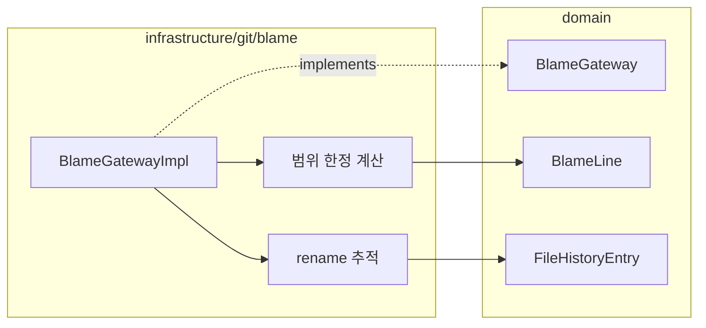

# [UND-29] Blame · 파일 이력 조회

> wave 7 · 사이즈 M · 의존 UND-01, UND-05 · 소유 `domain/blame/` · `infrastructure/git/blame/`

## 작업 내용 (설계 의도)
`BlameGateway` 를 신설한다. 파일의 **라인별 최종 수정 커밋**과 **파일 단위 변경 이력**을 조회한다.

blame 은 비싸다. 파일 전체를 한 번에 계산하면 큰 파일에서 초 단위로 멈추므로 **라인 범위 단위**로
계산하는 진입점을 둔다 — 화면에 보이는 구간만 먼저 계산하고 스크롤에 따라 확장한다.

**공백 무시**를 인자로 받는다. 들여쓰기만 바꾼 커밋이 모든 라인의 blame 을 덮어쓰면 실제 작성자를 찾을 수 없다.

**코드 이동·복사 탐지(`-M`/`-C` 상당)는 범위 밖이다.** 파일 단위 rename 추적과는 다른 기능이고,
JGit 의 blame 경로가 이를 제공하는지 확인되지 않았다. 필요해지면 별도 엔진이나 외부 `git` 실행 전략을
정하는 후속 티켓으로 다룬다 — **여기서 사용자 옵션으로 노출하지 않는다.**

파일 이력은 **이름 변경을 따라간다.** rename 지점에서 이력이 끊기면 파일의 진짜 시작점을 볼 수 없다.
UND-05 가 켠 rename 탐지를 여기서도 쓴다.

삭제된 파일의 이력도 조회할 수 있어야 한다 — 현재 워킹트리에 없는 경로를 특정 커밋 기준으로 조회한다.

## 다이어그램

### 처리 흐름

### 클래스 의존

## 테스트 케이스

- 파일의 각 라인에 최종 수정 커밋과 작성자가 매핑된다
- 라인 범위를 지정하면 그 범위만 계산된다 (전체 계산 없음)
- 공백 무시 옵션을 켜면 들여쓰기만 바꾼 커밋이 blame 결과를 덮지 않는다
- 이름이 바뀐 파일의 이력이 rename 지점을 넘어 이어진다
- 삭제된 파일도 특정 커밋 기준으로 이력을 조회할 수 있다
- 빈 파일의 blame 은 빈 결과를 반환하고 예외를 던지지 않는다
- 이진 파일에 blame 을 요청하면 지원하지 않음으로 명시 반환된다
