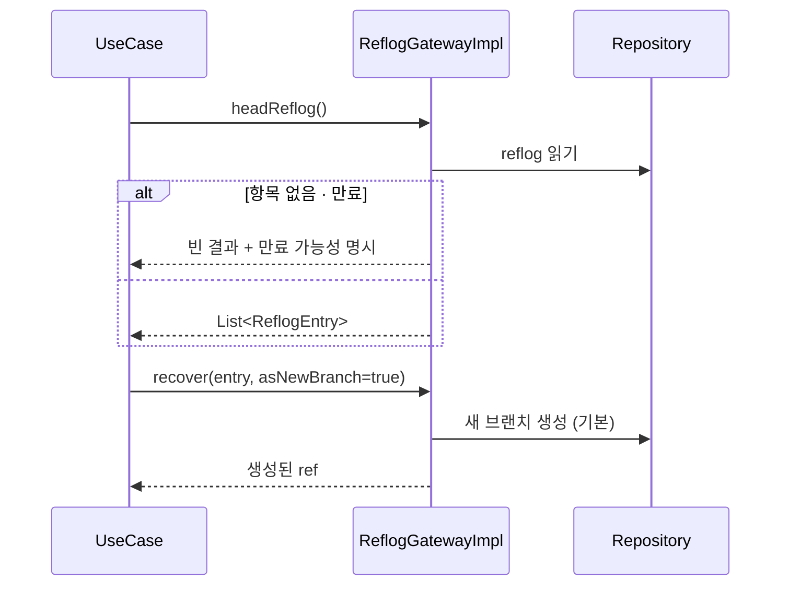
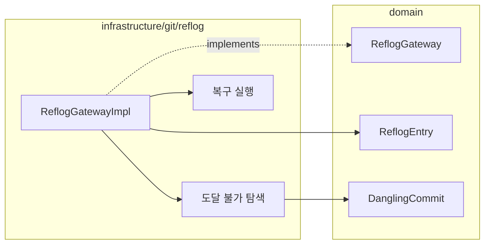

# [UND-30] Reflog 조회 · 복구

> wave 7 · 사이즈 M · 의존 UND-01 · 소유 `domain/reflog/` · `infrastructure/git/reflog/`

## 작업 내용 (설계 의도)
`ReflogGateway` 를 신설한다. **잘못된 reset·rebase·브랜치 삭제로 잃어버린 커밋을 되찾는 경로**다.
GUI 클라이언트가 있어야 할 이유 중 하나다 — 터미널에서 reflog 를 읽는 건 진입 장벽이 높다.

제공할 것:

1. **HEAD reflog 와 ref 별 reflog** — 언제 무엇이 어디로 움직였는지 시각·동작·이전/이후 해시.
2. **도달 불가 커밋 탐색** — reflog 에도 없지만 객체 DB 에 남아 있는 커밋. 느리므로 별도 진입점.
3. **복구** — 선택한 지점에 새 브랜치를 만들거나 기존 ref 를 그 지점으로 이동.

복구 기본값은 **새 브랜치 생성**이다. 기존 ref 이동은 또 다른 유실을 만들 수 있어 명시적 선택으로만 받는다.

reflog 는 만료된다(기본 90일). 항목이 없거나 만료됐을 가능성을 결과에 담아, 사용자가
"기록이 없다" 와 "조회에 실패했다" 를 구분할 수 있게 한다.

**롤백**: 복구는 새 ref 생성 또는 기존 ref 이동이라, 되돌리려면 reflog 에서 이전 위치를 다시 찾는다.

## 다이어그램

### 처리 흐름

### 클래스 의존

## 테스트 케이스

- reset 이후 HEAD reflog 에 이전 위치가 기록돼 조회된다
- 브랜치 삭제 후에도 reflog 로 삭제 직전 커밋을 찾을 수 있다
- 복구 기본 동작이 새 브랜치 생성이다 (기존 ref 이동이 아니다)
- 기존 ref 이동은 명시적 인자를 줬을 때만 수행된다
- reflog 항목이 없으면 빈 결과와 만료 가능성이 함께 반환된다
- 도달 불가 커밋 탐색이 reflog 에 없는 커밋을 찾아낸다
- 새로 만든 저장소의 reflog 조회가 예외 없이 빈 결과를 반환한다
