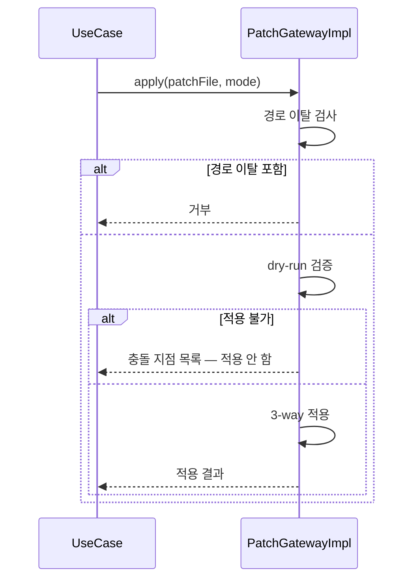
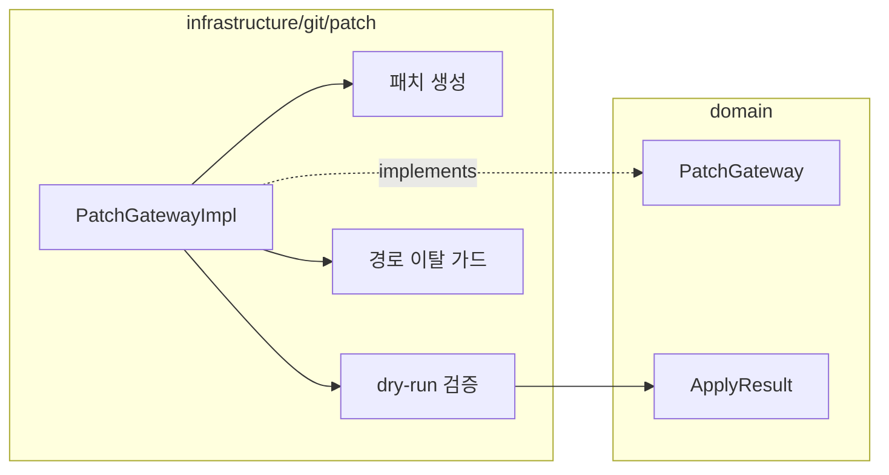

# [UND-31] Patch 생성 · 적용

> wave 7 · 사이즈 M · 의존 UND-05 · 소유 `domain/patch/` · `infrastructure/git/patch/`

> 🚫 **폐기 — [UND-60](UND-60-patch-apply-transaction.md) 이 대체한다.**
> 이 티켓의 구현은 실패 복원 경로에서 데이터 유실 p0 이 6라운드 동안 수렴하지 않아 **머지하지 않았다**.
> 기능 범위는 UND-60 이 그대로 이어받고, 복원 설계만 트리 트랜잭션으로 바꿨다.
> 이 문서는 그 판단 근거로만 남긴다 — 착수 대상이 아니다.

## 작업 내용 (설계 의도)
`PatchGateway` 를 신설한다. 커밋·변경 범위를 patch 파일로 내보내고, 받은 패치를 적용한다.
원격 접근 없이 변경을 주고받는 경로이자, 실험적 변경을 보관하는 수단이다.

**생성**: 커밋 범위 또는 워킹트리/인덱스 변경을 내보낸다. 여러 커밋이면 커밋당 파일 하나와
단일 통합 패치 둘 다 지원한다 — 용도가 다르다.

**적용**: 반드시 **dry-run 을 먼저** 돌린다. 적용 가능 여부와 충돌 지점을 알려준 뒤 실제 적용한다.
절반만 적용된 상태로 실패하면 사용자가 수습할 방법이 없다.

**원자성 확보 방식**: 표준 패치 적용 경로가 "검사만" 과 "실패 시 원상복구" 를 보장한다고 전제하지 않는다.
**격리된 임시 인덱스·작업 영역에서 먼저 적용해 보고, 전부 성공했을 때만 실제 워킹트리로 승격**한다.
dry-run 은 이 격리 적용의 결과를 보고하는 것이지 별도 API 호출이 아니다.

> 표준 라이브러리 경로만으로 이 보장이 되는지, 아니면 외부 `git apply --check/--3way` 를 써야 하는지는
> 스펙 단계에서 확인해 고정한다. **외부 프로세스를 쓰기로 하면 미설치 시 동작·정리 정책을 함께 정한다.**

적용 모드를 구분한다:

| 모드 | 동작 |
|---|---|
| 워킹트리에만 | 검토 후 직접 스테이징 |
| 인덱스까지 | 바로 커밋 가능 |
| 커밋까지 생성 | 작성자·메시지를 패치에서 가져옴 |

`3-way` 적용을 기본으로 켠다 — 단순 라인 매칭보다 잘 붙고, 실패해도 충돌 표식으로 남아
UND-23 충돌 에디터가 이어받을 수 있다.

패치는 **신뢰할 수 없는 입력**이다. 경로 이탈(`../`)이 포함된 패치는 거부한다.

**롤백**: 적용 전 dry-run 으로 검증하고, 적용 후 문제가 있으면 역방향 적용으로 되돌린다.

## 다이어그램

### 처리 흐름

### 클래스 의존

## 테스트 케이스

- 커밋 하나를 patch 로 내보내고 다시 적용하면 동일한 변경이 재현된다
- 여러 커밋을 커밋당 파일로 내보낼 수 있다
- 워킹트리 변경을 patch 로 내보낼 수 있다
- 적용 전 dry-run 이 먼저 수행되고, 불가하면 아무것도 적용되지 않는다
- 경로 이탈이 포함된 패치는 거부된다
- 3-way 적용으로 컨텍스트가 조금 다른 패치도 붙는다
- 적용 실패 시 워킹트리가 부분 적용 상태로 남지 않는다
- 빈 패치 파일은 변경 없음으로 처리된다
