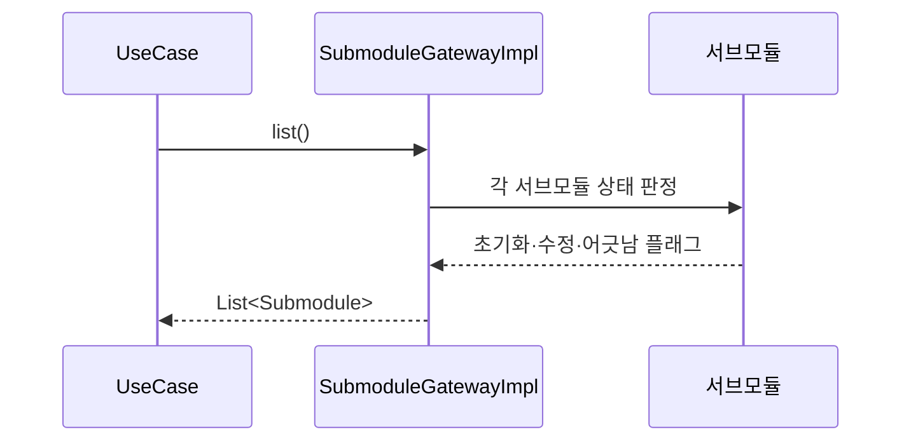
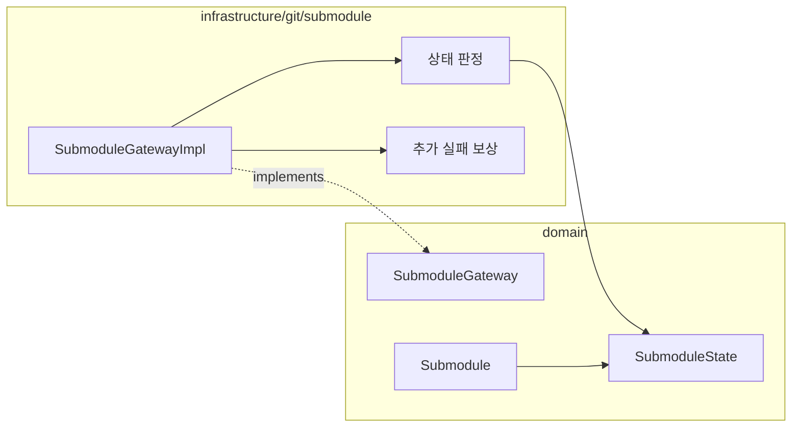

# [UND-32] Submodule 관리

> wave 7 · 사이즈 M · 의존 UND-02, UND-59 · 소유 `domain/submodule/` · `infrastructure/git/submodule/`

## 작업 내용 (설계 의도)

`SubmoduleGateway`를 신설해 서브모듈 목록·상태 조회, 초기화, 업데이트, 추가를 제공한다.

서브모듈 상태는 초기화 여부·로컬의 커밋되지 않은 수정 여부·부모가 기록한 커밋과 실제 HEAD의
어긋남 여부를 독립 플래그로 반환한다. 수정됨과 어긋남이 동시에 성립해도 정보를 하나로 접지 않는다.

**중첩 서브모듈**을 지원한다. 재귀 여부를 인자로 받되, 재귀는 느리고 네트워크를 많이 쓰므로
기본값을 비재귀로 둔다.

추가가 실패하면 `.gitmodules`·gitlink 인덱스 엔트리·설정 섹션과 이 호출이 만든 디렉터리를
호출 전 상태로 되돌린다.

서브모듈 제거는 이 티켓에서 제공하지 않는다. 재귀 삭제의 안전성은 별도 설계가 필요하므로
UND-62가 보존 대상 수집과 제한된 삭제 경로를 설계·구현한다.

## 다이어그램

### 처리 흐름

### 클래스 의존

## 테스트 케이스

- 서브모듈 목록이 각각의 상태와 함께 반환된다
- 미초기화 서브모듈을 초기화하면 최신 상태가 된다
- 부모가 기록한 커밋과 실제 HEAD가 다르면 어긋남으로 판정된다
- 재귀 옵션이 꺼져 있으면 중첩 서브모듈은 초기화·업데이트되지 않는다
- 추가 성공과 실패 보상이 `.gitmodules`·gitlink·설정·생성 디렉터리의 호출 전 상태를 보존한다
- 서브모듈이 없는 저장소는 빈 목록을 반환한다
- 서브모듈 안에 커밋되지 않은 변경이 있으면 수정됨으로 판정된다
