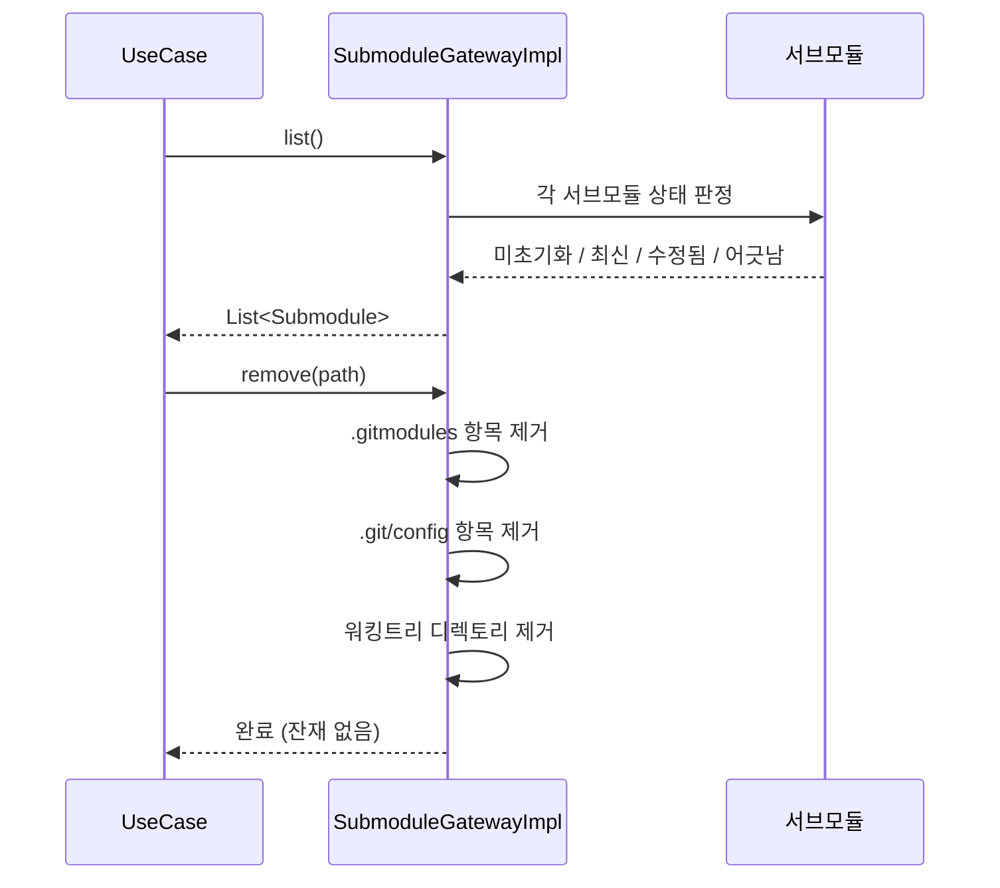
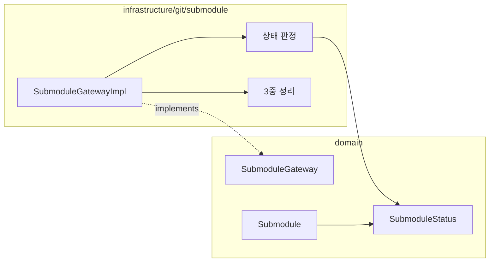

# [UND-32] Submodule 관리

> wave 7 · 사이즈 M · 의존 UND-02 · 소유 `domain/submodule/` · `infrastructure/git/submodule/`

## 작업 내용 (설계 의도)
`SubmoduleGateway` 를 신설한다. 서브모듈 목록·상태 조회, 초기화, 업데이트, 추가, 제거다.

서브모듈은 **부모 저장소가 특정 커밋을 가리키는** 구조라 상태가 넷으로 갈린다.

| 상태 | 의미 |
|---|---|
| 미초기화 | `.gitmodules` 에는 있지만 clone 되지 않음 |
| 최신 | 부모가 가리키는 커밋과 일치 |
| 수정됨 | 서브모듈 안에 커밋되지 않은 변경 있음 |
| 어긋남 | 부모가 가리키는 커밋과 실제 HEAD 가 다름 |

이 구분을 그대로 반환한다 — "변경 있음" 하나로 뭉치면 사용자가 무엇을 해야 할지 알 수 없다.

**중첩 서브모듈**을 지원한다. 재귀 여부를 인자로 받되, 재귀는 느리고 네트워크를 많이 쓰므로
기본값을 비재귀로 둔다.

제거는 위험하다. `.gitmodules` 항목·`.git/config` 항목·워킹트리 디렉토리 **세 곳을 모두** 정리해야
잔재가 남지 않는다. 하나라도 빠지면 다음 clone 에서 이상하게 동작한다.

**롤백**: 추가는 `.gitmodules` 항목과 디렉토리 제거로 되돌린다 — 제거는 되돌릴 수 없으므로 확인 절차를 거친다.

## 다이어그램

### 처리 흐름

### 클래스 의존

## 테스트 케이스

- 서브모듈 목록이 각각의 상태와 함께 반환된다
- 미초기화 서브모듈을 초기화하면 최신 상태가 된다
- 부모가 가리키는 커밋과 실제 HEAD 가 다르면 어긋남으로 판정된다
- 재귀 옵션이 꺼져 있으면 중첩 서브모듈은 초기화되지 않는다
- 제거 후 `.gitmodules`·`.git/config`·워킹트리에 잔재가 남지 않는다
- 서브모듈이 없는 저장소는 빈 목록을 반환한다
- 서브모듈 안에 커밋되지 않은 변경이 있으면 수정됨으로 판정된다
