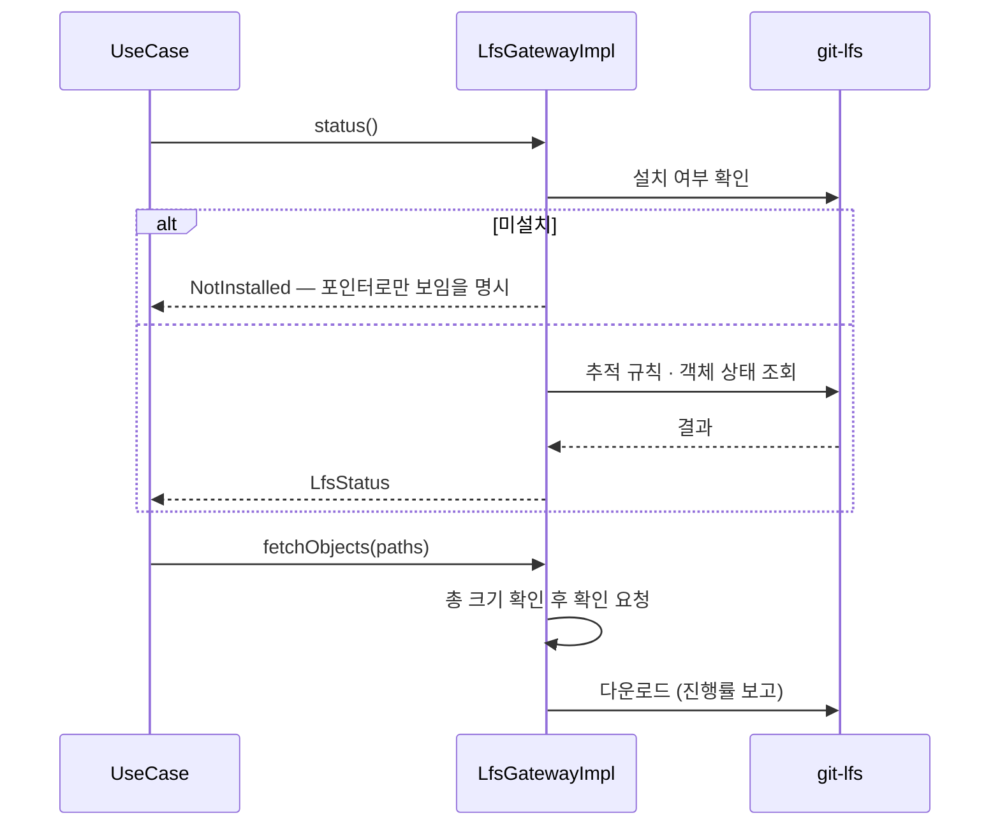
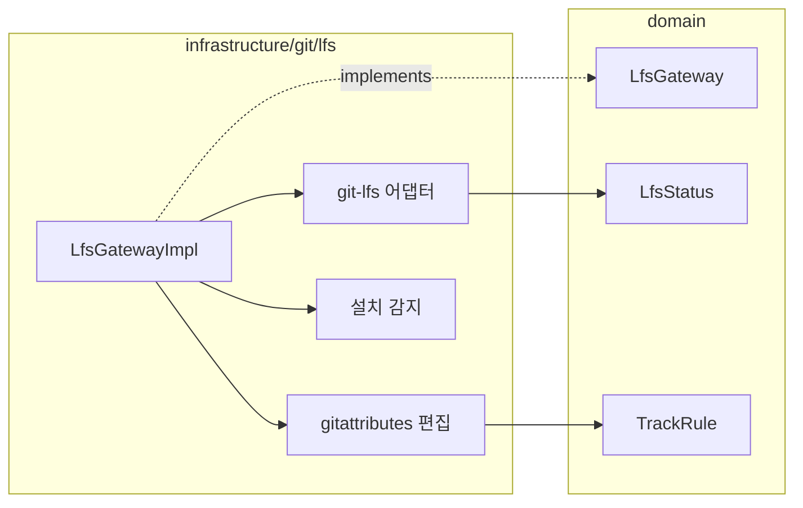

# [UND-33] Git LFS 연동

> wave 7 · 사이즈 M · 의존 UND-08 · 소유 `infrastructure/git/lfs/`

## 작업 내용 (설계 의도)
`LfsGateway` 를 신설한다. 대용량 파일을 포인터로 대체하는 Git LFS 를 다룬다.

**LFS 를 자체 구현하지 않는다.** 프로토콜을 직접 구현하면 서버 구현체마다 어긋난다.
설치된 `git-lfs` 를 호출하는 어댑터로 두고, **미설치 시 그 사실을 명확히 알린다** —
LFS 저장소를 LFS 없이 열면 포인터 텍스트만 보여 사용자가 "파일이 깨졌다" 고 오해한다.

다루는 것:

1. **추적 규칙 조회·추가·제거** (`.gitattributes` 기반)
2. **객체 상태** — 포인터만 있는지, 실제 파일이 받아졌는지
3. **fetch/pull 시 객체 동반 다운로드** — UND-08 원격 작업과 연동
4. **잠금(lock)** — 병합 불가능한 이진 파일의 동시 편집 방지. 서버가 지원할 때만

diff 화면에서 LFS 포인터는 **포인터 내용이 아니라 "LFS 객체" 로 표시**한다.
포인터 텍스트의 해시 변경을 diff 로 보여주는 건 무의미하다.

LFS 대역폭은 유료 한도가 있는 서비스가 많다. 큰 객체를 받기 전에 총 크기를 알리고 확인받는다.

**롤백**: 추적 규칙 추가는 `.gitattributes` 항목 제거로 되돌린다 — 이미 변환된 객체는 별도 마이그레이션이 필요하다.

## 다이어그램

### 처리 흐름

### 클래스 의존

## 테스트 케이스

- `git-lfs` 미설치 시 그 사실이 명시적으로 반환된다
- 추적 규칙을 추가하면 `.gitattributes` 에 반영된다
- 포인터만 있고 실제 객체가 없는 파일이 구분되어 보고된다
- 객체 다운로드 전에 총 크기가 보고된다
- 다운로드 진행률이 콜백으로 보고되고 취소할 수 있다
- LFS 추적 파일의 diff 가 포인터 텍스트가 아니라 LFS 객체로 표시된다
- 서버가 잠금을 지원하지 않으면 잠금 기능이 비활성으로 보고된다
- LFS 를 쓰지 않는 저장소는 빈 상태를 반환한다
