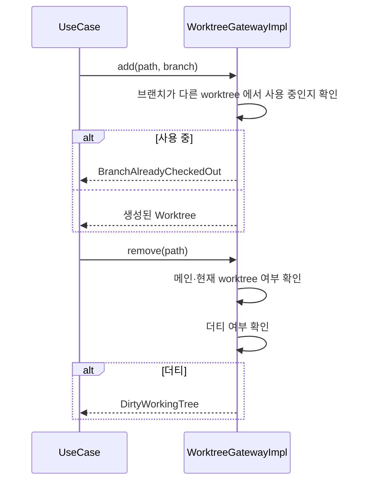
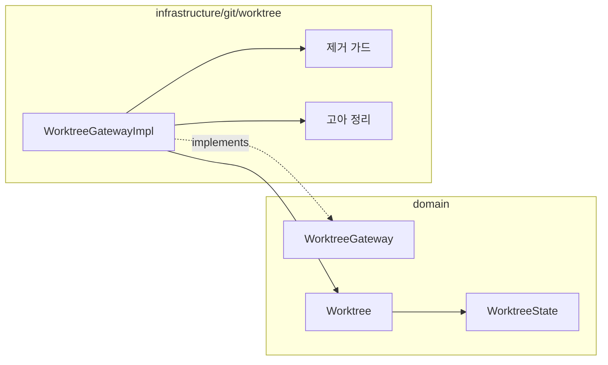

# [UND-34] Worktree 관리

> wave 7 · 사이즈 M · 의존 UND-02, UND-59 · 소유 `domain/worktree/` · `infrastructure/git/worktree/`

## 작업 내용 (설계 의도)
`WorktreeGateway` 를 신설한다. 하나의 저장소를 **여러 디렉토리에 동시 체크아웃**하는 git worktree 를 다룬다.
브랜치를 오갈 때 stash 하지 않아도 되는 실질적 이점이 크다.

목록·추가·제거를 제공한다. **prune·move·lock 은 범위 밖이다** — 고아 등록의 정리는 그 등록을
대상으로 한 `remove` 가 처리한다. 주의할 것 셋:

1. **같은 브랜치를 두 worktree 에 체크아웃할 수 없다.** 추가 전에 이미 사용 중인 브랜치인지 확인하고 알린다.
2. **제거는 커밋되지 않은 변경을 유실시킨다.** 대상이 더티하면 **항상 거부한다** — `force` 인자를
   두지 않는다. 강제 제거는 사용자 확인이 필요한 파괴적 연산이라 UI(UND-45)와 함께 다룬다.
3. **경로가 사라진 worktree 는 등록만 남는다.** 사용자가 디렉토리를 직접 지우면 메타데이터가 고아로
   남으므로, 목록에서 이 상태를 구분해 보여준다. 그 등록의 정리는 `remove` 로 한다.

메인 worktree 는 제거할 수 없다 — 목록에서 구분해 표시한다.
앱 자신이 열고 있는 worktree 를 제거하려는 시도도 막는다.

## 비목표 — 검사와 실행 사이의 외부 변경은 방어하지 않는다

더티 검사 · 빈 디렉터리 검사와 실제 삭제 · 생성 사이에 **다른 프로세스가** 워킹트리를 바꾸는 상황
(TOCTOU)은 이 티켓의 방어 대상이 아니다. 막으려면 워킹트리 전체 잠금이나 내용 해시 대조가 필요하고,
`git worktree remove` 자신도 같은 계약이다 (`.claude-local/WAVE7-DECISIONS.md` M1).

여전히 지키는 것: 정리는 **자기가 만든 경로만** 되돌린다. 대상 디렉터리를 재귀 삭제하지 않고,
기록에 없는 항목이 남아 있으면 지우지 않고 실패로 보고한다.

**롤백**: 추가는 제거로 되돌린다 — 제거 시 커밋되지 않은 변경은 유실되므로 확인 절차를 거친다.

## 다이어그램

### 처리 흐름

### 클래스 의존

## 테스트 케이스

- worktree 목록에 메인 worktree 가 구분되어 표시된다
- 사용 중이 아닌 브랜치로 worktree 를 추가하면 지정 경로에 생성되고 목록·브랜치 상태에 반영된다
- 이미 다른 worktree 가 체크아웃한 브랜치로 추가하면 거부된다
- 더티한 worktree 제거는 항상 거부된다 (강제 경로가 없다)
- 메인 worktree 는 제거할 수 없다
- 앱이 현재 열고 있는 worktree 는 제거할 수 없다
- 디렉토리가 사라진 worktree 가 고아 상태로 구분 표시된다
- 고아 등록을 대상으로 한 remove 가 그 등록만 정리하고 정상 worktree 는 건드리지 않는다
