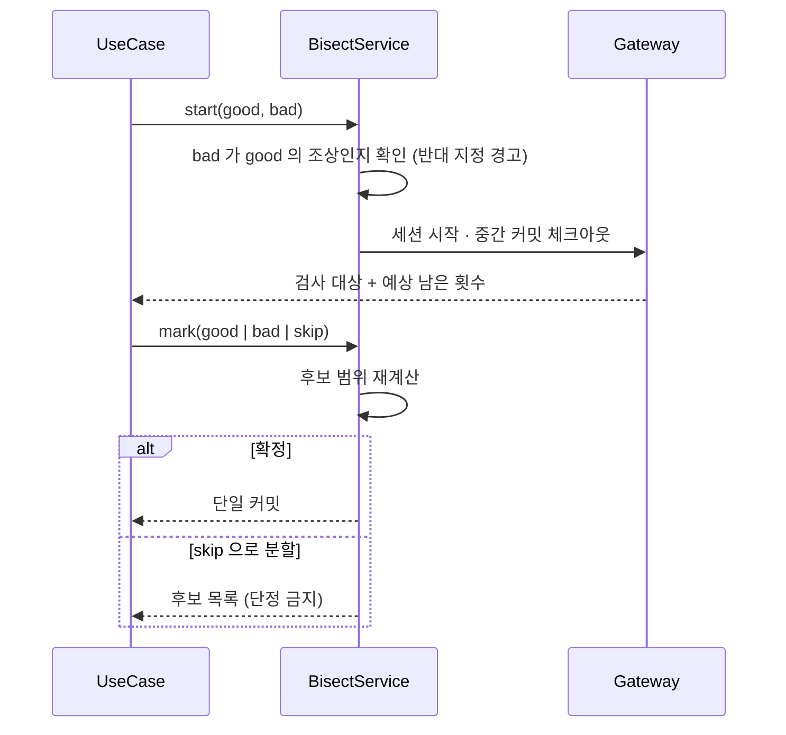
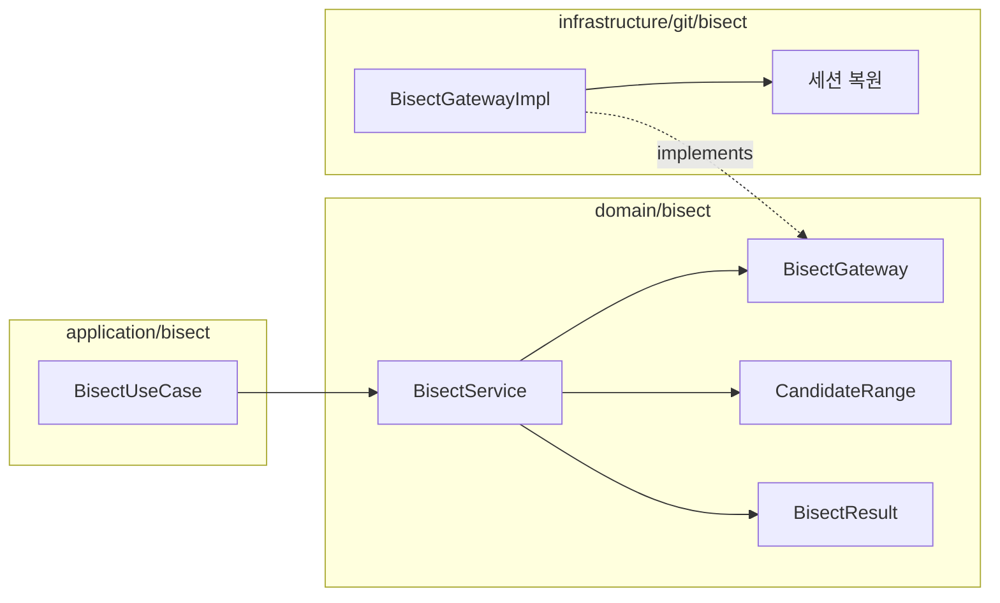

# [UND-35] Bisect 세션

> wave 7 · 사이즈 M · 의존 UND-03 · 소유 `domain/bisect/` · `application/bisect/` · `infrastructure/git/bisect/`

## 작업 내용 (설계 의도)
버그가 처음 들어온 커밋을 이분 탐색으로 찾는다. 세션이 여러 단계에 걸치므로 **상태 관리**가 본체다.

흐름: 시작(good/bad 지정) → 체크아웃된 커밋 판정(good/bad/skip) → 반복 → 결과 확정 → reset.

도메인에 **탐색 로직을 순수 함수로** 둔다 — 남은 후보 범위에서 다음 검사 대상과 예상 남은 횟수를
계산하는 부분은 저장소 없이 단위 테스트할 수 있다. "앞으로 약 3번 남았습니다" 를 보여주려면 이 계산이 필요하다.

`skip` 처리가 까다롭다. 빌드가 깨져 판정할 수 없는 커밋을 건너뛰면 후보 집합이 분할되어,
최종 결과가 **단일 커밋이 아니라 후보 목록**이 될 수 있다. 이 경우를 결과 타입에서 구분한다 —
하나로 단정하면 틀린 커밋을 지목하게 된다.

세션 상태는 저장소에 남으므로 **앱을 껐다 켜도 이어서 진행**할 수 있어야 한다.

good/bad 를 반대로 지정하는 실수가 흔하다. bad 가 good 의 조상이면 시작 시 경고한다.

**롤백**: reset 으로 시작 전 브랜치·커밋으로 복구한다 — 세션 상태는 저장소에 남아 앱 재시작 후에도 복구 가능하다.

## 다이어그램

### 처리 흐름

### 클래스 의존

## 테스트 케이스

- good/bad 지정 후 중간 커밋이 체크아웃된다
- 예상 남은 검사 횟수가 후보 수에 맞게 계산된다 (순수 함수 단위 테스트)
- good/bad 를 반복 지정하면 원인 커밋이 확정된다
- bad 가 good 의 조상이면 시작 시 경고가 반환된다
- skip 으로 후보가 분할되면 결과가 단일 커밋이 아니라 후보 목록으로 반환된다
- 앱 재시작 후 진행 중 세션이 복원된다
- reset 하면 시작 전 브랜치로 복구된다
- good 과 bad 사이에 커밋이 없으면 즉시 확정된다
