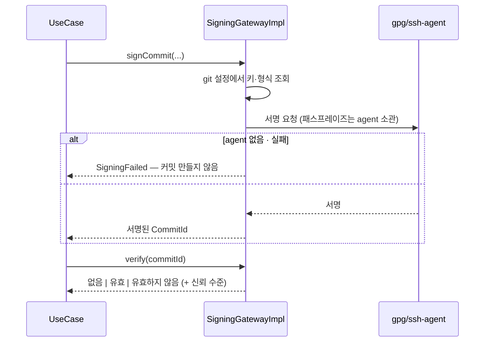
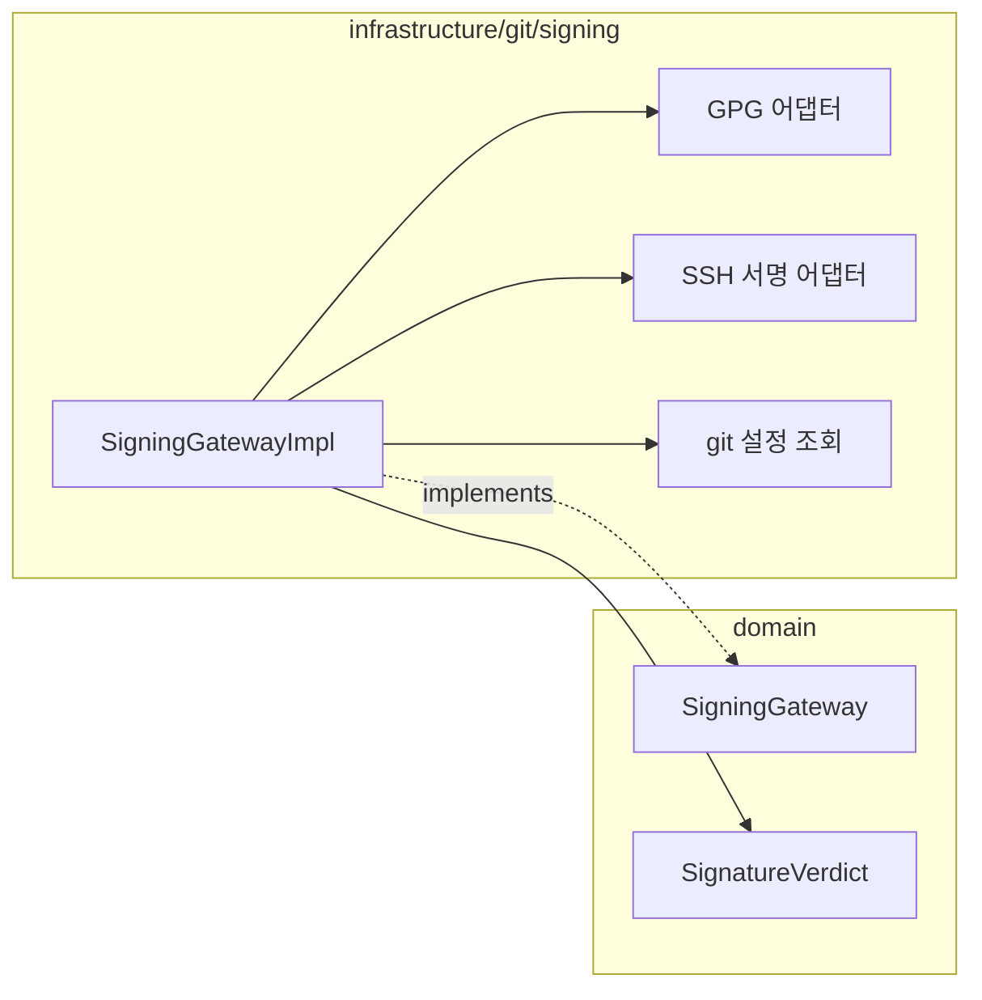

# [UND-36] 커밋 서명 (GPG / SSH)

> wave 7 · 사이즈 M · 의존 UND-06 · 소유 `domain/signing/` · `infrastructure/git/signing/`

## 작업 내용 (설계 의도)
커밋과 태그에 서명하고, 기존 커밋의 서명을 검증한다. GPG 와 SSH 서명 두 방식을 모두 지원한다.

**서명 키는 앱이 관리하지 않는다.** 기존 `gpg-agent`/`ssh-agent` 와 git 설정(`user.signingkey`,
`gpg.format`)을 그대로 쓴다. 앱이 별도 키 저장소를 만들면 사용자의 기존 설정과 어긋난다
([`credential-handling`](../.agent/rules/credential-handling.md) 규칙 4).

**패스프레이즈 입력란을 앱에 두지 않는다.** agent 가 처리하게 하고, agent 가 없어 실패하면
그 사실을 알린다. 앱이 패스프레이즈를 받으면 그 순간 메모리에 비밀이 생긴다.

검증은 셋으로 구분한다 — 서명 없음 / 유효 / **유효하지 않음**. 뭉치면 위조 서명이 "서명 없음" 과
같아 보인다. 신뢰 수준(키를 신뢰하는지)도 함께 반환한다.

서명 실패 시 **커밋을 만들지 않는다.** 서명하려다 실패했는데 서명 없이 커밋되면 사용자는 서명된 줄 안다.

**롤백**: 서명 설정은 끄면 즉시 비활성화된다 — 이미 서명된 커밋은 그대로 유효하다.

## 다이어그램

### 처리 흐름

### 클래스 의존

## 테스트 케이스

- 서명 활성화 상태에서 커밋하면 서명이 포함된다
- 서명 실패 시 커밋이 생성되지 않는다
- 검증 결과가 서명 없음 / 유효 / 유효하지 않음 셋으로 구분된다
- SSH 서명 형식이 설정된 저장소에서 SSH 서명이 사용된다
- agent 가 없으면 그 사실이 실패 사유로 반환된다
- 앱이 패스프레이즈를 직접 받지 않는다 (입력 경로 부재 검증)
- 서명되지 않은 기존 커밋 검증이 '서명 없음' 으로 정상 반환된다
- 태그 서명도 동일 경로로 동작한다
