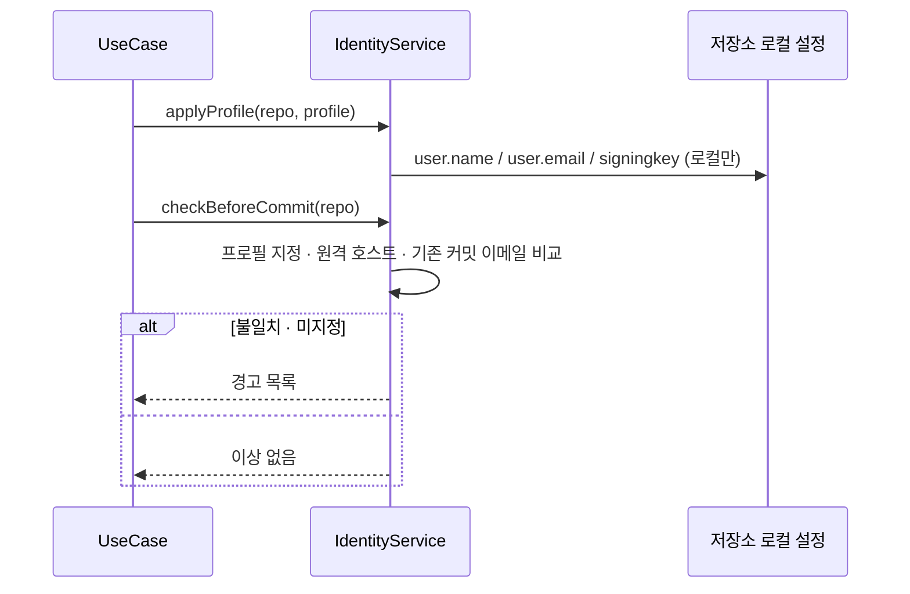
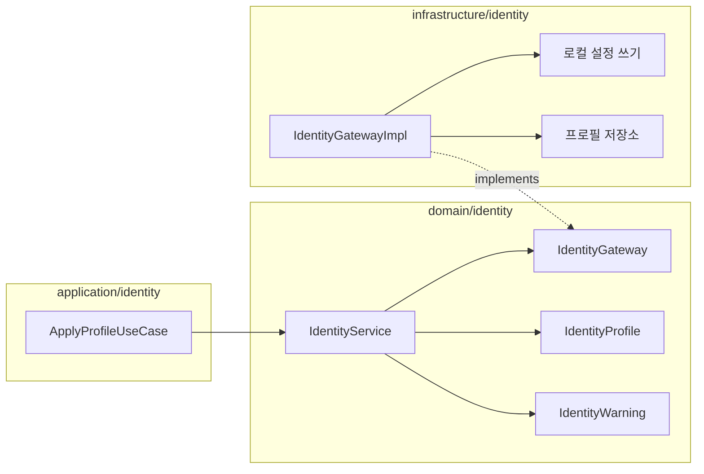

# [UND-37] Git identity 프로필

> wave 7 · 사이즈 S · 의존 UND-06, UND-11 · 소유 `domain/identity/` · `application/identity/` · `infrastructure/identity/`

## 작업 내용 (설계 의도)
회사 계정과 개인 계정을 오가는 흔한 상황을 다룬다. **잘못된 이메일로 쌓인 커밋은 되돌리는 비용이 크다.**

프로필은 이름·이메일·서명 키·기본 인증 방식을 묶은 단위다. 저장소별로 프로필을 지정하면
그 저장소의 **로컬** git 설정에 적용한다.

**전역 설정을 덮어쓰지 않는다.** 앱이 전역 설정을 바꾸면 터미널에서 하는 작업까지 영향을 받는다.

경고 규칙:

| 조건 | 동작 |
|---|---|
| 저장소에 프로필이 지정되지 않음 | 첫 커밋 전에 확인 요청 |
| 원격 호스트가 프로필의 예상 호스트와 다름 | 경고 (회사 레포에 개인 계정 등) |
| 이미 다른 이메일로 커밋한 이력이 있음 | 불일치 알림 |

프로필은 UND-11 설정 저장소에 보관한다. **서명 키 ID 는 저장하지만 키나 패스프레이즈는 저장하지 않는다.**

**롤백**: 프로필 적용은 저장소 로컬 설정 변경이라, 이전 값으로 되돌리거나 로컬 설정을 제거하면 전역 값으로 복귀한다.

## 다이어그램

### 처리 흐름

### 클래스 의존

## 테스트 케이스

- 프로필을 적용하면 저장소 로컬 설정에만 반영되고 전역 설정은 변경되지 않는다
- 프로필이 지정되지 않은 저장소에서 커밋 전 확인 경고가 발생한다
- 원격 호스트가 프로필의 예상 호스트와 다르면 경고가 발생한다
- 기존 커밋과 다른 이메일이면 불일치 알림이 발생한다
- 프로필에 서명 키 ID 는 저장되지만 키·패스프레이즈는 저장되지 않는다
- 프로필을 삭제하면 해당 저장소는 전역 설정을 따른다
- 프로필이 0건이면 빈 목록을 반환하고 경고만 동작한다
