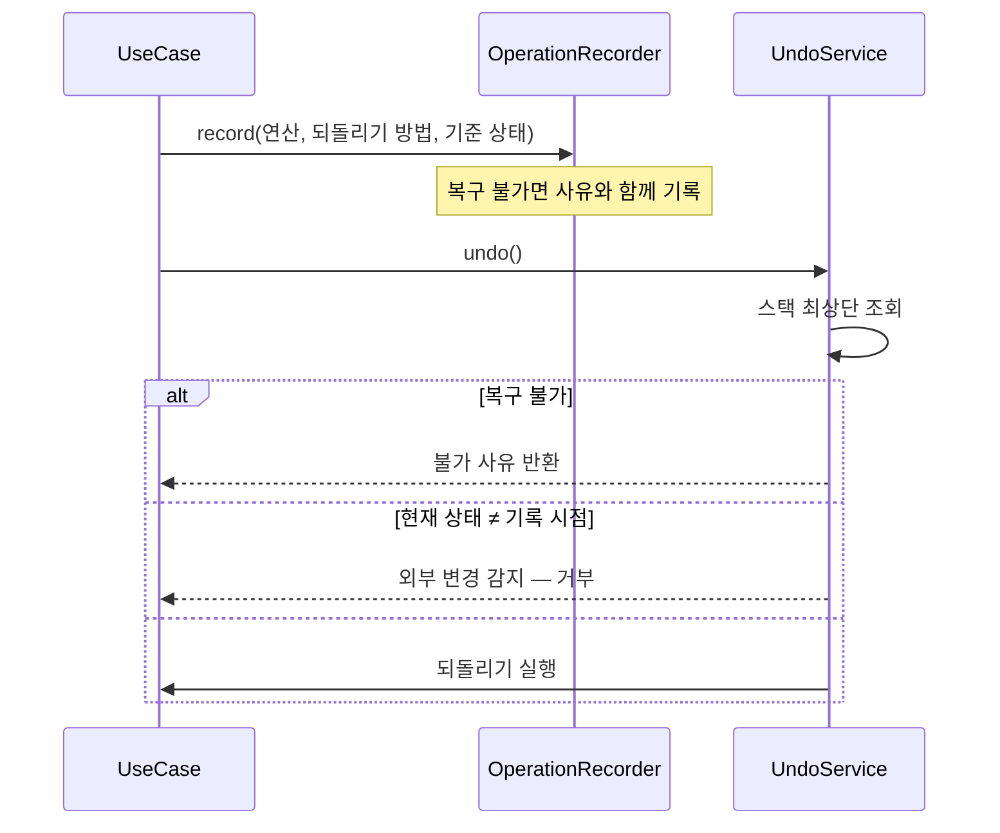
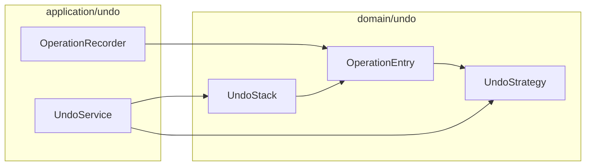

# [UND-38] 실행 이력 · Undo 스택

> wave 7 · 사이즈 L · 의존 UND-09, UND-21 · 소유 `domain/undo/` · `application/undo/`

## 작업 내용 (설계 의도)
앱에서 수행한 Git 연산을 기록하고 **되돌릴 수 있는 것은 되돌린다.** GitKraken 의 Undo 버튼에 해당하며,
Git GUI 를 안심하고 쓰게 만드는 핵심 장치다.

**Git 은 원래 undo 가 없다.** 되돌리기는 연산마다 다른 방법으로 흉내 내야 하므로,
각 연산이 자기 되돌리기 방법을 함께 기록한다.

| 연산 | 되돌리기 |
|---|---|
| commit | 직전 커밋으로 soft reset |
| checkout | 이전 ref 로 재체크아웃 |
| branch 생성 | 브랜치 삭제 |
| merge / rebase / cherry-pick | 조작 결과의 `previousTarget` 으로 조건부 reset (`HardResetTo`) |
| stash push | stash pop |
| **push** | **복구 불가** — 스택에 명시 |
| **hard reset · stash drop** | **복구 불가** — 스택에 명시 |

**복구 불가 연산을 조용히 넘기지 않는다.** Undo 가 안 되는 이유를 문장으로 보여줘야
사용자가 "왜 안 되지" 로 끝나지 않는다.

되돌리기 전 **현재 상태가 기록 시점과 같은지 확인**한다. 그 사이 터미널에서 다른 작업을 했다면
되돌리기가 엉뚱한 결과를 만든다 — 다르면 거부하고 이유를 알린다.

스택은 세션 단위로 유지하고 상한을 둔다. 이력은 저장소에 남기지 않는다 — 앱 상태다.

**롤백**: Undo 자체가 롤백 수단이다 — 되돌릴 수 없는 연산은 스택에 '복구 불가' 로 기록해 명시한다.

## 다이어그램

### 처리 흐름

### 클래스 의존

## 테스트 케이스

- 커밋 후 undo 하면 직전 상태로 soft reset 된다
- 브랜치 생성 후 undo 하면 브랜치가 삭제된다
- 병합 후 undo 하면 조작 결과의 `previousTarget` 위치로 복구되고, 그 사이 다른 이동이 있었으면 거부된다
- push 는 복구 불가로 기록되고 undo 시 사유가 반환된다
- hard reset 은 복구 불가로 기록된다
- 기록 이후 외부에서 저장소가 변경되면 undo 가 거부되고 사유가 반환된다
- 스택 상한을 넘으면 오래된 항목부터 제거된다
- 스택이 비어 있으면 undo 가 아무 동작도 하지 않고 그 사실을 반환한다
- undo 이력 자체가 저장소에 커밋되지 않는다
