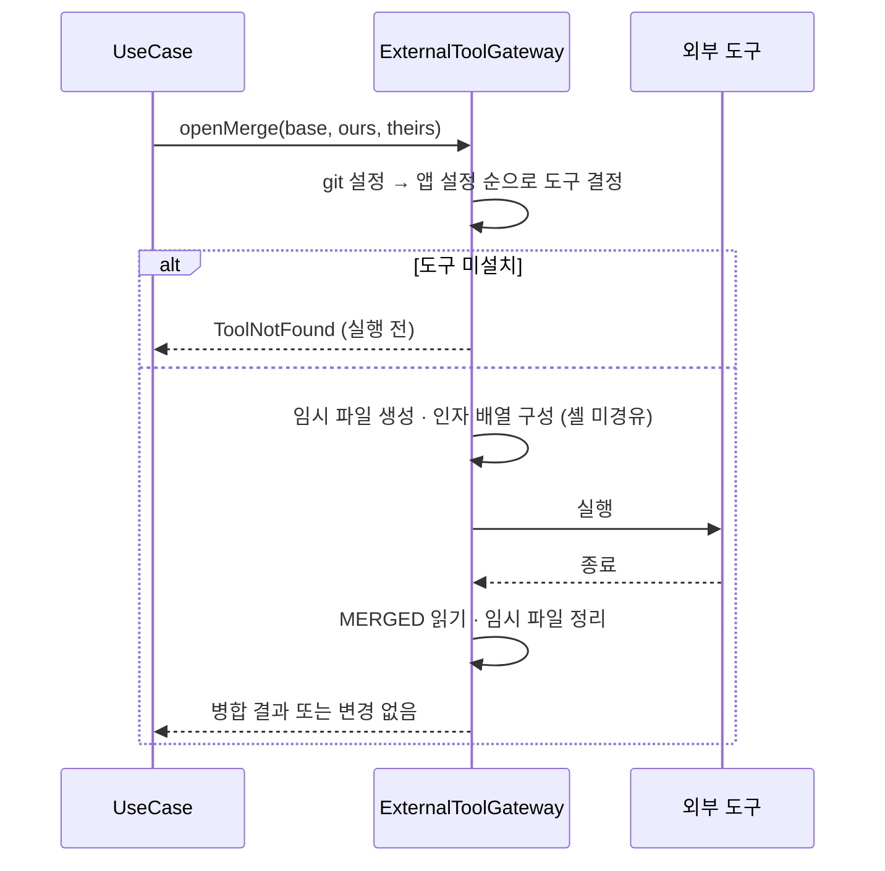
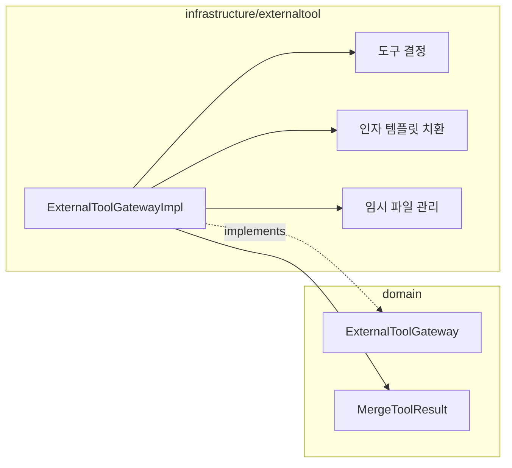

# [UND-39] 외부 diff/merge 도구 연동

> wave 7 · 사이즈 S · 의존 UND-05, UND-11 · 소유 `infrastructure/externaltool/`

## 작업 내용 (설계 의도)
사용자가 이미 쓰는 외부 도구로 diff·병합을 열 수 있게 한다. 내장 뷰어가 모든 상황을 대체하지는
못하므로 **탈출구**를 만들어 둔다.

git 설정의 `diff.tool`/`merge.tool` 을 **먼저** 읽는다. 사용자가 이미 설정해 뒀다면 그것을 쓴다 —
앱에서 또 설정하게 만들지 않는다. 설정이 없을 때만 앱 설정을 쓴다.

실행 인자 템플릿(`$LOCAL`·`$REMOTE`·`$BASE`·`$MERGED`)을 치환해 프로세스를 띄우되,
**셸을 거치지 않고 인자 배열로 실행**한다 — 경로에 공백·특수문자가 있으면 셸 경유는 깨지고,
최악의 경우 임의 명령 실행이 된다.

병합 도구는 **결과 파일을 기다린다.** 종료 후 `$MERGED` 를 읽어 충돌 해결 결과로 반영하고,
저장하지 않고 닫았으면 변경 없음으로 처리한다.

임시 파일은 도구가 비정상 종료해도 남지 않도록 정리한다.
도구가 설치돼 있지 않으면 **실행 전에** 알린다 — 프로세스 시작 실패 메시지는 사용자에게 의미가 없다.

**롤백**: 외부 도구 결과를 반영하기 전 원본을 보존하고, 도구가 저장 없이 종료하면 아무것도 반영하지 않는다. 임시 파일은 비정상 종료에도 정리한다.

## 다이어그램

### 처리 흐름

### 클래스 의존

## 테스트 케이스

- git 설정의 `diff.tool` 이 앱 설정보다 우선 적용된다
- 도구가 설치돼 있지 않으면 실행 전에 알린다
- 경로에 공백이 포함돼도 인자가 올바르게 전달된다 (셸 미경유 검증)
- 병합 도구 종료 후 결과 파일이 충돌 해결 결과로 반영된다
- 저장하지 않고 닫으면 변경 없음으로 처리된다
- 도구가 비정상 종료해도 임시 파일이 정리된다
- 설정된 도구가 없으면 내장 뷰어로 대체된다
