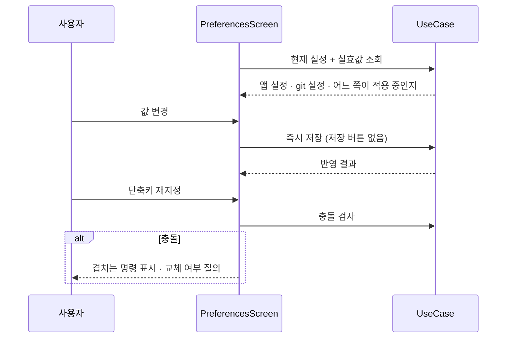
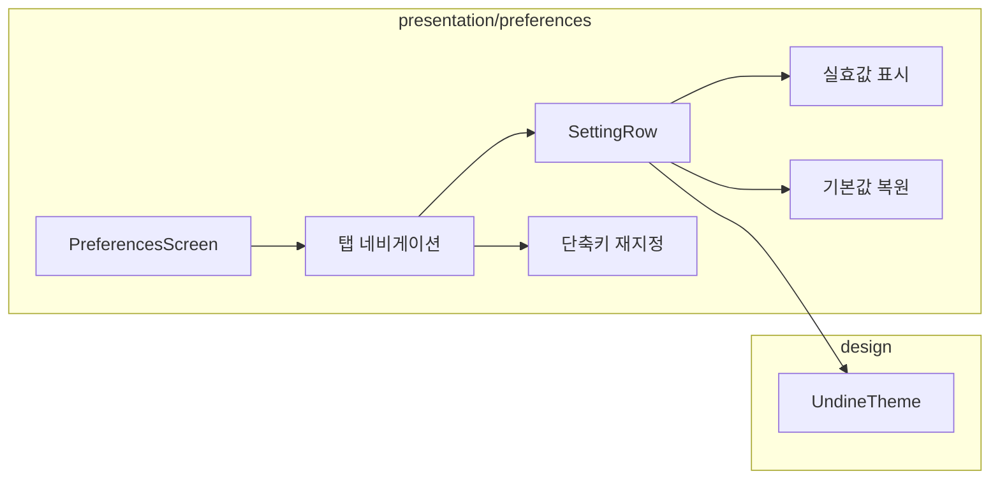

# [UND-40] 설정 화면

> wave 8 · 사이즈 M · 의존 UND-10, UND-11, UND-22, UND-37, UND-39, UND-63 · 소유 `presentation/preferences/` · `application/preferences/`

## 작업 내용 (설계 의도)
UND-11 이 만든 설정 저장소를 **사용자가 실제로 조작할 수 있는 화면**을 만든다.
1차 티켓에서 빠져 있던 실질적 공백을 메운다.

탭 구성:

| 탭 | 항목 |
|---|---|
| 일반 | 테마(라이트/다크/시스템), 언어, 시작 시 마지막 저장소 열기 |
| Git | 기본 브랜치명, pull 방식(merge/rebase), fetch 주기, 커밋 서명 활성화 |
| 계정 | identity 프로필 관리 (UND-37) — 추가·수정·저장소별 매핑 |
| 도구 | 외부 diff/merge 도구 (UND-39), 탭 폭, 고정폭 서체 |
| 단축키 | 커맨드별 단축키 재지정 (UND-22 레지스트리 연동) |
| 고급 | 대용량 파일 임계치, 커밋 페이지 크기, 로그 위치 |

설계 원칙 셋:

1. **즉시 적용.** 저장 버튼을 두지 않는다. 변경하면 바로 반영되고 바로 저장된다 —
   "저장을 눌렀나" 를 사용자가 신경 쓰게 하지 않는다.
2. **각 항목에 현재 실효값을 보여준다.** git 설정이 앱 설정을 이기는 항목(외부 도구·서명 키)은
   **어느 쪽이 적용 중인지** 표시한다. 앱에서 바꿨는데 안 먹는 이유를 알 수 있어야 한다.
3. **되돌리기 경로.** 항목별 "기본값으로" 와 전체 초기화를 제공한다.

단축키 재지정은 **충돌을 즉시 알린다** — 이미 쓰는 키를 지정하면 어느 명령과 겹치는지 보여주고
교체할지 묻는다.

**롤백**: 설정 변경은 화면에서 기본값 복원으로 되돌린다 — 저장 스키마는 UND-11 의 하위 호환 규칙을 따른다.

## 다이어그램

### 처리 흐름

### 클래스 의존

## 테스트 케이스

- 설정을 변경하면 저장 버튼 없이 즉시 반영·저장된다
- 테마를 바꾸면 앱 전체가 즉시 전환된다
- git 설정이 앱 설정을 이기는 항목에서 어느 쪽이 적용 중인지 표시된다
- 단축키 재지정 시 충돌하면 겹치는 명령이 표시된다
- 항목별 기본값 복원이 해당 항목만 되돌린다
- 전체 초기화 후 앱이 기본 설정으로 정상 동작한다
- identity 프로필을 추가·삭제하고 저장소에 매핑할 수 있다
- 설정 파일이 손상된 상태에서 화면을 열어도 기본값으로 표시된다
