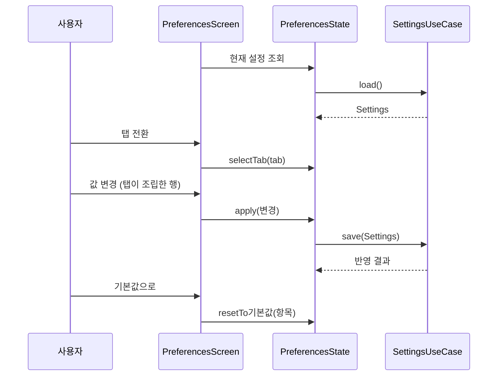
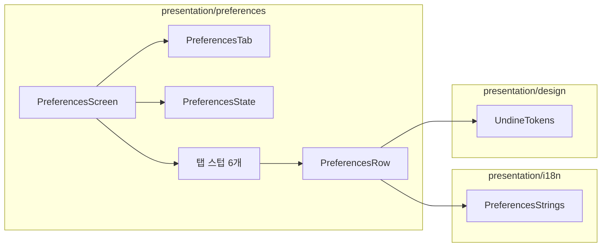

# [UND-40] 설정 화면 골격 · 공통 설정 행 계약

> wave 8 · 사이즈 L · 의존 UND-10 · UND-11 · UND-22 · UND-49 · UND-63 · 소유 `presentation/preferences/` · `application/preferences/` · `presentation/i18n/PreferencesStrings.kt` · `domain/Settings.kt` · `domain/SettingsGateway.kt` · `infrastructure/settings/` · `presentation/palette/`(런타임 재바인딩)

## 작업 내용 (설계 의도)

설정 화면의 **골격과 공통 계약**만 만든다. 탭 6개의 내용은 후속 티켓(UND-65~70)이 각자 채운다.

**왜 쪼개는가.** 탭 6개는 각각 다른 상위 계약(UND-11 설정 · UND-22 단축키 · UND-37 identity ·
UND-39 외부 도구)에 붙는다. 한 티켓으로 묶으면 사이즈가 L 을 넘고, 여러 작업자가 같은
`PreferencesScreen.kt` · `PreferencesState.kt` 를 동시에 고쳐 Single Writer per File 을 위반한다.
골격이 **파일 경계와 공통 계약을 먼저 확정**하면 탭 6개가 충돌 없이 동시에 열린다.

이 티켓이 정하는 것 셋:

1. **탭 셸** — `PreferencesTab` 열거(일반·Git·계정·도구·단축키·고급)와 탭 전환, 선택 탭에 따른
   내용 디스패치. 각 탭 내용은 후속 티켓이 채울 **빈 스텁 파일**로 미리 만들어 둔다
   (스텁은 "이 탭은 UND-NN 에서 채운다" 를 화면에 드러내지 않는다 — 문자열 리소스의 준비 중 문구를 쓴다).
2. **공통 설정 행 계약** — `PreferencesRow` 가 라벨 · 현재 값 · **실효값 출처**(앱 설정이 적용 중인지
   git 설정이 이기고 있는지) · **항목별 기본값 복원**을 한 자리에서 다룬다. 탭은 이 행을 조립할 뿐
   자기 방식으로 다시 그리지 않는다.
3. **즉시 적용** — 저장 버튼을 두지 않는다. 값이 바뀌면 곧바로 반영·저장된다. 이 저장 경로를
   `PreferencesState` 가 공통으로 소유하고, 탭 상태 홀더는 그 경로를 호출한다.

**문자열은 이 티켓이 전량 선행 정의한다.** 6개 탭이 각자 `PreferencesStrings.kt` 를 고치면 같은 파일을
6번 고치게 된다 — UND-63 이 wave 8 i18n 스텁을 선행 제공한 것과 같은 이유로, 탭별 키를 여기서
한 번에 채운다. 탭 티켓은 이 파일을 수정하지 않는다.

**범위 밖**: 탭 내용 구현 · 단축키 재지정 로직 · identity 프로필 관리 · 외부 도구 설정.
전부 후속 티켓이다. 이 티켓에서 그 코드를 미리 넣지 않는다.

### 저장 계약도 이 티켓이 세운다 (결정 E2 · G10)

단축키 오버라이드는 **공유 병목**이라 골격이 세운다 — `Settings` 스키마 3→4(`커맨드 id → 단축키`
매핑) · `SettingsCodec` 왕복 · `CommandRegistry` 런타임 재바인딩. 탭 티켓은 UI 만 만든다.
**재지정 UI · 충돌 해소 · 미등록 명령 오버라이드 보존 규칙은 UND-69 소유다.**

### 화면은 낙관적으로 그리지 않는다 (결정 G12)

값은 **저장·읽기 결과로만** 갱신하고 순서는 홀더의 FIFO 작업 줄이 보장한다. 세대 검사는 값이 아니라
**실패 표시에만** 쓴다. "즉시 적용" 은 저장 버튼이 없다는 뜻이지 낙관적 렌더링을 요구하지 않는다.

**롤백**: 설정 스키마를 3 → 4 로 올린다 — 단축키 오버라이드 매핑(`shortcutOverrides`)을 담는 자리다
(E2·G10). 코드는 revert 로 되돌아가지만 **이미 v4 로 저장된 파일이 남는다.**

- v3 앱이 v4 파일을 읽으면 `SettingsGatewayImpl` 이 원본을 `settings.json.newer-<epochMillis>` 로
  보존한 뒤 v3 파일을 새로 쓴다 — 오버라이드 값은 지워지지 않고 백업에 남는다.
- 다시 v4 로 올라오면 `recoverFieldsFromNewerSchemaBackup` 이 그 백업에서 **v3 이 담을 수 없던
  `shortcutOverrides` 만** 되살린다. v3 이 아는 필드는 사용자가 그 사이 고쳤을 수 있어 건드리지 않는다.
- 오버라이드를 실제로 지우려면 단축키 항목의 기본값 복원 또는 전체 초기화를 쓴다. 스키마 롤백은
  값을 지우는 수단이 아니다.

PR 본문 **추가 유의사항**에 이 스키마 상승(3 → 4)과 위 역방향 복구 경로를 적는다 —
설정 스키마 변경은 프로세스 게이트 룰 4(파괴적 변경 명시) 대상이다.

## 다이어그램

### 처리 흐름

### 클래스 의존

## 테스트 케이스

- 탭을 전환하면 선택 탭의 내용만 렌더링된다
- 값을 변경하면 저장 버튼 없이 즉시 저장 경로가 호출된다
- 저장이 실패하면 화면이 이전 값으로 되돌아가고 실패가 표시된다
- git 설정이 이기는 항목에서 실효값 출처가 "git 설정" 으로 표시된다
- 항목별 기본값 복원이 해당 항목만 되돌리고 다른 항목은 유지한다
- 설정 파일이 손상돼 로드에 실패해도 화면은 기본값으로 열린다
- 6개 탭 문자열 키가 두 로케일 카탈로그에 모두 존재한다
