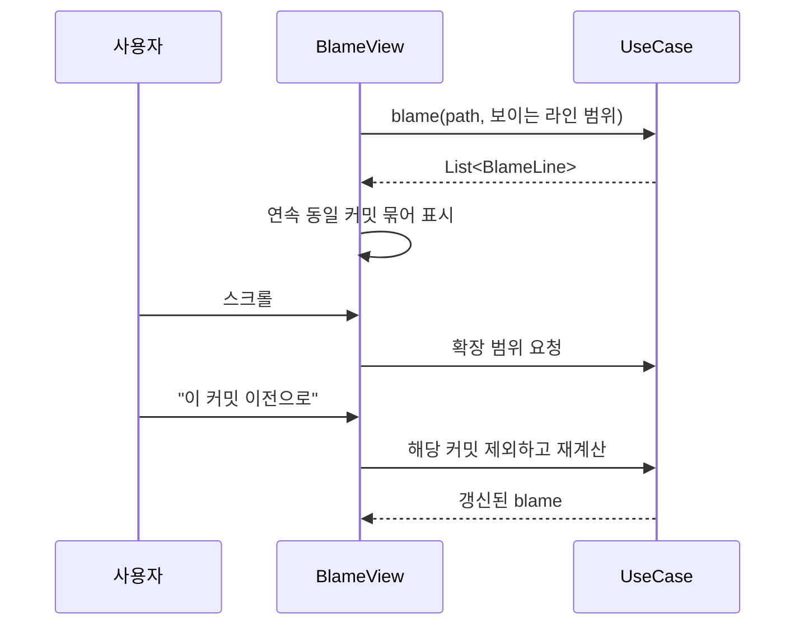
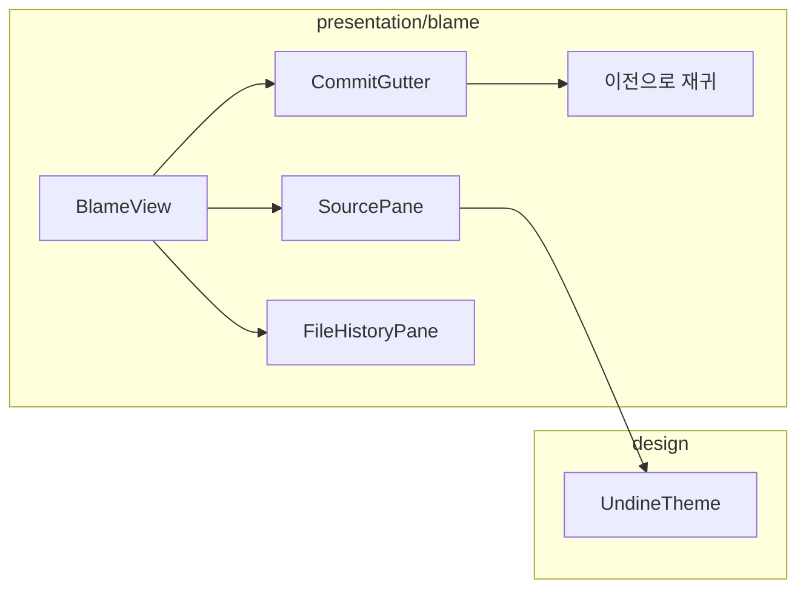

# [UND-41] Blame 뷰 · 파일 이력 화면

> wave 8 · 사이즈 M · 의존 UND-10, UND-29, UND-63 · 소유 `presentation/blame/` · `application/blame/`(확장)

## 작업 내용 (설계 의도)
파일을 열어 **라인별 작성자**를 보고, 그 파일의 **변경 이력**을 따라간다.

blame 뷰 레이아웃: 왼쪽에 커밋 정보(짧은 해시·작성자·상대 시각), 오른쪽에 소스. 같은 커밋이
연속된 라인은 **한 번만 표시**해 시각적 잡음을 줄인다.

성능: UND-29 가 라인 범위 계산을 지원하므로 **보이는 구간만 먼저 계산**하고 스크롤에 따라 확장한다.
`LazyColumn` 에 라인 번호 key 를 준다.

상호작용:

- 커밋 정보를 클릭하면 그 커밋의 상세로 이동한다.
- **"이 커밋 이전으로" (blame 재귀)** — 특정 커밋을 제외하고 다시 blame 한다. 대량 포맷팅 커밋을
  건너뛰고 실제 작성자를 찾는 핵심 기능이다.
- 공백 무시 토글을 화면에서 바로 켜고 끌 수 있다.

파일 이력 화면은 해당 파일을 건드린 커밋 목록을 보여주고, 두 시점을 선택하면 그 사이 diff 를 띄운다.
**이름 변경 지점을 이력에 표시**한다 — 경로가 바뀐 사실이 보여야 한다.

## 다이어그램

### 처리 흐름

### 클래스 의존

## 테스트 케이스

- 각 라인에 최종 수정 커밋·작성자가 표시된다
- 같은 커밋이 연속된 라인은 커밋 정보가 한 번만 표시된다
- 보이는 구간만 먼저 계산되고 스크롤 시 확장된다
- 커밋 정보를 클릭하면 커밋 상세로 이동한다
- '이 커밋 이전으로' 를 누르면 해당 커밋을 제외한 blame 이 표시된다
- 공백 무시 토글이 즉시 결과에 반영된다
- 파일 이력에서 이름 변경 지점이 표시된다
- 두 시점을 선택하면 그 사이 diff 가 표시된다
- 이진 파일은 blame 미지원 안내가 표시된다
