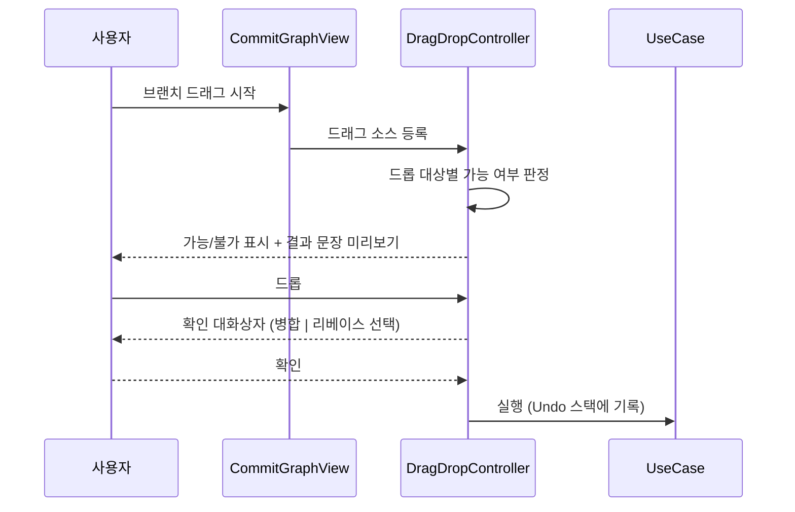
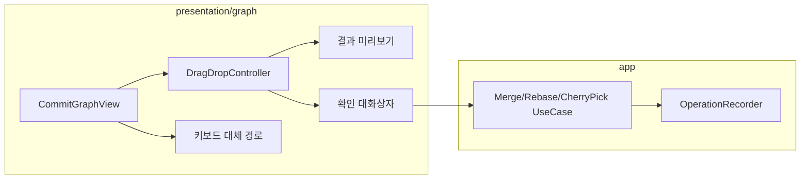

# [UND-42] 그래프 드래그&드롭 조작

> wave 8 · 사이즈 M · 의존 UND-14 · UND-38 · UND-63 · UND-71 · UND-72 · 소유 `presentation/graph/` (dnd 확장) · `domain/graphops/` · `application/graphops/`

## 작업 내용 (설계 의도)
**GitKraken 의 시그니처 기능**이다. 그래프에서 브랜치를 다른 브랜치 위로 끌어다 놓아 병합·리베이스하고,
커밋을 끌어다 놓아 cherry-pick 한다. 명령어를 몰라도 Git 을 쓸 수 있게 만드는 장치다.

드롭 대상에 따라 의도가 갈리므로 **드래그 중에 무슨 일이 일어날지 미리 보여준다.**

| 끄는 것 | 놓는 곳 | 동작 |
|---|---|---|
| 브랜치 | 다른 브랜치 | 병합 또는 리베이스 (드롭 시 선택) |
| 커밋 | 브랜치 | cherry-pick |
| 브랜치 | 커밋 | 브랜치를 그 커밋으로 reset (위험 — 확인 필수) |
| 태그(lightweight) | 커밋 | 태그 이동. **annotated 태그는 드롭 불가** — 커밋으로 다시 겨누면 메시지·tagger 가 사라져 되돌릴 수 없다 |

**세 가지를 반드시 지킨다.**

1. **드롭 전에 결과를 문장으로 보여준다.** "feature 를 main 에 병합합니다" 처럼.
   아이콘만으로는 병합인지 리베이스인지 구분되지 않는다.
2. **드롭 즉시 실행하지 않는다.** 확인 단계를 거친다 — 드래그는 손이 미끄러지기 쉬운 입력이다.
3. **불가능한 조합은 드롭 자체를 막는다.** 드롭 가능 여부를 드래그 중에 시각적으로 표시해,
   놓고 나서 실패 메시지를 보는 일이 없게 한다.

모든 동작은 UND-38 Undo 스택에 기록한다. 드래그로 실수한 것은 드래그만큼 쉽게 되돌릴 수 있어야 한다.

**키보드 대체 경로를 반드시 제공한다** — 드래그는 접근성 관점에서 배타적 입력이다.
컨텍스트 메뉴와 커맨드 팔레트로 같은 동작에 도달할 수 있어야 한다.

**실행은 UND-71 의 계약을 호출만 한다.** 브랜치 대상 조작의 원자 실행(checkout+조작 한 임계 구역),
ref 이동의 조건부 갱신, Undo 전략 3종은 전부 gateway 소유다 — 이 티켓은 그 계약을 **쓰기만 하고
직접 만들지 않는다.** `domain/RefGateway.kt` · `domain/WorktreeOpsGateway.kt` ·
`infrastructure/git/{ref,worktreeops}/` · `application/undo/` 를 수정하면 소유 위반이다
(`application/undo/` 는 UND-43 소유다).

**이 경계는 앞선 실패의 결과다.** 1차 구현이 소유 밖 13개 파일로 번지면서 gateway 층의 원자성 결함을
UI 티켓 안에서 고치려 했고, 같은 p0 가 4라운드 동안 형태만 바꿔 재발했다.

**롤백**: 모든 동작은 UND-38 Undo 스택에 기록되며, 충돌 시 UND-21 의 abort 로 복구한다.

저장소 변경이 성공한 뒤 **Undo 기록에 실패**하면 그 변경은 Undo 목록에 없다 — 변경을 실패로
되돌리지 않는 대신 화면이 그 사실과 **reflog 에서 이전 지점을 찾는 경로**를 안내한다.

## 다이어그램

### 처리 흐름

### 클래스 의존

## 테스트 케이스

- 브랜치를 다른 브랜치에 드롭하면 병합/리베이스 선택 대화상자가 뜬다
- 커밋을 브랜치에 드롭하면 cherry-pick 이 제안된다
- 드래그 중 드롭 결과가 문장으로 미리 표시된다
- 불가능한 조합은 드롭 대상이 비활성으로 표시된다
- 드롭 즉시 실행되지 않고 확인 단계를 거친다
- 브랜치를 커밋에 드롭하는 reset 은 위험 경고가 함께 표시된다
- 실행된 동작이 Undo 스택에 기록된다
- 같은 동작을 컨텍스트 메뉴와 커맨드 팔레트로도 수행할 수 있다
- 드래그를 취소(ESC)하면 아무 동작도 일어나지 않는다
