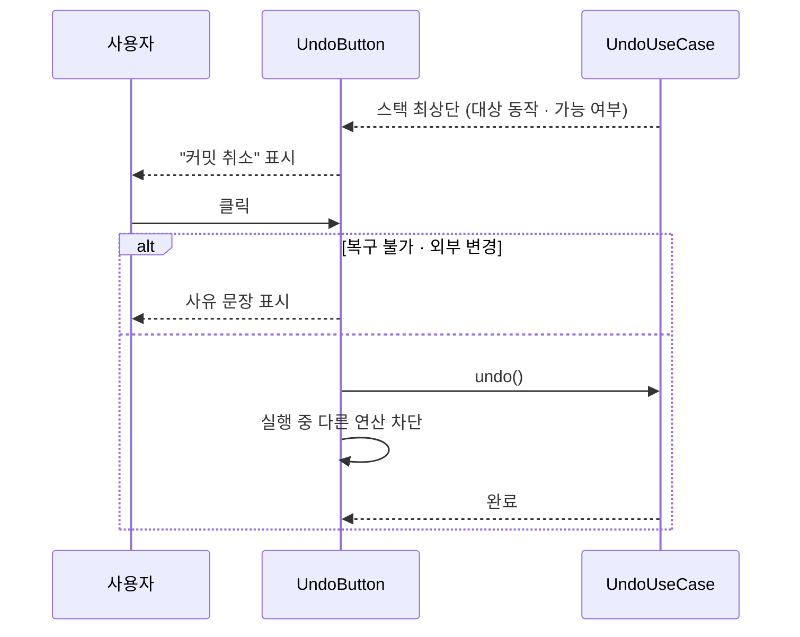
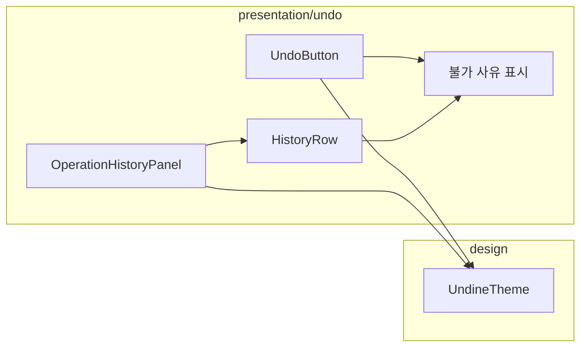

# [UND-43] Undo 버튼 · 실행 이력 패널

> wave 8 · 사이즈 M · 의존 UND-10, UND-38 · 소유 `presentation/undo/`

## 작업 내용 (설계 의도)
UND-38 이 만든 Undo 스택을 화면에 노출한다. 툴바의 Undo 버튼과 실행 이력 패널이다.

**Undo 버튼은 무엇을 되돌릴지 말해준다.** "실행 취소" 만 쓰면 무엇이 취소될지 모른 채 누르게 된다.
툴팁과 버튼 레이블에 "커밋 취소" 처럼 대상 동작을 넣는다.

**되돌릴 수 없을 때 이유를 보여준다.** 버튼을 비활성으로만 두면 사용자는 왜 안 되는지 모른다.

| 상태 | 표시 |
|---|---|
| 스택 비어 있음 | "되돌릴 작업이 없습니다" |
| 복구 불가 연산 | "push 는 되돌릴 수 없습니다" |
| 외부 변경 감지 | "저장소가 외부에서 변경되어 되돌릴 수 없습니다" |

실행 이력 패널은 세션 동안 수행한 연산을 시각·대상·되돌리기 가능 여부와 함께 목록으로 보여준다.
특정 지점까지 한 번에 되돌리는 건 **제공하지 않는다** — 중간 단계를 건너뛰면 예측이 어렵고,
Git 에서 그건 되돌리기가 아니라 새로운 사고다. 한 단계씩만 되돌린다.

되돌리기 실행 중에는 다른 Git 연산을 막는다.

## 다이어그램

### 처리 흐름

### 클래스 의존

## 테스트 케이스

- Undo 버튼에 되돌릴 대상 동작명이 표시된다
- 스택이 비어 있으면 사유와 함께 비활성화된다
- 복구 불가 연산이 최상단이면 그 사유가 표시된다
- 외부 변경이 감지되면 그 사유가 표시된다
- 실행 이력 패널에 세션 중 연산이 시각·대상과 함께 나열된다
- 각 이력 항목에 되돌리기 가능 여부가 표시된다
- 특정 지점까지 일괄 되돌리기는 제공되지 않는다
- 되돌리기 실행 중에는 다른 Git 연산이 차단된다
