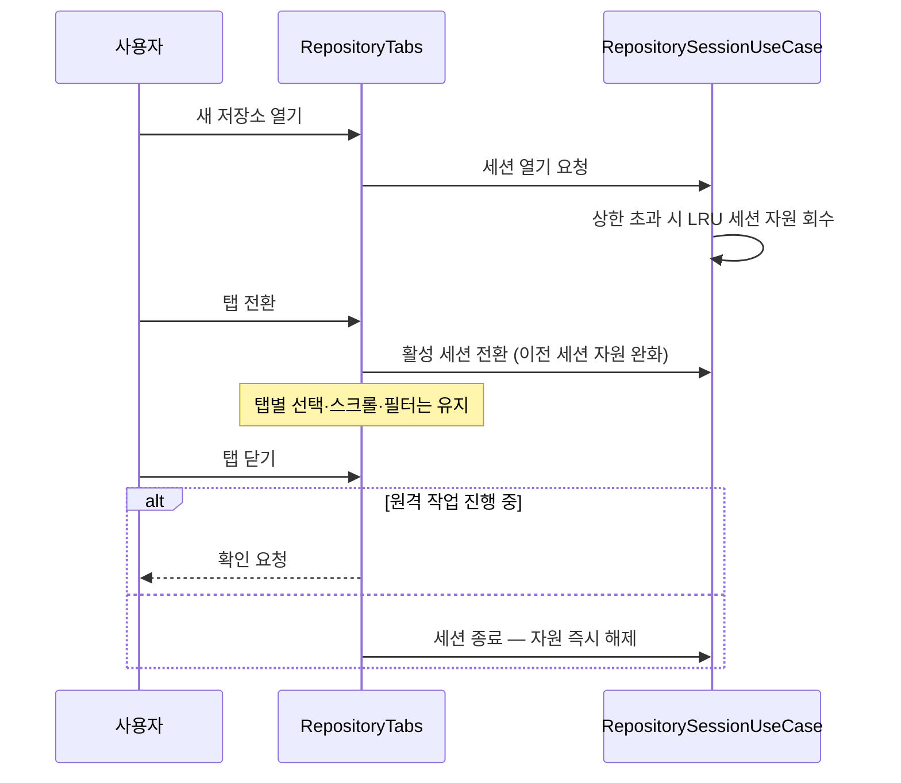
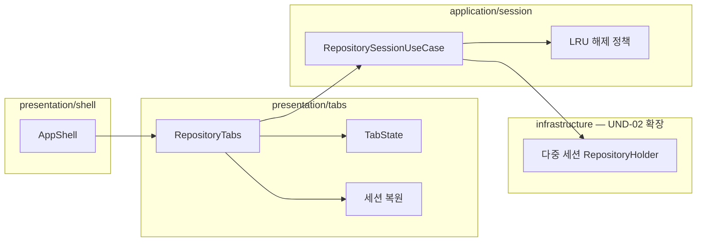

# [UND-44] 다중 저장소 탭

> wave 8 · 사이즈 L · 의존 UND-02, UND-12, UND-63 · 소유 `presentation/tabs/` · `presentation/shell/` · `application/session/` · `infrastructure/git/repository/` (다중 세션 확장)

## 작업 내용 (설계 의도)
여러 저장소를 탭으로 동시에 열어 오간다. 저장소를 자주 오가는 사용자에게는 가장 체감이 큰 기능이다.

**UND-12 가 세운 "저장소 하나" 전제를 확장**한다. 셸 파일을 수정하므로 wave 를 분리했다
(Single Writer per File — 1차 UI 티켓들과 같은 wave 에 두지 않는다).

핵심은 **자원 관리**이고, 그 소유가 어디에 있느냐가 이 티켓의 설계 판단이다.
탭마다 `Repository` 핸들이 열리므로 무한정 열면 파일 핸들이 고갈된다.

**자원 수명은 presentation 이 소유하지 않는다.** UND-02 가 세운 "저장소 핸들은 하나만 연다" 전제를
**다중 세션**으로 확장하되, 그 확장은 infrastructure 의 홀더에서 하고 열기·직렬화·해제 정책은
`application/session` 의 UseCase 가 갖는다. presentation 은 탭 상태와 UseCase 호출만 담당한다
([`architecture-layers`](../.agent/rules/architecture-layers.md) 규칙 3).

1. **활성 탭만 완전 로드.** 비활성 탭은 상태를 유지하되 무거운 자원(`Repository`·캐시)을 놓는다.
2. **탭 상한**을 두고 초과 시 가장 오래 안 쓴 탭의 자원을 회수한다 (LRU 정책은 application 소관).
3. **탭을 닫으면 자원을 즉시 해제**한다.

각 탭은 **독립 상태**를 갖는다 — 선택된 커밋·스크롤 위치·필터가 탭마다 유지돼야 오가는 의미가 있다.

세션 복원: 앱을 다시 켜면 열려 있던 탭을 복원한다. **사라진 경로의 탭은 조용히 버리지 않고**
"경로를 찾을 수 없음" 으로 표시한다.

진행 중인 원격 작업이 있는 탭을 닫으려 하면 확인한다.

**롤백**: 탭 상태는 설정에 저장되므로, 스키마 문제가 생기면 탭 세션을 초기화해 단일 저장소 모드로 복구한다.

## 다이어그램

### 처리 흐름

### 클래스 의존

## 테스트 케이스

- 여러 저장소를 탭으로 동시에 열 수 있다
- 탭을 전환해도 각 탭의 선택 커밋·스크롤 위치·필터가 유지된다
- 비활성 탭의 무거운 자원이 회수된다
- 탭 상한을 초과하면 가장 오래 안 쓴 탭의 자원이 회수된다
- 탭을 닫으면 해당 저장소의 JGit 자원이 즉시 해제된다
- 원격 작업 진행 중인 탭을 닫으면 확인을 요청한다
- 앱 재시작 시 열려 있던 탭이 복원된다
- 경로가 사라진 탭은 오류 표시로 복원되고 조용히 사라지지 않는다
- 탭이 하나뿐이면 탭 바를 숨겨도 동작에 문제가 없다
