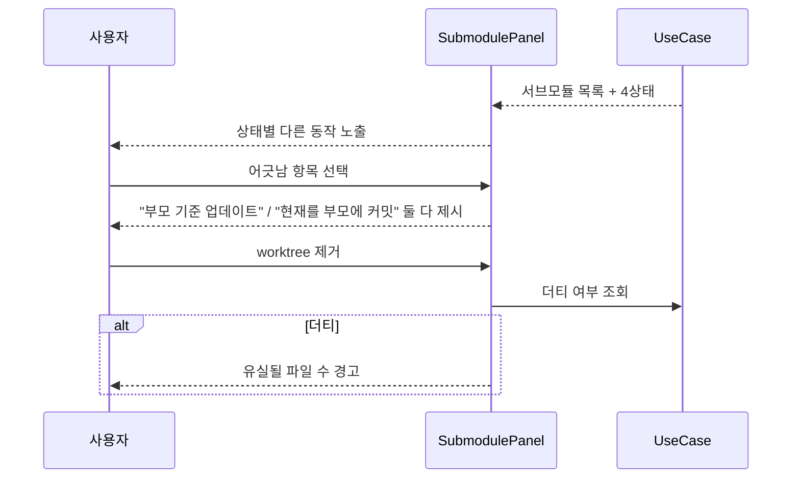
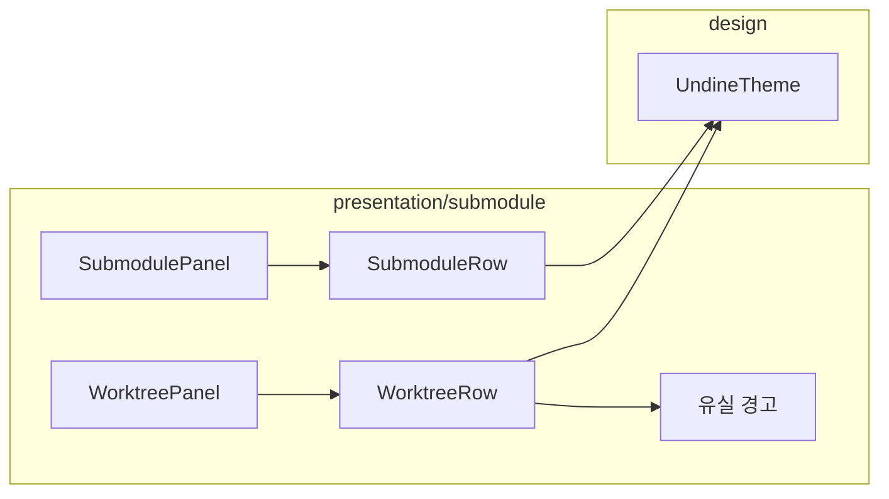

# [UND-45] Submodule · Worktree 패널

> wave 8 · 사이즈 M · 의존 UND-10, UND-32, UND-34 · 소유 `presentation/submodule/`

## 작업 내용 (설계 의도)
서브모듈과 worktree 를 사이드바 하위 섹션과 전용 패널에서 관리한다.

**서브모듈 섹션**은 UND-32 가 구분한 네 상태(미초기화·최신·수정됨·어긋남)를 **각각 다른 표시**로 보여준다.
상태마다 사용자가 할 일이 다르기 때문이다.

| 상태 | 제공 동작 |
|---|---|
| 미초기화 | 초기화 |
| 최신 | 열기 (해당 서브모듈을 새 탭으로) |
| 수정됨 | 열어서 커밋하기 |
| 어긋남 | 부모 기준으로 업데이트 / 현재 상태를 부모에 커밋 |

**어긋남 상태의 두 선택지를 모두 제시**하는 게 중요하다. "업데이트" 만 주면 사용자가 서브모듈에서
한 작업이 날아간다.

**Worktree 섹션**은 목록·추가·제거·prune 을 제공한다. 각 worktree 의 브랜치와 경로를 보여주고,
현재 앱이 열고 있는 worktree 를 구분 표시한다. 다른 worktree 는 **새 탭으로 열기**를 제공한다
(UND-44 와 연동).

제거는 UND-34 가 더티 여부를 판정해 주므로, 더티하면 **무엇이 유실되는지 파일 수와 함께** 경고한다.

## 다이어그램

### 처리 흐름

### 클래스 의존

## 테스트 케이스

- 서브모듈 4상태가 각각 다른 표시로 구분된다
- 미초기화 서브모듈에 초기화 동작이 제공된다
- 어긋남 상태에 업데이트와 부모에 커밋 두 선택지가 모두 제시된다
- 서브모듈을 새 탭으로 열 수 있다
- worktree 목록에 브랜치·경로가 표시되고 현재 것이 구분된다
- 더티한 worktree 제거 시 유실될 파일 수가 경고에 포함된다
- 고아 worktree 에 prune 동작이 제공된다
- 서브모듈·worktree 가 0건이면 각각 빈 상태 안내가 표시된다
