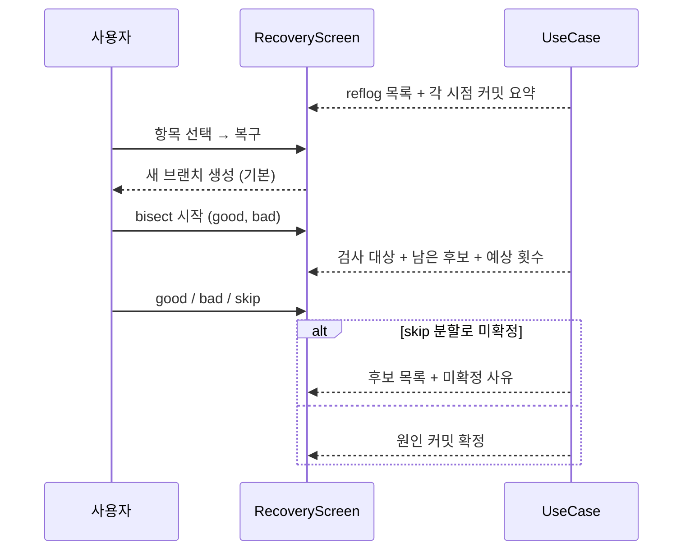
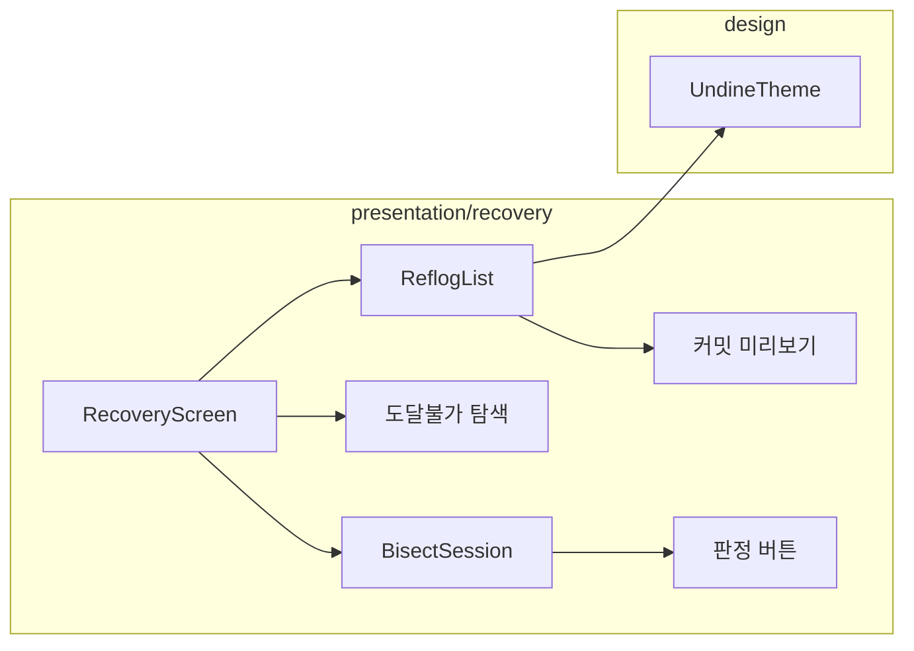

# [UND-46] Reflog · Bisect 화면

> wave 8 · 사이즈 M · 의존 UND-10, UND-30, UND-35 · 소유 `presentation/recovery/`

## 작업 내용 (설계 의도)
"잃어버린 커밋 찾기" 와 "버그 커밋 찾기" 두 복구 도구의 화면이다.

**Reflog 화면**은 시간순 목록으로 언제 무엇이 어디로 움직였는지 보여준다. 각 항목에서
**해당 시점의 커밋을 미리 볼 수 있어야** 한다 — 해시만 보고 어느 지점인지 판단할 수 없다.
커밋 메시지와 변경 파일 요약을 함께 표시한다.

복구는 **새 브랜치 생성이 기본**이고, 기존 ref 이동은 별도 메뉴에 두고 경고를 붙인다 (UND-30 의 계약 그대로).

도달 불가 커밋 탐색은 **느리다는 사실을 먼저 알리고** 사용자가 시작을 누르면 진행률과 함께 실행한다.
자동으로 돌리지 않는다.

**Bisect 화면**은 세션의 현재 상태를 보여준다 — 지금 검사할 커밋, 남은 후보 수, 예상 남은 횟수,
지금까지의 판정 이력. good/bad/skip 버튼을 크게 두어 반복 조작이 편하게 한다.

결과가 후보 **목록**으로 나온 경우(skip 으로 분할) 단일 커밋처럼 표시하지 않는다 — 후보 전부를
보여주고 왜 확정되지 않았는지 설명한다.

세션 중단(reset) 경로를 항상 화면에 노출한다.

**롤백**: bisect 는 reset 으로 시작 전 브랜치·커밋으로 복구한다 — ref 이동은 되돌릴 수 없으므로 reflog 에서 이전 위치를 다시 찾는다.

## 다이어그램

### 처리 흐름

### 클래스 의존

## 테스트 케이스

- reflog 항목에 커밋 메시지와 변경 요약이 함께 표시된다
- 복구 기본 동작이 새 브랜치 생성으로 제시된다
- 기존 ref 이동은 별도 메뉴에 있고 경고가 붙는다
- 도달 불가 탐색이 자동 실행되지 않고 사용자가 시작한다
- bisect 화면에 남은 후보 수와 예상 남은 횟수가 표시된다
- good/bad/skip 판정 이력이 화면에 누적 표시된다
- skip 분할로 미확정이면 후보 목록과 사유가 표시된다
- 세션 중단 경로가 항상 노출된다
- reflog 가 비어 있으면 만료 가능성 안내가 표시된다
